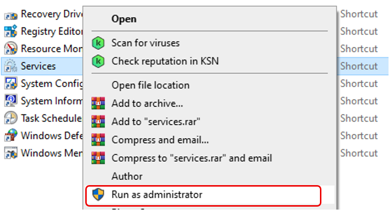
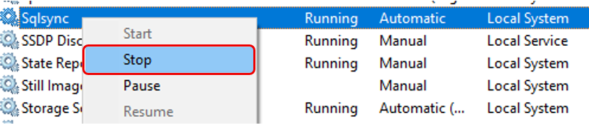
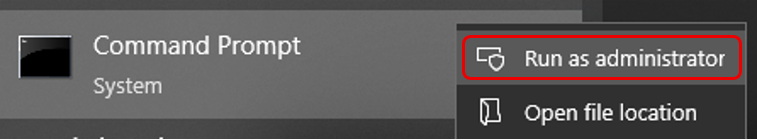
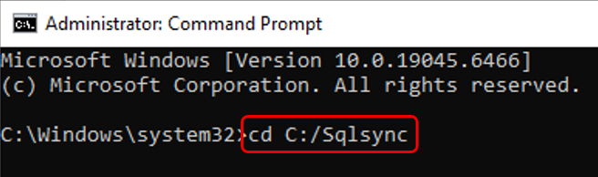
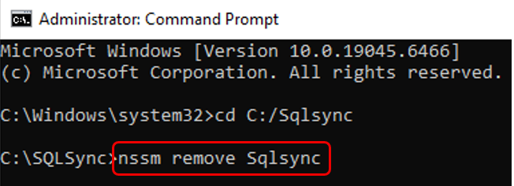
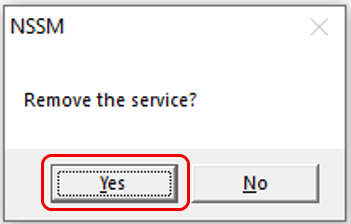
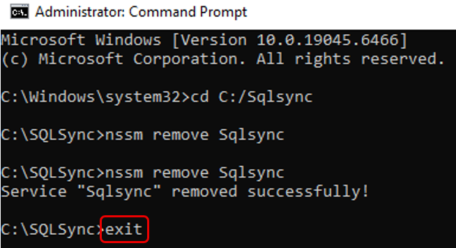
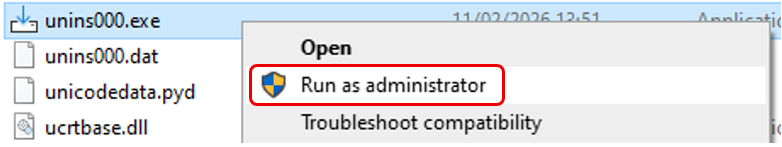
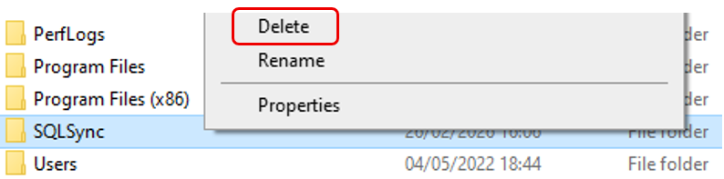

## Setup

### Step 1 – Stop The Service

1. Control Panel > Administrative Tools > Select **Services** > Right click > **Run as administrator**

   

2. Select **Sqlsync** > Right click > **Stop**

   

### Step 2 – Remove Sqlsync From Services

1. Search **Command Prompt** > **Run as administrator**

   

2. In the command line type `cd C:/Sqlsync` > Hit Enter

   

3. In the command line type `nssm remove Sqlsync` > Hit Enter

   

4. Click **Yes** to remove the service

   

5. In the command line type `exit` > Hit Enter

   

### Step 3 – Uninstall Sqlsync From The Computer

1. Navigate to `C:\SQLSync` > select `unins000.exe` > right click > **Run as administrator**

   

2. Restart the computer

3. Navigate to `C:\` > Select **Sqlsync** folder > **Delete**

   
