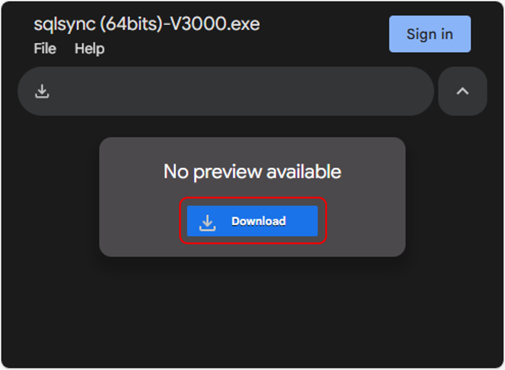
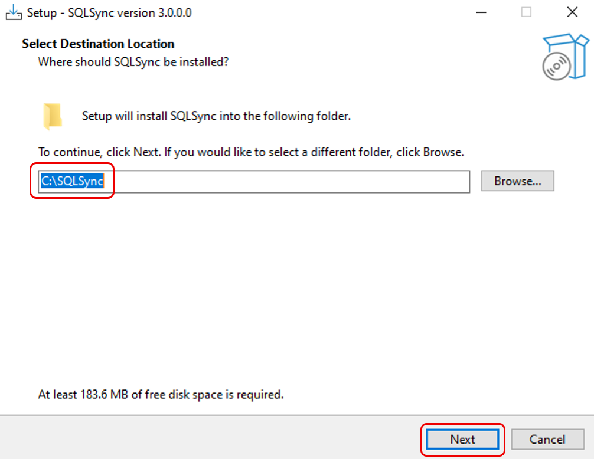
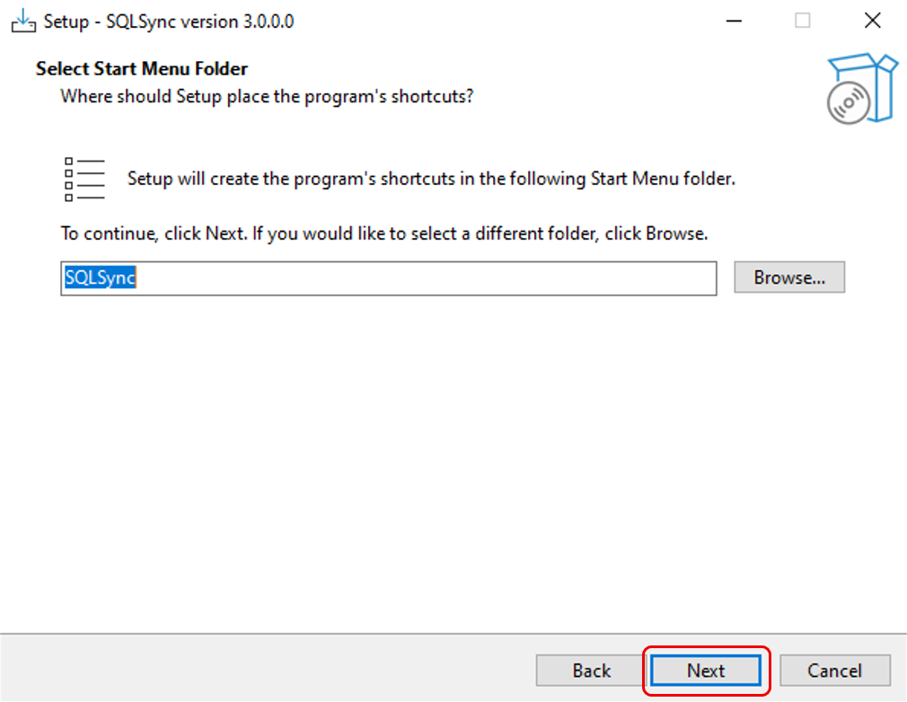
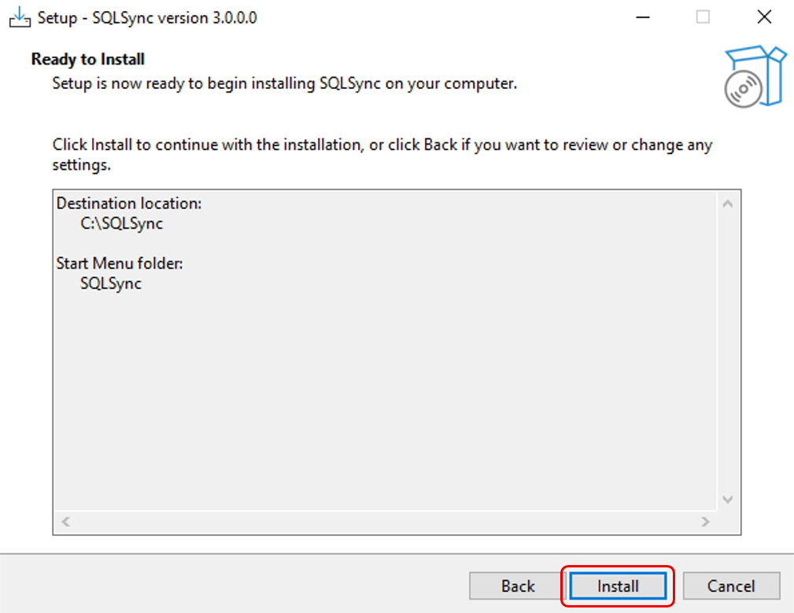
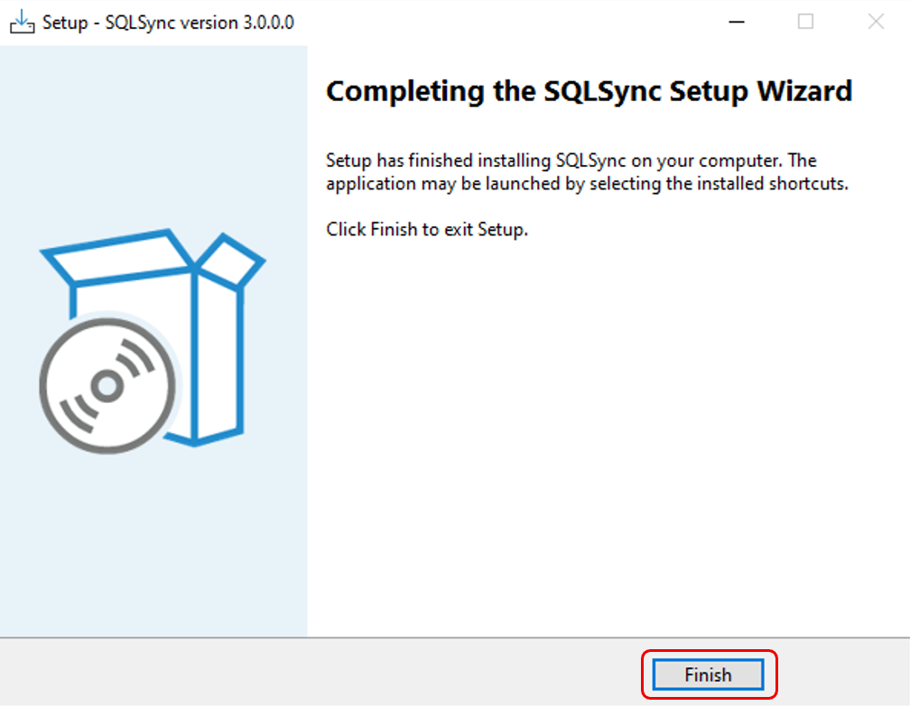
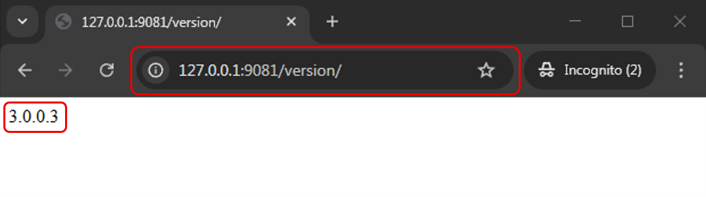
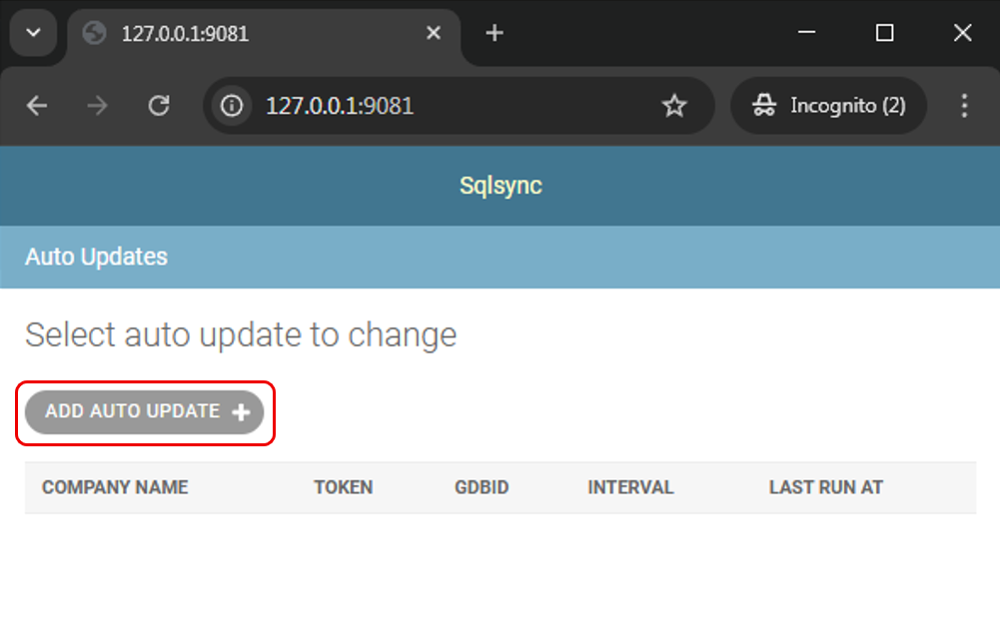
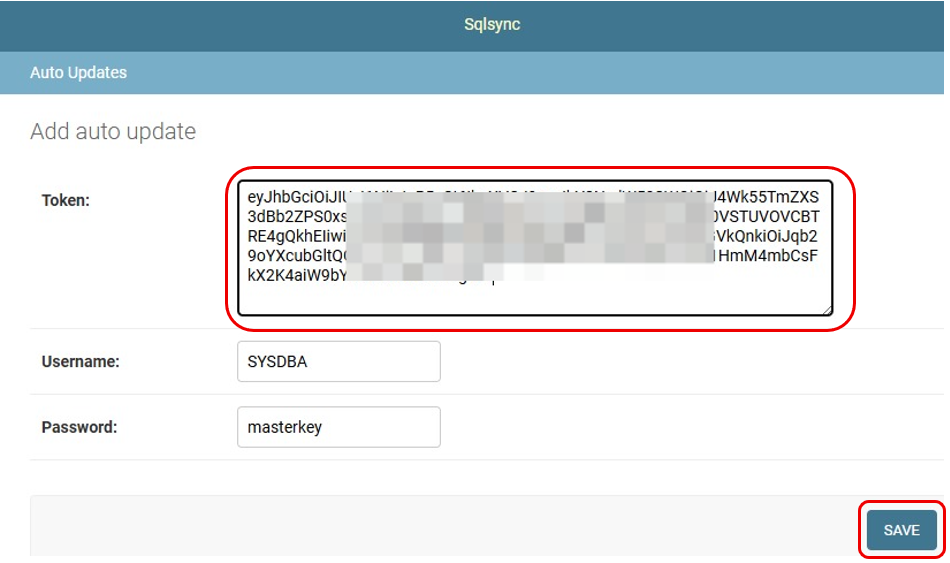
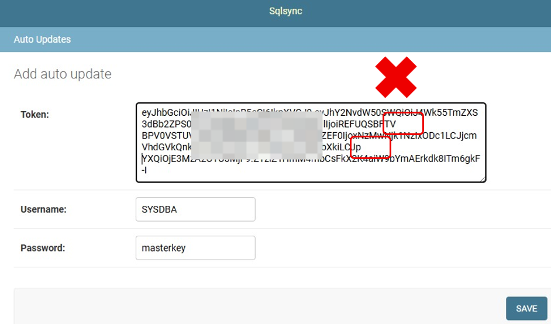

## Prerequisites

- Install in `SQL Account` server PC
- Must have Firebird 3.0 or above (including standalone license)
- Windows 10 (64 bit) or above
- Have internet access

## Setup

### Step 1 – Install SQL BI Dashboard Sync Tool

1. Download [Sqlsync tool](https://drive.google.com/file/d/1MeOmnmYXZg0-LCPcld1ZCoI_-h39REJN/view)

   :::warning
   If computer previously installed Sqlsync or Gobi sync, please proceed to [Complete Uninstall](./complete-uninstall).
   :::

   

2. Select `sqlsync (64bits)-V3000.exe` > Right click > **Run as administrator**

   

3. Confirm the installation folder > **Next**

   

4. Click **Next**

   

5. Click **Install**

   

6. Click **Finish**

   

### Step 2 – Ensure SQL BI Dashboard Sync Tool Service Running

1. Open web browser > type in `127.0.0.1:9081/version/` at address bar > click enter

   

2. Ensure page content showing `3.0.0.3` or above

### Step 3 – Insert SQL BI Dashboard Token

:::info
To start with BI Dashboard, contact your SQL Service Consultant for the service registration.
:::

1. Open web browser > type in `127.0.0.1:9081` at address bar > click enter

2. Click **Add Auto Update**

   

3. Paste Token\* > **Save**

   

   :::warning
   Please ensure that the token without line break
   :::

   
