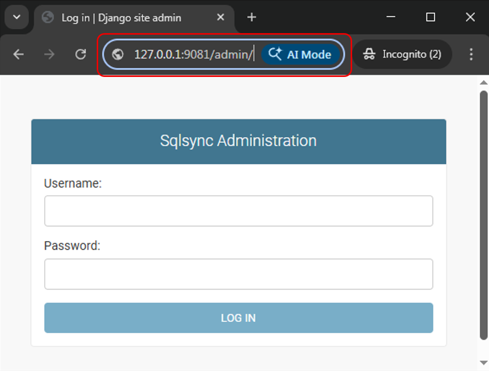
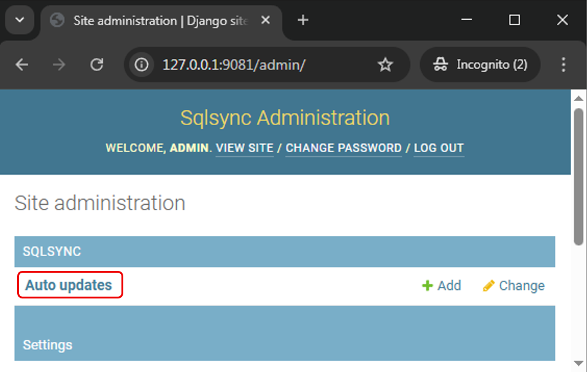
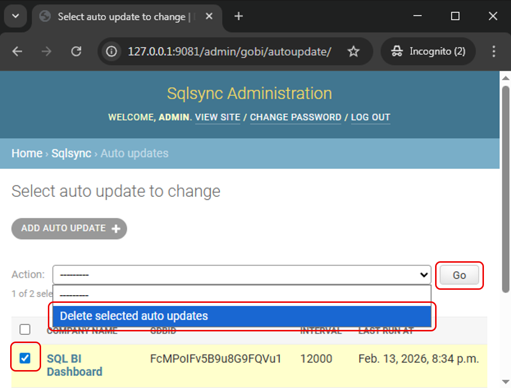
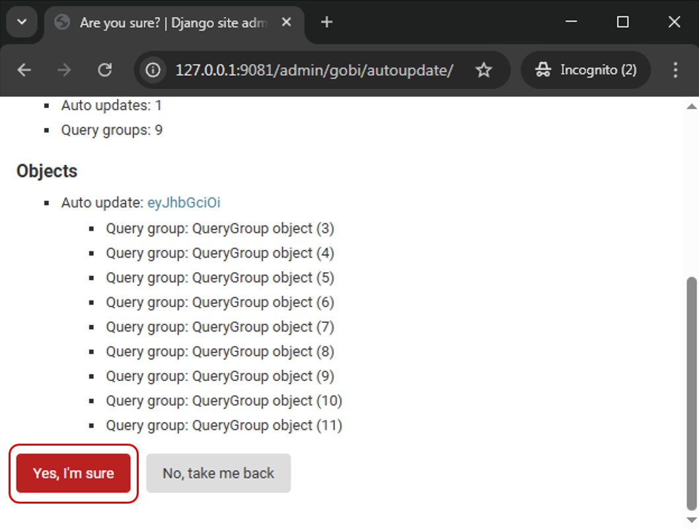

1. Open web browser > type in `127.0.0.1:9081/admin/` at address bar > click enter

   

2. Key in username and password

   | Field    | Value      |
   |----------|------------|
   | Username | admin      |
   | Password | _Contact your SQL Service Consultant for the default password_ |

3. Click on **Auto updates**

   

4. Check box for the account you wish to delete > Under **Action** > Select **Delete selected auto updates** > Click **Go**

   

5. Click **Yes, I'm sure** to proceed to remove the token

   
