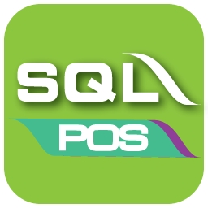
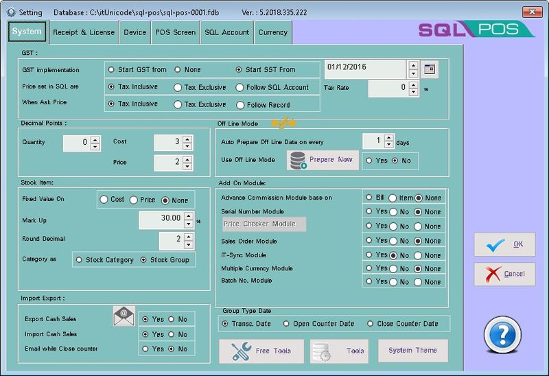
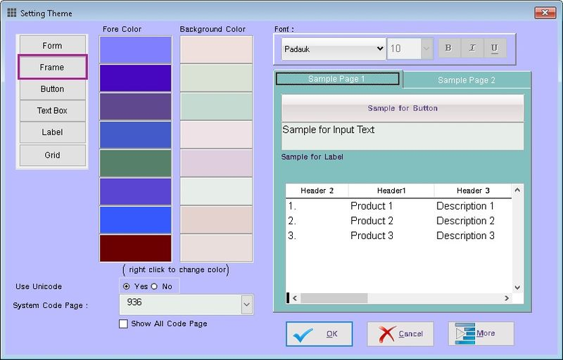
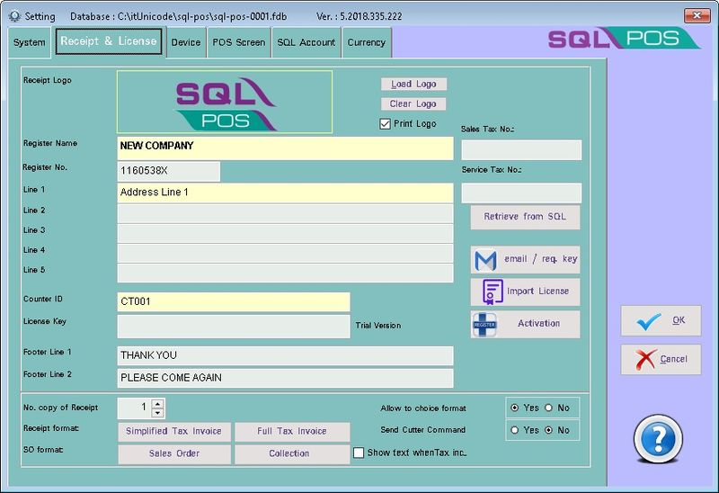

Cash collection, Inventory Management and Business Intelligence - all in one place. Seamless integration make it easy to sell you products and accept multiple payments. Inventory, orders and customer data are automatically updated. SQL Pos covers a wide range of industries - Mini Markets, Book Stores, Hardware Stores, Pharmacies Medical Sore and many more.

## System Requirements
The following requirements are needed in order to run SQL Pos
- for Standalone or Client (Workstation) PC

:::info
  - [SQL Accounting](https://docs.sql.com.my/sqlacc)
  - Microsoft Windows 10 and above (recommended with 64 bits windows).
  - XGA - minimum of 16 bis colors recommended.
  - Intel i5 and above computer.
  - 4 GB of RAM (recommended 8 GB and above).
  - 10 GB of available hard disk space (recommended use the Solid-State Drive (SSD) Disk).
  - Microsoft Windows Compatible Printer.
:::

- for Server PC

:::info
  - [Firebird](https://docs.sql.com.my/sqlacc/getting-started/multi-user-setup#firebird-installation)
  - [SQL Accounting](https://docs.sql.com.my/sqlacc)
  - Microsoft Windows 10 and above (recommended with 64 bits windows).
  - XGA - minimum of 16 bis colors recommended.
  - Intel i5, i7 and above computer.
  - 8 GB of RAM (recommended 12 GB and above).
  - 10 GB of available hard disk space (recommended use the Solid-State Drive (SSD) Disk).
  - Microsoft Windows Compatible Printer.
  - 100 Base-T NIC.
:::

## System 

### 1. System - System

### 2. GST

<table class="pos-table">
  <thead>
    <tr>
      <th>Field</th>
      <th>Description</th>
    </tr>
  </thead>
  <tbody>
    <tr>
      <td><b>GST Implementation</b></td>
      <td>
        <ul>
          <li><b>Start GST from</b> – When GST is start Charge</li>
          <li><b>None</b> – No Tax</li>
          <li><b>Start SST from</b> – When SST is start Charge</li>
        </ul>
      </td>
    </tr>
    <tr>
      <td><b>Date</b></td>
      <td>
        <ul>
          <li>Enter the Start Date for GST/SST</li>
        </ul>
      </td>
    </tr>
    <tr>
      <td><b>Price set in SQL are</b></td>
      <td>
        <ul>
          <li><b>Tax Inclusive</b> – System will Reverse the Price to exclude Tax Amount</li>
          <li><b>Tax Exclusive</b> – System will directly get the Price</li>
        </ul>
      </td>
    </tr>
    <tr>
      <td><b>When Ask Price</b></td>
      <td>
        <ul>
          <li><b>Tax Inclusive</b> – System will Reverse the entered Price to exclude Tax Amount</li>
          <li><b>Tax Exclusive</b> – System will directly use the Price entered</li>
          <li><b>Follow Record</b> – System will follow last Selected Setting</li>
        </ul>
      </td>
    </tr>
    <tr>
      <td><b>Tax Rate</b></td>
      <td>
        <ul>
          <li>The Tax Rate</li>
        </ul>
      </td>
    </tr>
  </tbody>
</table>

### 3. Decimal Points

<table class="pos-table">
  <thead>
    <tr>
      <th>Field</th>
      <th>Description</th>
    </tr>
  </thead>
  <tbody>
    <tr>
      <td><b>Qty</b></td>
      <td>Quantity Field Display format</td>
    </tr>
    <tr>
      <td><b>Cost</b></td>
      <td>Stock Unit Cost Display format</td>
    </tr>
    <tr>
      <td><b>Price</b></td>
      <td>Sales Unit Price Display format</td>
    </tr>
  </tbody>
</table>

### 4. Off Line Mode

<table class="pos-table">
  <thead>
    <tr>
      <th>Field</th>
      <th>Description</th>
    </tr>
  </thead>
  <tbody>
    <tr>
      <td><b>Auto Prepare Off Line Data on every</b></td>
      <td>
        <ul>
          <li>Set Number of Days to Update</li>
        </ul>
      </td>
    </tr>
    <tr>
      <td><b>Use Of Line Mode</b></td>
      <td>
        <ul>
          <li>Yes - To Enable Off Line Mode Function</li>
          <li>No - To Disable Off Line Mode Function</li>
        </ul>
      </td>
    </tr>
    <tr>
      <td><b>Prepare Now</b></td>
      <td>
        <ul>
          <li>Adhoc update Data</li>
        </ul>
      </td>
    </tr>
  </tbody>
</table>

### 5. Stock Item

<table class="pos-table">
  <thead>
    <tr>
      <th>Field</th>
      <th>Description</th>
    </tr>
  </thead>
  <tbody>
    <tr>
      <td><b>Fixed Value On</b></td>
      <td>
        <ul>
          <li>Cost – ???</li>
          <li>Price – ???</li>
          <li>None – ???</li>
        </ul>
      </td>
    </tr>
    <tr>
      <td><b>Mark Up</b></td>
      <td>???</td>
    </tr>
    <tr>
      <td><b>Round Decimal</b></td>
      <td>???</td>
    </tr>
    <tr>
      <td><b>Category as</b></td>
      <td>
        <ul>
          <li>Stock Category – ???</li>
          <li>Stock Group – ???</li>
        </ul>
      </td>
    </tr>
  </tbody>
</table>

### 6. Add On Module

<table class="pos-table">
  <thead>
    <tr>
      <th>Field</th>
      <th>Description</th>
    </tr>
  </thead>
  <tbody>
    <tr>
      <td><b>Advance Commission Module base on</b></td>
      <td>
        <ul>
          <li>Bill - ???</li>
          <li>Item - ???</li>
          <li>None - ???</li>
        </ul>
      </td>
    </tr>
    <tr>
      <td><b>Serial Number</b></td>
      <td>
        <ul>
          <li>Yes - ???</li>
          <li>No - ???</li>
          <li>None - ???</li>
        </ul>
      </td>
    </tr>
    <tr>
      <td><b>Price Checker Module</b></td>
      <td>
        <ul>
          <li>Yes - ???</li>
          <li>No - ???</li>
          <li>None - ???</li>
        </ul>
      </td>
    </tr>
    <tr>
      <td><b>Sales Order Module</b></td>
      <td>
        <ul>
          <li>Yes - ???</li>
          <li>No - ???</li>
          <li>None - ???</li>
        </ul>
      </td>
    </tr>
    <tr>
      <td><b>iT-Sync Module</b></td>
      <td>
        <ul>
          <li>Yes - ???</li>
          <li>No - ???</li>
          <li>None - ???</li>
        </ul>
      </td>
    </tr>
    <tr>
      <td><b>Multiple Currency Module</b></td>
      <td>
        <ul>
          <li>Yes - ???</li>
          <li>No - ???</li>
          <li>None - ???</li>
        </ul>
      </td>
    </tr>
    <tr>
      <td><b>Batch No. Module</b></td>
      <td>
        <ul>
          <li>Yes - ???</li>
          <li>No - ???</li>
          <li>None - ???</li>
        </ul>
      </td>
    </tr>
  </tbody>
</table>

### 7. Import Export

<table class="pos-table">
  <thead>
    <tr>
      <th>Field</th>
      <th>Description</th>
    </tr>
  </thead>
  <tbody>
    <tr>
      <td><b>Export Cash Sales</b></td>
      <td>
        <ul>
          <li>Yes - Allow Export Cash Sales Data (Default)</li>
          <li>No - Not Allow Export Cash Sales Data</li>
        </ul>
      </td>
    </tr>
    <tr>
      <td><b>Import Cash Sales</b></td>
      <td>
        <ul>
          <li>Yes - Allow Import Cash Sales Data (Default)</li>
          <li>No - Not Allow Import Cash Sales Data</li>
        </ul>
      </td>
    </tr>
    <tr>
      <td><b>Email while Close counter</b></td>
      <td>
        <ul>
          <li>Yes - ???</li>
          <li>No - (Default)</li>
        </ul>
      </td>
    </tr>
  </tbody>
</table>

### 8. Group Type Date
This Option is to determine what date to post to SQL Accounting

<table class="pos-table">
  <thead>
    <tr>
      <th>Field</th>
      <th>Description</th>
    </tr>
  </thead>
  <tbody>
    <tr>
      <td><b>Transc. Date</b></td>
      <td>
        <ul>
          <li>Post Base On Transactions Date (Default)</li>
        </ul>
      </td>
    </tr>
    <tr>
      <td><b>Open Counter Date</b></td>
      <td>
        <ul>
          <li>Post Base on Open Counter Date.</li>
          <li>This is useful if Counter is closed on next Date but account needs to be posted on Today.</li>
        </ul>
      </td>
    </tr>
    <tr>
      <td><b>Close Counter Date</b></td>
      <td>
        <ul>
          <li>Post Base on Open Counter Date.</li>
          <li>This is useful if Counter is closed on next Date and account needs to be posted on next Date.</li>
        </ul>
      </td>
    </tr>
  </tbody>
</table>

### 9. Free Tools

<table class="pos-table">
  <thead>
    <tr>
      <th>Field</th>
      <th>Description</th>
    </tr>
  </thead>
  <tbody>
    <tr>
      <td><b>Import Product list from Excel File</b></td>
      <td>???</td>
    </tr>
    <tr>
      <td><b>Import Customer list from Excel File</b></td>
      <td>???</td>
    </tr>
    <tr>
      <td><b>Import Supplier list from Excel File</b></td>
      <td>???</td>
    </tr>
    <tr>
      <td><b>Global Price Adjustment</b></td>
      <td>???</td>
    </tr>
    <tr>
      <td><b>Delete Zero Quantity Items</b></td>
      <td>???</td>
    </tr>
    <tr>
      <td><b>Fix Firebird Shutdown Database</b></td>
      <td>???</td>
    </tr>
  </tbody>
</table>

### 10. Tools

<table class="pos-table">
  <thead>
    <tr>
      <th>Field</th>
      <th>Description</th>
    </tr>
  </thead>
  <tbody>
    <tr>
      <td><b>Backup Database</b></td>
      <td>
        <ul>
          <li>Backup the current SQL Pos DB</li>
        </ul>
      </td>
    </tr>
    <tr>
      <td><b>Restore Database</b></td>
      <td>
        <ul>
          <li>???</li>
        </ul>
      </td>
    </tr>
    <tr>
      <td><b>Delete Data / Clean Test Data</b></td>
      <td>
        <ul>
          <li>???</li>
        </ul>
      </td>
    </tr>
    <tr>
      <td><b>Unipos Migration</b></td>
      <td>
        <ul>
          <li>???</li>
        </ul>
      </td>
    </tr>
  </tbody>
</table>

### 11. Theme
This function is allow user to change the Application Skin/Theme to suit the user. From form till grid & label

## System - Receipt & License
This Page is to:
- Register the SQL Pos
- Design the Receipt

