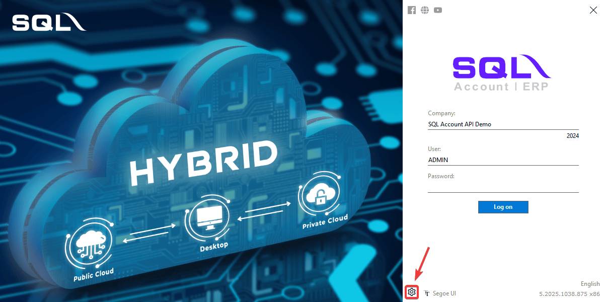
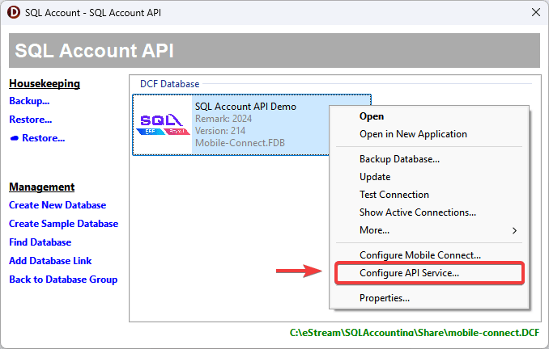
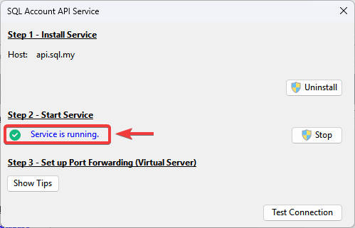
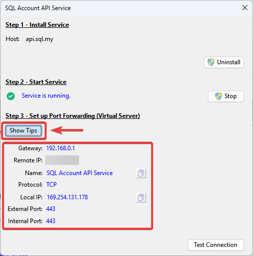
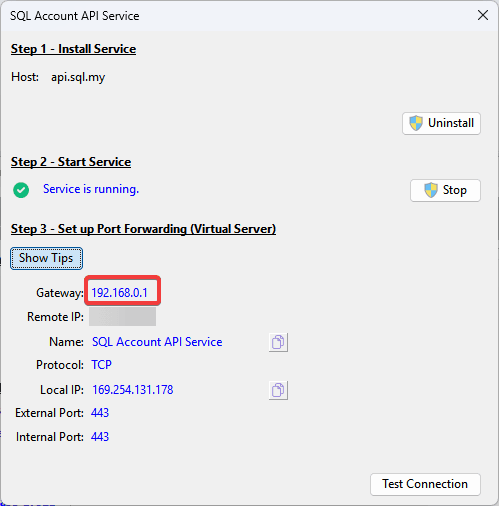
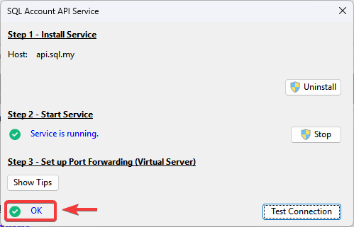

## Prerequisites

- `SQL Account` **version 5.2025.1038.875** or above
- Fix server IP address (either DHCP Reservation or Static)
- [Public IP Address](#public-ip-address)
- [Port Forwarding](#step-3---port-forwarding)

## Public IP Address

Make sure to have a **dedicated public IP Address**.

:::info[Check Public IP Address]
You can using [SQL Connect Detector](https://connect.sql.com.my/document/private-cloud/requirements/sql-connect-detector#download) to check whether public IP is enabled by your ISP.

Make sure the last requirement **Port Forward?** is in <text style={{color: "#43a047"}}>**Green**</text>
:::

:::tip[Hints]
If the result is <text style={{color:"#f44336"}}>**Red**</text>, kindly call your internet service provider and request for dedicated Public IP.

If the provider requests a reason, you can explain that you intend to host a server and therefore need to set up port forwarding.
:::

## Setup

### Step 1 - Install SQL API Service

1. On `Logon Screen` > **Click** `⚙️`

   

2. **Right-Click** on company database > **Select** `Configure API Service...`

   

3. **Click** on `Install` to install  API service

   

### Step 2 - Start Service

After the installation, start the service. Once successful, `Service is running` status will show on screen.

### Step 3 - Port Forwarding

Next, we will need to do `Port Forwarding`.

:::info[Port Forwarding Information]
You can **Click** on `Show Tips` to find all the information for port forwarding configuration.

:::

1. **Access Router Setting**: Login to the router's administration interface on web browser.

   You can **Click** on `Show Tips` > `Gateway IP Address`, to access login page of the router.

    :::warning
   If you are using a firewall or serving the router's web administration interface via a different IP address, this might not work.
    :::

   

2. **Navigate to Port Forwarding Section**: Find `Port Forwarding`, `Virtual Service` or similar section in the router's setting.

3. **Add New Rule**: Create a new port forwarding rule. (All information can get from [Port Forwarding Information](#step-3---port-forwarding))

   - `Service Name`: Enter a description name (**SQL Account API Service**)
   - `External/Public Port`: Specify the port number to use for external access (**443**)
   - `Internal IP Address`: Enter the IP address of the device to forward to (**E.g. 192.168.0.238**)
   - `Internal/Private Port`: Specify the port number the service is listening on within the internal network (**443**)

4. **Save the Rule**: Save the new port forwarding rule.

5. **Verify**: **Click** on `Test Connection` to test `SQL Account API Service` status. When `✅ OK` status is shown, it means the service is setup successfully.

   

### Examples of Port Forward

Can refer to [Sample of port forward setup](../sql-mobile-connect/on-premise-setup#examples-of-port-forward) on different router