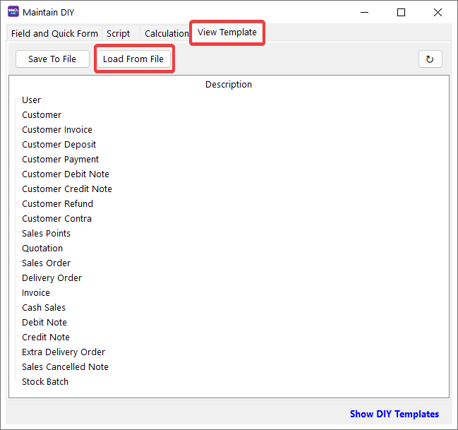
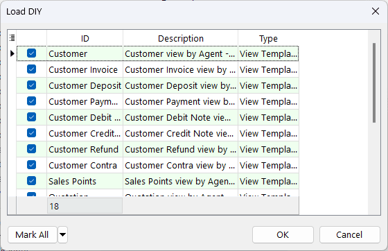
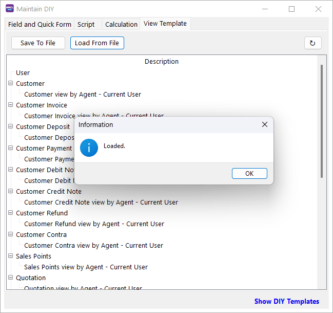
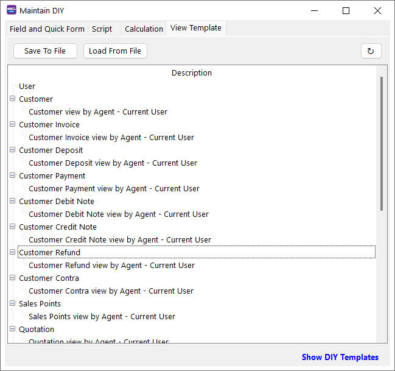

## 1.0 How to Set User View

Step 1: Go to Tools | DIY | Maintain DIY

Step 2: Select **‘View Template’** , then Select **‘Load From File’**

**Script**: [Mobile Connect View By Agent](https://cdn.sql.com.my/wp-content/uploads/2024/07/Mobile-Connect-View-By-Agent.zip)

Step 3: Select **Load All** or **Custom**

If you Select **‘Custom’**, you can choose which table to apply

Once completed, a message will be displayed as shown below.

Step 4: Right-click the field to be set and select **'User View'**.

Step 5: Check the box to set User View [Agent = User], so that the selected user can only view their own documents.

Based on the scenario above, SQL Acc will display sales invoices where the agent is set to 'SALES' when the SALES user ID is logged in.

Thank You.
