Whatsapp Scan feature let you manage your transaction easier by uploading invoice, bill or receipt through WhatsApp. Text, document, image and audio type are accepted.

### How to open Whatsapp Scan?

1) Go to Menu Bar > ☁️ > **Whatsapp Scan**

### Select Default Customer and Supplier Account 

1) Go to Menu Bar > **Tools** > **Options** > **Customer**

    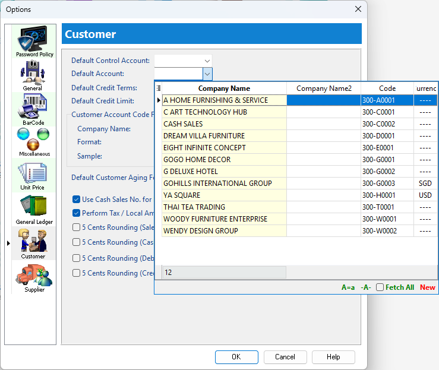

2) Go to Menu Bar > **Tools** > **Options** > **Supplier**

    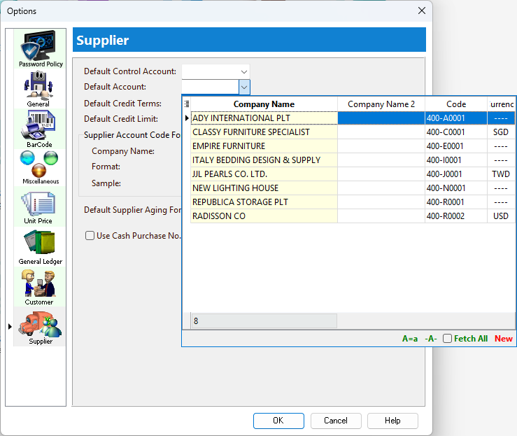

### Linking Setup 

1) Tools > Maintain User > Create New User or Select Target User

2) Assign the mobile number registered with **Whatsapp** and click **Save**.

    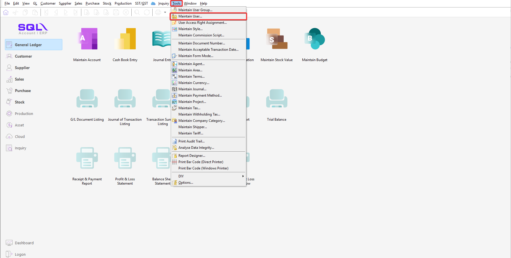

3) Click **Register** at the top right corner. 

    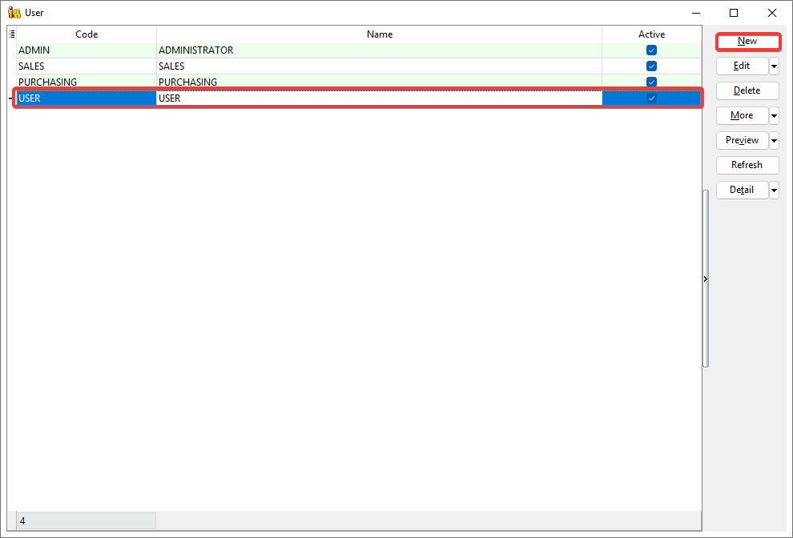

4) **Select user** that request for linking > **OK**

5) Click **Copy Link to Clipboard** or **Share** to share the url generated.

6) Do not close the dialog.

7) The user is required to: 

    1. Click the link.

    2. Send the pre-filled message with the phone number registered.

8) Dialog show **"Registered Successful"** indicates linking completed.

### Upload Files to Whatsapp Scan

1) A message will be received by the sender if the upload is successful.

    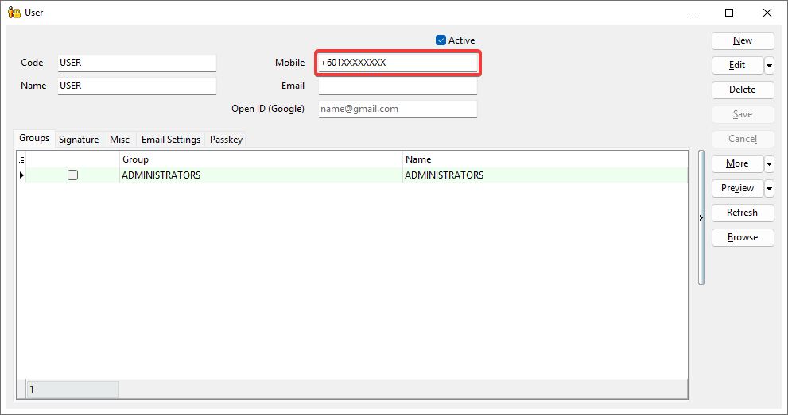

2) Click the refresh button and click the record to review the document uploaded.

    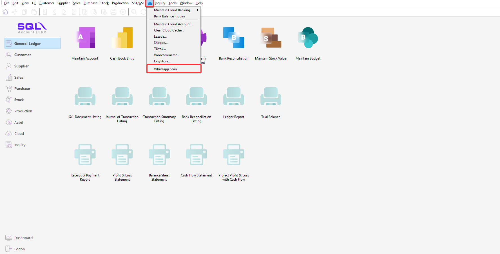   

### Assign Document Type on Files

The document created or attached to will be based on **document type**. eg. If the tag is ‘Invoice", the created document will be Invoice with default customer code.

1) Select target record > Click on "▼" symbol > Select document type.

    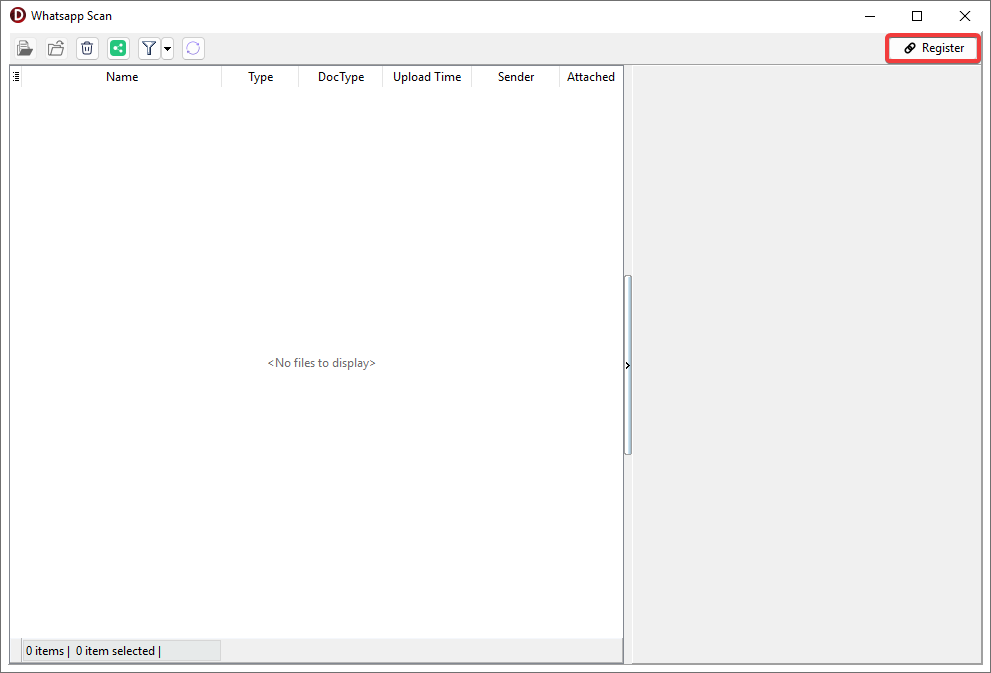

### Group Files into one attachment

This feature is to group related files for easy management.

1) To **Group**. Select multiple files, then either:

    1. Right Click > **Group Files…** 

    2. Click “Folder” button on the top panel.

    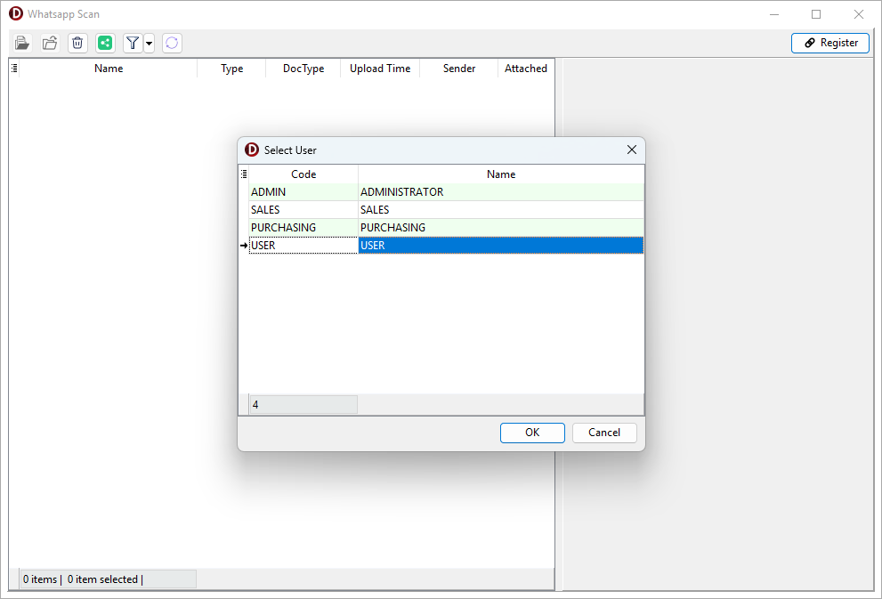

2) To **Ungroup**. Select grouped attachment, then either:
    
    1. Right Click > **Ungroup Files…**

    2. Click “Unfolder” button on the top panel.

    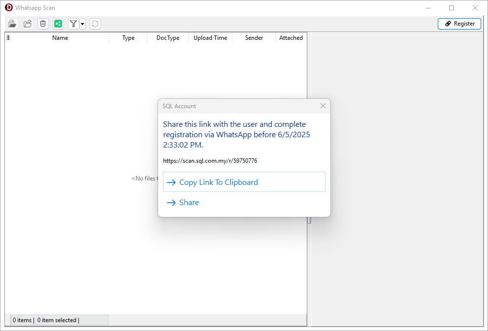

### Create new document

1) Select or Multiselect files to batch create multiple documents based on tag.

2) Right click > Click **Create New Document**.

    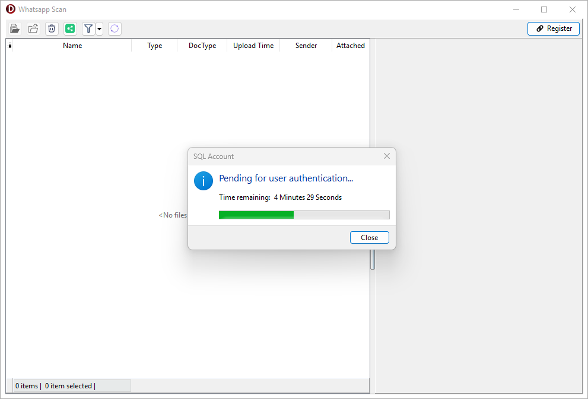

3) Navigate to the browsing screen and review the document created.

    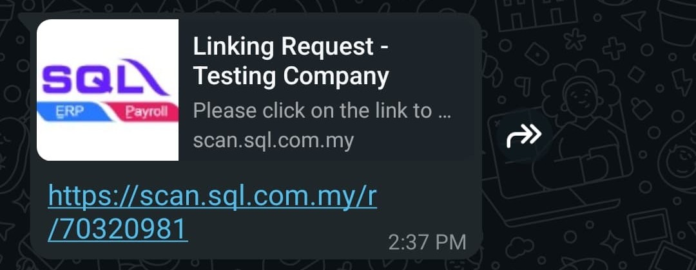
 
### Attach to an existing document

1) Select file to attach to existing document based on tag.

2) Right click > Click **Attach to Existing Document** > Select Target Document > Click **OK**

    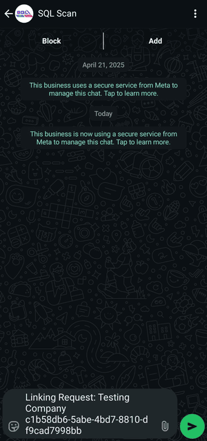

### Drag and Drop 

1) Select the target document (eg. IV-0001).

2) Pin the **Attachments** panel.

    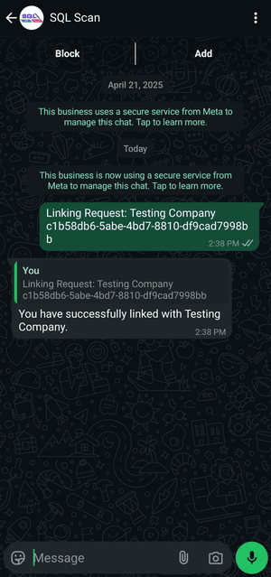

3) Click **Edit**.

4) Drag the selected file(s) from Whatsapp Scan and drop it on the **Attachments** panel.

    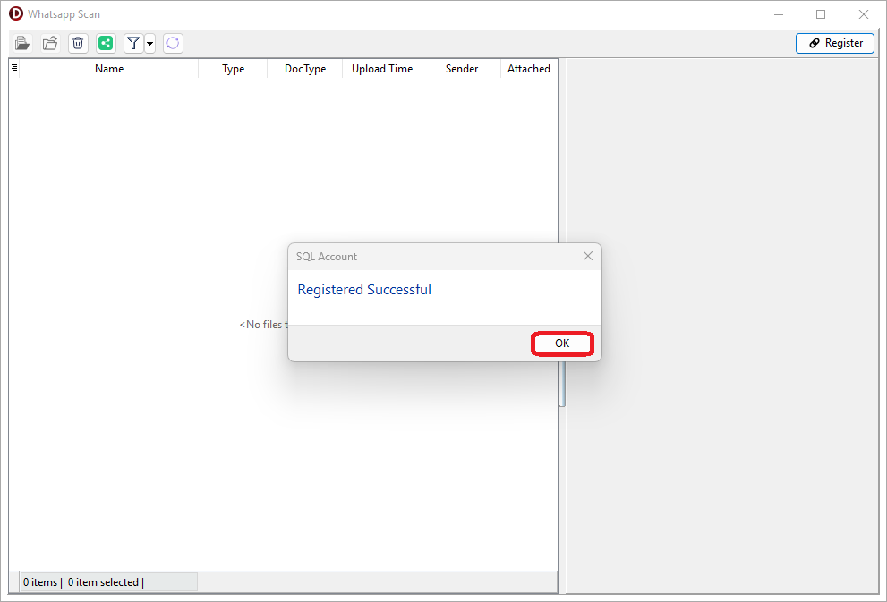

5) Click **Save**.