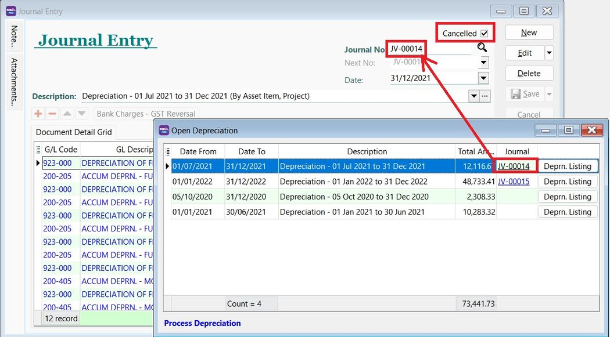
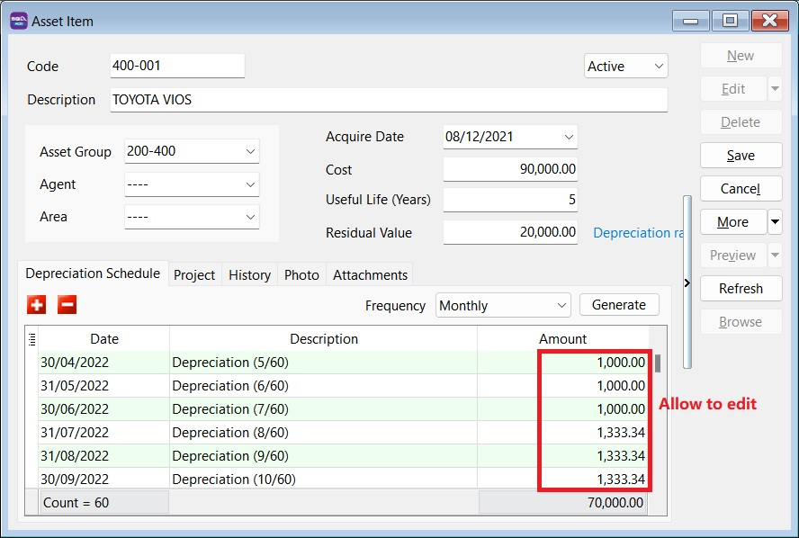
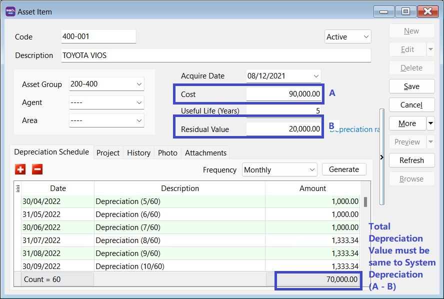
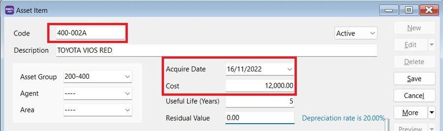

## How to process Asset Opening and tally with the GL Maintain Opening Balance

### Process Opening Depreciation 

__Menu: Asset | Process Depreciation...__

    You are allow to process Asset Opening Depreciation BEFORE System Conversation Date.

:::note Tips:
A - FIRST acquire date of the asset
B - System Conversation Date -1 day
:::

## I have posted the depreciation until December 2021. How to record my new asset?

### Method 1 : Simple follow Last Asset Net Book Value from Balance Sheet

Maintain the Asset Item as below:

1. Key in the Cost as *Net Book Value* (as at 31/12/2021).
2. Acquire Date, eg. 01/01/2022
3. Useful life = *Balance of useful life* to be depreciate
4. Start Process Depreciation from 01/01/2022

**OR**  

### Method 2: Follow Original Cost and Acquire Date

Maintain the Asset as below :

1. Key in the Cost as *Original Cost*
2. Acquire Date set as *Original Purchase Date*
3. Useful life = *Full useful life*
4. Process Depreciation until 31/12/2021.

5. Tick *Cancelled* to the Journal posted from Step 4

## Somehow the depreciation value is different with my previous Journal, can I edit the depreciation value calculated in Maintain Asset Item?

Yes, it is allowed to change the depreciation value in Maintain Asset Item (Depreciation Schedule).

## Can the amortization of Intangible Assets like license use in Asset Module?

Can. Just maintain as usual like **Tangible Asset** (Fixed Asset).

For **Intangible Asset** (eg. goodwill, license), the **amortization calculation** is using **straight line method** can choose in the Asset Group. It is calculated by taking the difference between the cost of the asset and its anticipated salvage or book value and dividing that figure by the total number of years it will be used.

## Can I import the asset list using Excel instead of key-in?

Yes, can. Asset import function available in SQL Account version 5.2022.948.826

Refer to [Import-Asset Master List](../../usage/asset/guide#importing-asset-master-list)

## How to handle additional cost for the Fixed Asset?

Create new asset code to handle additional cost, eg.

| **Asset Code** | **Description**            | **Remark**          |
|----------------|-----------------------------|---------------------|
| MV-0001        | TOYOTA VIOS - BZZ 999       | Initial Purchase    |
| MV-0001A       | TOYOTA VIOS - BZZ 999       | Additional Cost     |

:::info
    Don't mixed up the depreciation value between original and additional.
:::

### Quick Steps

1. Copy the existing asset code.

2. Create new asset.
3. Click on More | Paste Asset Item.

4. *Change the asset code* by inserted any characters to differentiate it
    - Acquire date = Date incurred additional cost
    - Cost = Additional Cost

## Cost in Maintain Asset Item should key-in as local currency or original currency (eg. purchase in USD)?

Cost should key-in as **Local value**. So, depreciation value will calculated and posted in local value