## Asset 

:::note Fixed Asset Module
This is a **paid module**.
:::

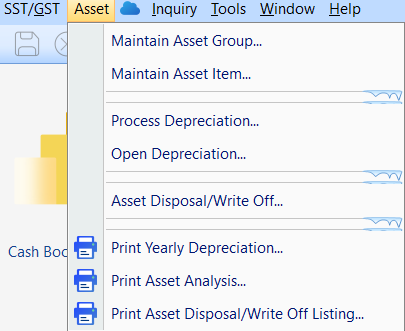

## Maintain Asset Group

__Menu: Asset | Asset Group...__

Group the asset items based on the following considerations.

    a. Type of assets, eg. Motor Vehicle, Furniture, etc;
    b. GL Account mapping.

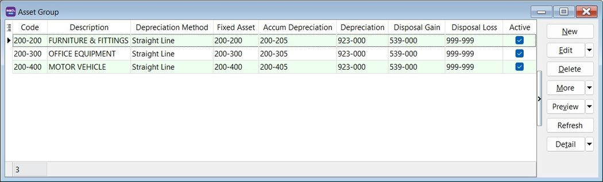

### Asset Group

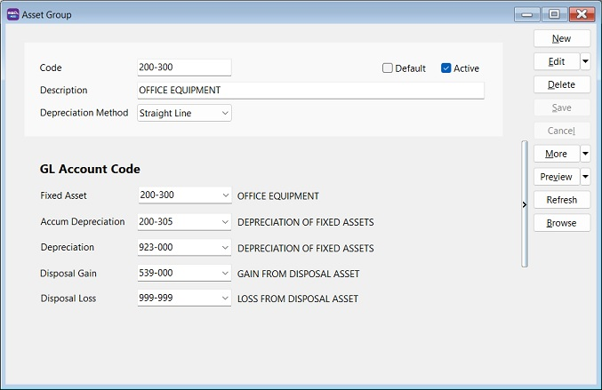

| **Field Name**         | **Explanation & Properties**                                                                 |
|-------------------------|-----------------------------------------------------------------------------------------------|
| **Code**                | Input the new Asset Group Code  <ul><li>Field type: Alphanumerical</li><li>Length: 20</li></ul> |
| **Description**         | Input the Asset Group description, e.g., Furniture, Motor Vehicle  <ul><li>Field type: Alphanumerical</li><li>Length: 200</li></ul> |
| **Depreciation Method** | Select an appropriate Depreciation Method to generate depreciation value                      |
| **Fixed Asset**         | Select Balance Sheet GL Account code for Fixed Asset                                          |
| **Accum Depreciation**  | Select Balance Sheet GL Account code for Accumulated Depreciation                             |
| **Depreciation**        | Select P&L GL Account for Depreciation of Asset                                               |
| **Disposal Gain**       | Select P&L GL Account for Gain from Disposal Asset                                            |
| **Disposal Loss**       | Select P&L GL Account for Loss from Disposal Asset                                            |

## Maintain Asset Item

__Menu: Asset | Asset Item...__

Add new asset items.

### Asset Item

| **Field Name**          | **Field Type**   | **Length** | **Explanation**                                                                 |
|--------------------------|------------------|------------|---------------------------------------------------------------------------------|
| **Code**                 | Alphanumerical   | 20         | Input the new Asset Item Code                                                   |
| **Description**          | Alphanumerical   | 200        | Input the Asset Item description, e.g., Meeting Table, Toyota Vios, Perodua MYVI |
| **Asset Group**          | Selection        | –          | Select an appropriate Asset Group for depreciation calculation and GL Account posting |
| **Agent**                | Selection        | –          | Select who is the Agent using this Asset Item                                   |
| **Area**                 | Selection        | –          | Select where the asset is located                                               |
| **Acquire Date**         | Date             | –          | Set the acquire date for this asset                                             |
| **Cost**                 | Currency         | –          | Set the purchase cost for this asset                                            |
| **Useful Life (Years)**  | Integer/Float    | –          | Set the useful life of this asset                                               |
| **Residual Value**       | Currency/Float   | –          | Set the residual value for this asset                                           |
| **Status**               | Selection        | –          | Default is Active. Can be set to Inactive with an inactive date                 |

### Deprecaition Schedule

1. Select the Frequency to generate the depreciation schedule by :-
    a. Monthly
    b. Quarterly
    c. Half Yearly
    d. Yearly

2. Click Generate button.

### Project
    Set the depreciation allocation by Project (for Departmental/Cost Center purpose).

### History 

Add the important remarks in the asset history. For instances:
    a. who has borrow/ when has return this asset?
    b. asset has send for repair or service...
    c. asset has destroyed by flood

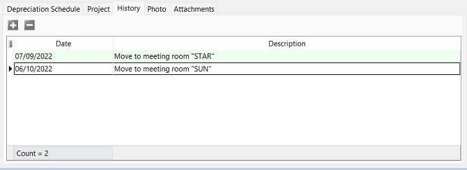

### Photo 
    Add the asset photo.

### Attachments
    Add the attachments for an asset

## Process Depreciation

__Menu: Asset | Process Depreciation...__

### Asset Depreciation 

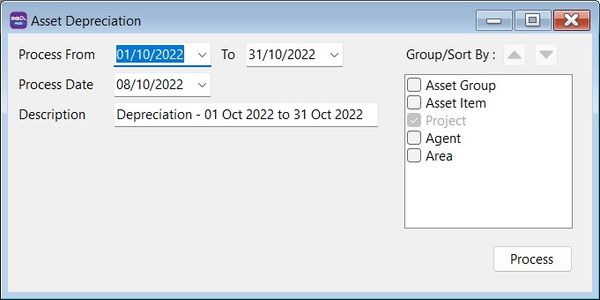

1. Select the process date range.

:::note Tips:
1. Process date range allows to select more than 1 month or 1 year to process the depreciation.
2. Allow to process BEFORE system conversation date (No update to Maintain Opening Balance).
:::

2. Select the Process Date.

:::note Tips:
Journal Voucher date will follow this Process Date.
:::

3. Description will be captured in the Journal Voucher description.
4. Click Process.
5. Preview the assets depreciation value and Net Book Value (NBV) before post to Journal Voucher. Click Save to post it.

## Open Depreciation

__Menu: Asset | Open Depreciation...__

    Open to view the historical Depreciation Listing.

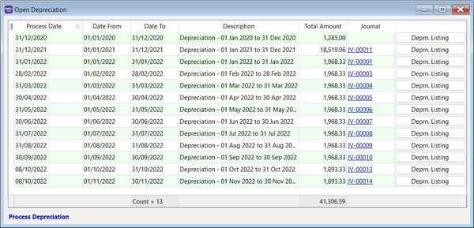

## Asset Disposal

__Menu: Asset | Asset Disposal...__

### Asset Disposal Entry

1. Click New.
2. Enter Date.
3. Select Asset wish to dispose.
4. Enter Description.
5. Enter Ref1, eg. invoice no.
6. Enter Ref2 if any.
7. Select Project. Default follow Asset Item.
8. Select Agent. Default follow Asset Item.
9. Select Area. Default follow Asset Item.

### General Tab

1. Cost, Accum Depreciation,and Net Book Value are retrieve from Maintain Asset Item automatically.
2. Key-in the **Disposal** value.
3. Select **Payment Method** to receive disposal value.
4. **(Gain)/Loss** workout automatically.
5. Gain/Loss Account default follow from Maintain Asset. May change the **(Gain)/Loss Account** if necessary.

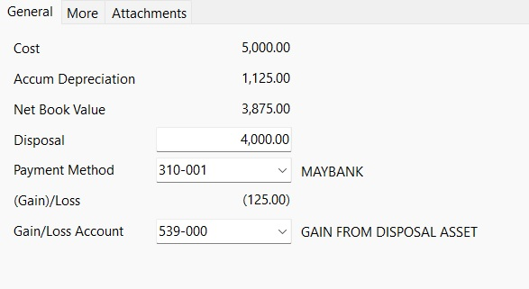

### More Tab
    Enter detailed **Note**.
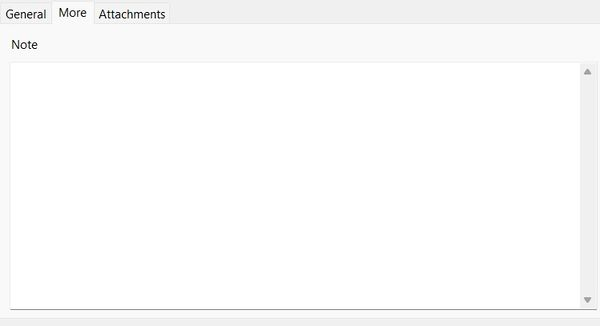

### Attachments
    Add more attachment files
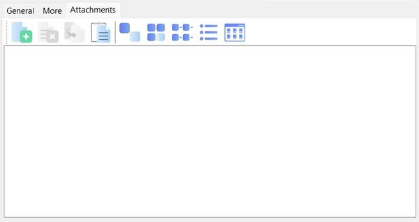

## Print Yearly Depreciation

__Menu: Asset | Print Yearly Depreciation...__

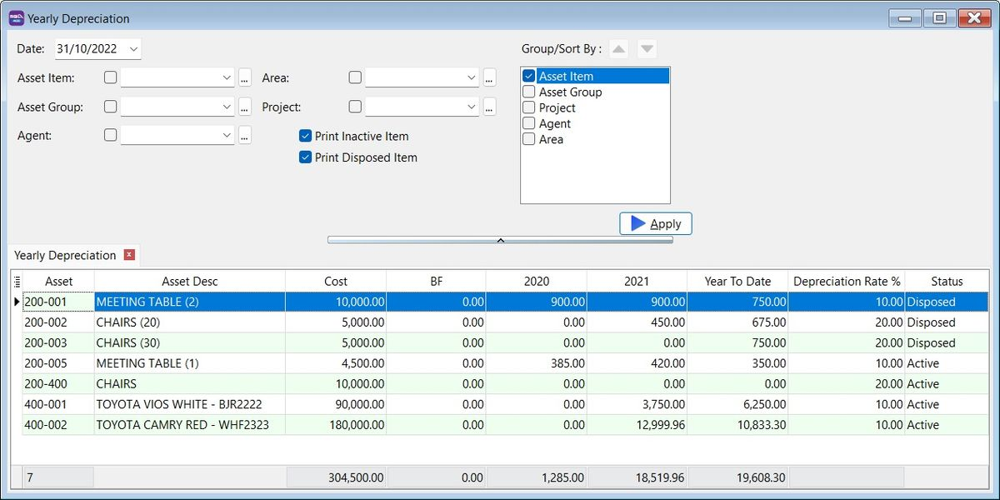

## Print Yearly Analysis

__Menu: Asset | Print Asset Analysis...__

### Reports Selection

1. This will analyse the asset **Cost, Accumulated Depreciation, Net Book Value (NBV)** and **Disposal Value**.
2. It allows you to choose and generate the following reports format:
Monthly (12 Months)
Quarterly (4 quarters)
Half Yearly (First Half and 2nd Half)
Yearly (5 Years)

### Asset Analysis vs GL Balance Sheet Report 

1. At GL | Print Balance Sheet Statement..., choose the Balance Sheet Format : **This Year - 3 columns**
2. At Asset | Print Asset Analysis..., choose Report: **Yearly (5 columns)**

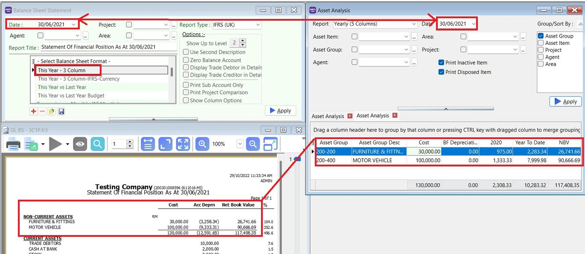

## Print Asset Disposal Listing

__Menu: Asset | Print Asset Disposal Listing...__

## Importing Asset Master List

### Preparation for Asset Master Import Excel Template 

Download the [Asset Master Template](https://download.sql.com.my/customer/asset/assetBasicGuide/Asset_Master_Import.xlsx)

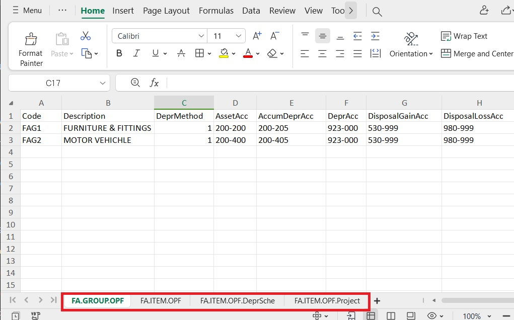

### Asset Master Template (xlsx)

| **Sheet Name**           | **Refer to**                                      |
|---------------------------|--------------------------------------------------|
| **FA.GROUP.OPF**          | Maintain Asset Group                              |
| **FA.ITEM.OPF**           | Maintain Asset Item                               |
| **FA.ITEM.OPF.DeprSche**  | Maintain Asset Item – Depreciation Schedule tab   |
| **FA.ITEM.OPF.Project**   | Maintain Asset Item – Project tab                 |

:::warning NOTE:
**DO NOT** rename the **sheet** name.
:::

1. FA.GROUP.OPF (Maintain Asset Group)

- **FA.GROUP.OPF**

| **Column**        | **Length**      | **Note**                                                                 |
|--------------------|-----------------|--------------------------------------------------------------------------|
| **Code**           | 20              | Asset Group Code, e.g., Furniture                                        |
| **Description**    | 160             | Asset Group Description, e.g., Furniture & Fittings                      |
| **DeprMethod**     | 1 (Integer)     | Depreciation Method, e.g., 1: Straight Line Method                       |
| **AssetAcc**       | 10              | e.g., Furniture & Fittings under Non-Current Assets (B/S)                 |
| **AccumDeprAcc**   | 10              | e.g., Accumulated Depreciation – Furniture & Fittings under Non-Current Assets (B/S) |
| **DeprAcc**        | 10              | e.g., Depreciation account under Expenses (P&L)                          |
| **DisposalGainAcc**| 10              | e.g., Disposal Gain account under Other Income / Expenses (P&L)          |
| **DisposalLossAcc**| 10              | e.g., Disposal Loss account under Expenses (P&L)                         |

- **Example :**

| **Code**   | **Description**          | **DeprMethod** | **AssetAcc** | **AccumDeprAcc** | **DeprAcc** | **DisposalGainAcc** | **DisposalLossAcc** |
|------------|--------------------------|----------------|--------------|------------------|-------------|---------------------|---------------------|
| Furniture  | Furniture & Fittings     | 1              | 200-200      | 200-205          | 923-000     | 530-999             | 980-999             |
| MV         | Motor Vehicle            | 1              | 200-400      | 200-405          | 923-000     | 530-999             | 980-999             |

2. FA.ITEM.OPF (Maintain Asset Item)

- **FA.ITEM.OPF**

| **Column**       | **Length**  | **Note**                                                                 |
|-------------------|-------------|--------------------------------------------------------------------------|
| **Code**          | 20          | Asset Code, e.g., FF-0001                                                |
| **Description**   | 160         | Asset Description, e.g., Chairs, Table                                   |
| **Asset Group**   | 20          | Asset Group, e.g., Furniture                                             |
| **Agent**         | 10          | Assigned an agent if any                                                 |
| **Area**          | 10          | Assigned an area if any                                                  |
| **AcquireDate**   | Date        | Purchase date                                                            |
| **Cost**          | Currency    | Purchase cost                                                            |
| **UsefulLife**    | Float       | Useful life in years, e.g., 5 years, 3.3 years                           |
| **DeprFrequency** | 1 (Integer) | Depreciation frequency options:<ul><li>1: Monthly</li><li>2: Quarterly</li><li>3: Half Yearly</li><li>4: Yearly</li></ul> |
| **Residual**      | Float       | Resellable value                                                         |

- **Example**

| **Code**  | **Description**              | **Asset Group** | **Agent** | **Area** | **AcquireDate** | **Cost**   | **UsefulLife** | **DeprFrequency** | **Residual** |
|-----------|------------------------------|-----------------|-----------|----------|-----------------|------------|----------------|-------------------|--------------|
| FF-001    | Chairs                       | Furniture       | ----      | KL       | 13/10/2022      | 12,000.00  | 10             | 1 (Monthly)       | 100.00       |
| FF-002    | Meeting Table                | Furniture       | ----      | KL       | 23/01/20021     | 15,000.00  | 10             | 2 (Quarterly)     | 0.01         |
| MV-001    | TOYOTA VIOS 1.5 / RED        | MV              | YUKI      | SEL      | 17/03/2020      | 88,000.00  | 5              | 4 (Yearly)        | 30,000.00    |

3. FA.ITEM.OPF.DeprSche (Maintain Asset item-Depreciation Schedule)

- **FA.ITEM.OPF.DeprSche**

| **Column**     | **Length** | **Note**                                                                 |
|----------------|------------|--------------------------------------------------------------------------|
| **Code**       | 20         | Asset Code, e.g., FF-0001                                                |
| **ScheDate**   | Date       | Scheduled depreciation posting date                                      |
| **Description**| 160        | Depreciation description                                                 |
| **Amount**     | Currency   | Depreciation amount based on the depreciation frequency                  |

**Depreciation Frequency**

- **Monthly**

| **Calculation**       | **Formula**                       | **Result**  |
|------------------------|-----------------------------------|-------------|
| No. of Rows            | Useful life × 12 months           | 5 × 12 = 60 |
| Amount per Row (RM)    | (Cost – Residual) ÷ No. of Rows   | (88,000 – 30,000) ÷ 60 = 966.67 |

- **Quarterly**

| **Calculation**       | **Formula**                       | **Result**  |
|------------------------|-----------------------------------|-------------|
| No. of Rows            | Useful life × 4 quarters          | 5 × 4 = 20  |
| Amount per Row (RM)    | (Cost – Residual) ÷ No. of Rows   | (88,000 – 30,000) ÷ 20 = 2,900 |

- **Half-Yeary**

| **Calculation**       | **Formula**                       | **Result**  |
|------------------------|-----------------------------------|-------------|
| No. of Rows            | Useful life × 2 half-years        | 5 × 2 = 10  |
| Amount per Row (RM)    | (Cost – Residual) ÷ No. of Rows   | (88,000 – 30,000) ÷ 10 = 5,800 |

- **Yearly**

| **Calculation**       | **Formula**                       | **Result**  |
|------------------------|-----------------------------------|-------------|
| No. of Rows            | Useful life (years)               | 5           |
| Amount per Row (RM)    | (Cost – Residual) ÷ No. of Rows   | (88,000 – 30,000) ÷ 5 = 11,600 |

**Example**

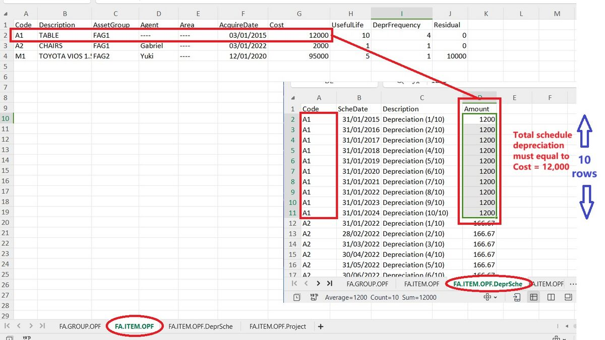

**4.FA.ITEM.OPF.Project(Maintain Asset Item-Project)**

- **FA.ITEM.OPF.Project**

| **Column** | **Length** | **Note**                          |
|------------|------------|------------------------------------|
| **Code**   | 20         | Asset Code, e.g., FF-0001          |
| **Project**| 20         | Project Code                       |
| **Rate**   | Float      | Allocation percentage (%)          |

**Example**

| **Code**  | **Project**  | **Rate** |
|-----------|--------------|----------|
| FF-001    | Project-A    | 30       |
| FF-001    | Project-B    | 70       |
| MV-001    | Project-A    | 100      |

### Quick Import Asset List 

__Menu: File | Import | Excel Files...__

1. Click Open folder button.

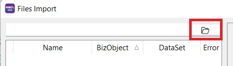

2. Select the Asset Template excel file...

3. Click Execute (Direct Import). Click Verify if you wish to verify the excel data before import.

:::note NOTE:
Asset import function available in SQL Account version 5.2022.948.826 and above.
:::