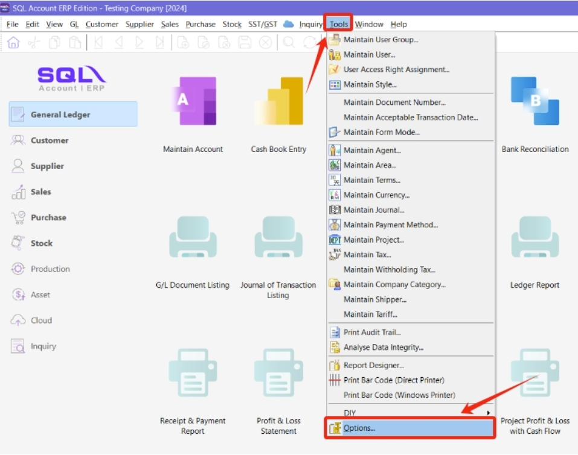
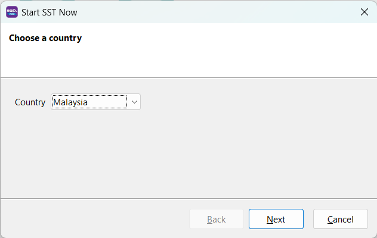
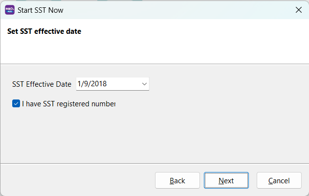
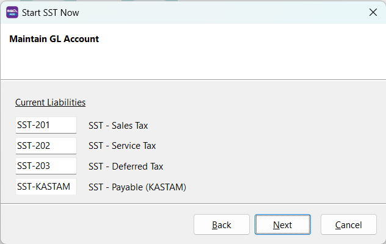
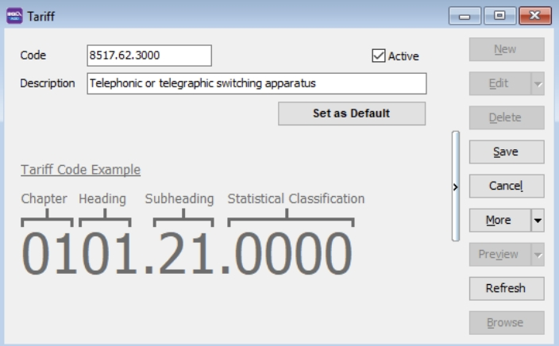
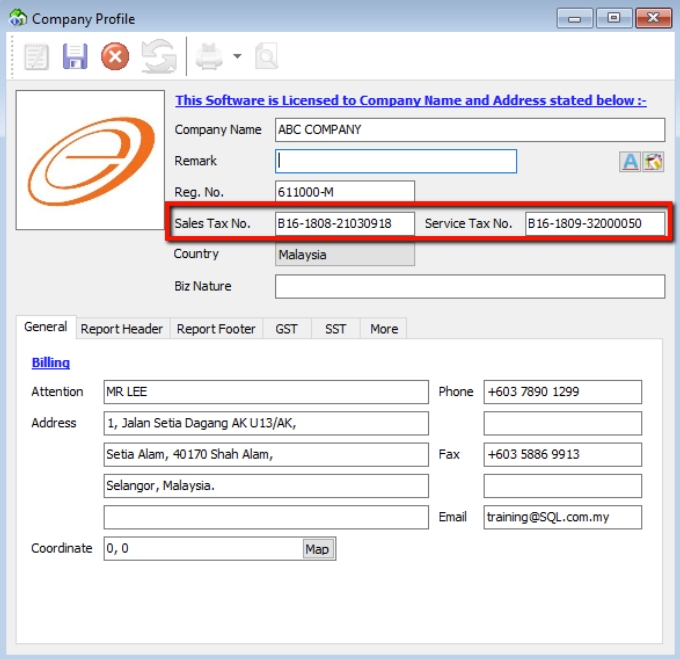

## Financial Period & System Conversion Date

:::info
Watch tutorial video here : [Youtube](https://www.youtube.com/watch?v=yH8VfNGjEr0&feature=youtu.be)
:::

1. **Tools** | **Options**

    

    :::note
    Once you have set up your Financial Start Period & System Conversion Date, it is not possible to change it again. This configuration can only be set once during the creation of a new database.
    :::

2. Select **General Ledger**

3. Select **Financial Start Period & System Conversion Date**

   

   :::note Scenario 1
   My financial period starts on 1st January every year, I start using SQL from 1/1/2015.

   **Financial Start Period** = 1/1/2015

   **System Conversion Date** = 1/1/2015
   :::

   :::note Scenario 2
   My financial period starts on 1st January every year, I start using SQL from 1/4/2015.

   **Financial Start Period** = 1/1/2015

   **System Conversion Date** = 1/4/2015
   :::

## SST

### Activate SST

1. In SQL Account, click on the menu **SST/GST** -> **Start SST now...**

   

2. For the country, select **Malaysia**, and click Next

   

3. Fill in **SST Effective Date**

4. Tick **I have SST registered number** if you have a valid SST registration number from the government (skip to *Step 6* if you don't have one)

   

5. Fill in your **Sales Tax No** and **Service Tax No** (These details will be auto updated in your company profile)

   

6. In the next step, click Next to auto generate **SST GL Account**

   

7. In the following screen, you can preset your tax code for billing (Sales Tax, Service Tax, Sales Tax Exempted, etc.)

   

8. System will prompt to re-login, and you are good to go

9. After log-in, you will see a new drop down list for SST Functions, the SST setup is now completed.

### Maintain Tariff

Go to **Tools** | **Maintain tariff** | **New**

Insert your product tariff code here, you can also find out your product tariff code from Malaysia Custom [JKDM HS Explorer](https://ezhs.customs.gov.my/)

## Company Profile

1. Go To **File** | **Company Profile**

   Fill in your company particulars and if this company is subject to both sales and service tax, fill in the Sales Tax number / Service Tax number.

   

2. Select **Report Header** & **Set Report Header**

   
