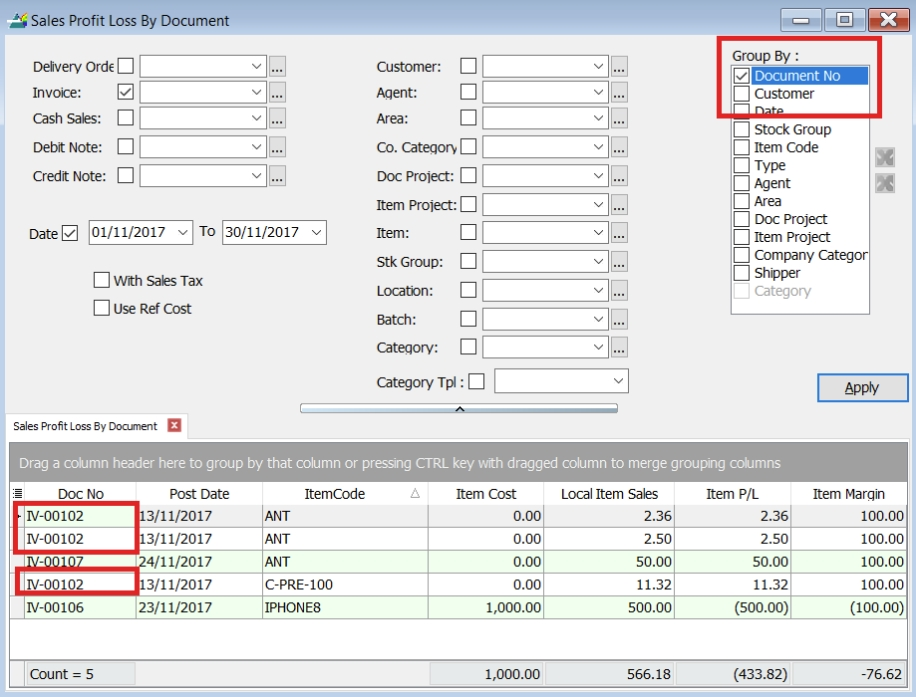
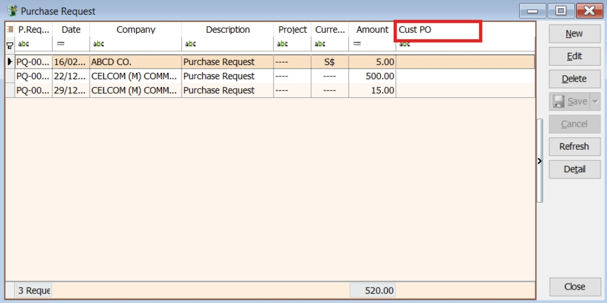
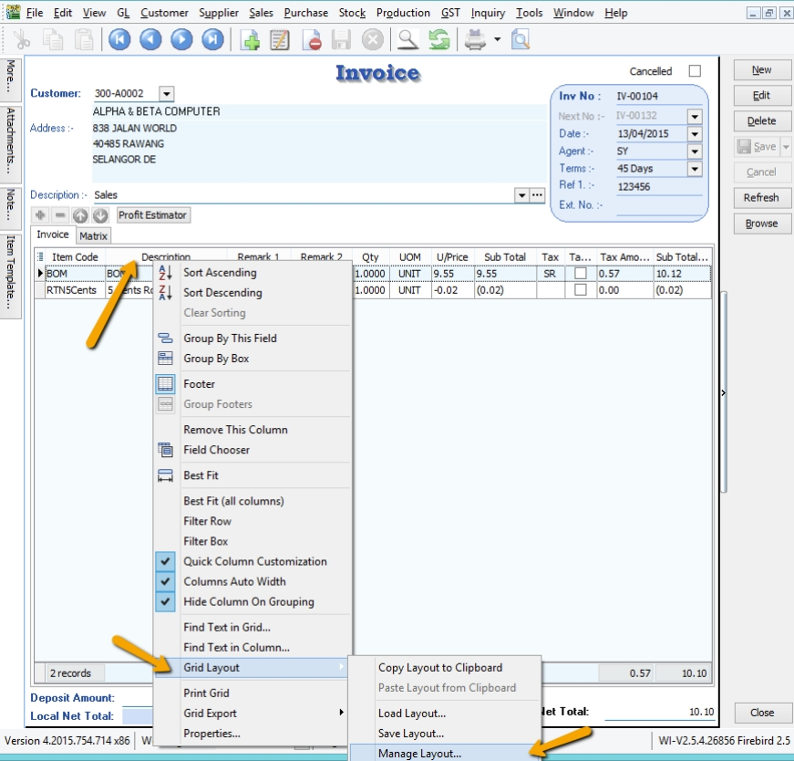
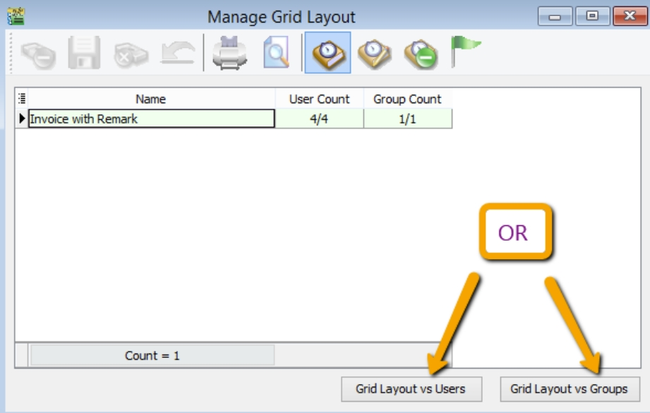
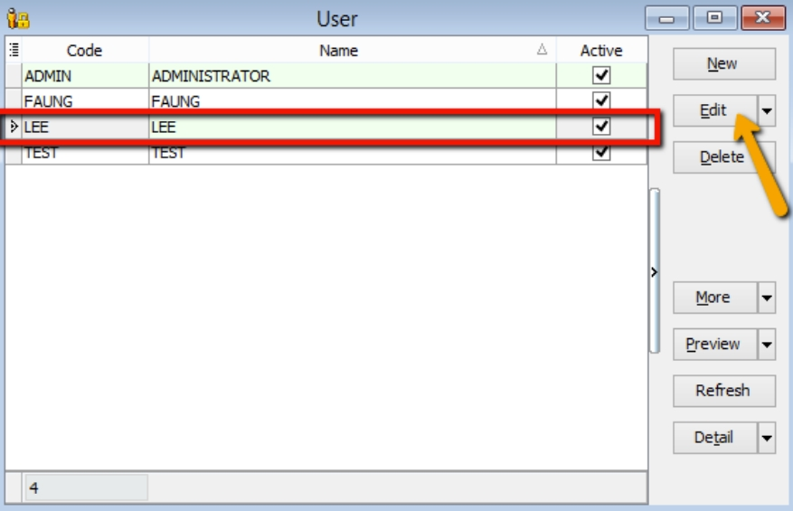
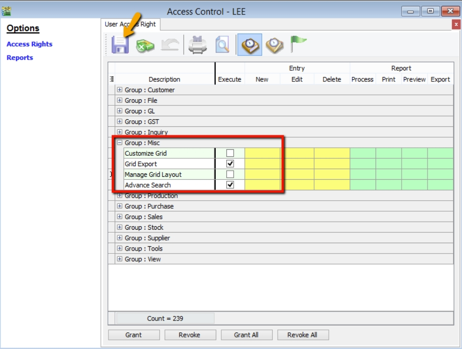

## Clear Sorting

### Scenario

I have selected "Group by Document No" in Sales Profit and Loss by Document. However, when previewing the report, the same document number is split. How can I resolve this issue, as shown in the screenshots below?

### Steps & Instruction

1. Right click on any grid column.

2. From the pop-up menu, click on Clear Sorting.

    

3. All the grid columns will be clear the sorting and follow the Group By command.

    

4. Preview the report. The same document numbers will now be grouped together.

    

## Rename Grid Header

### Rename Steps & Instruction

1. Right click on any grid header. From the small menu, select **Properties**.

    

2. Look for the column and change the caption. Click Ok to confirm.

    

3. Original column name “Ref 1” has been changed to “Cust PO”.

    

## Reset/Delete Layout

### Step to reset layout

1. Hover over **Item code** and **right click**

2. Select **Grid Layout**

3. Click on **Load Layout**

    

4. Press **Reset Layout**

### Step to delete Existing Layout

1. Hover over **item code** and **right click**

2. Select **Grid Layout**

3. Click on **Manage Layout**

If your screen looks like the one above , select the **layout | press DELETE | SAVE**

## Save and Manage Layout

### How to call out hidden field?

1. Click on the button from left side of Item Code , checked all field you wish to show out

    

2. **Right click on the Grid** , Eg: point on wording “Description” and right click | **Grid Layout | Save Layout**

    

3. Enter a Layout Name , and checked on “**Save as Default Layout**” if you wish to set this as your **Default Layout** | **Save**

    

### How to assign this layout to others users?

1. After you had save your layout, **Right click on the Grid** , Eg : point on wording “Description” and right click | **Grid Layout | Manage Layout**

    

2. You can assign your layout either by users or by groups , Let’s said by Users

    

3. Click on the arrow down key from the users name and select & SAVE.

    

:::note
**Default** : Make this layout default

− : Empty it without setting any layout for this user

**Deny** : To hide this layout , so when this user try to Load Layout unable to see this layout .
:::

### How to disable users access right to go field chooser and customize layout ?

1. Go **Tools | Maintain User**

    

2. **Highlighted** on the user name and press on **EDIT**

    

3. Click on **More | Access Control**

    

4. Go to Group : Misc | unchecked on Customize grid (field chooser) & Manage Grid Layout | SAVE

    
