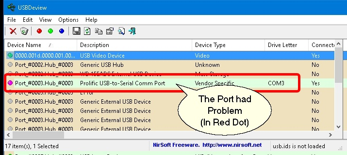
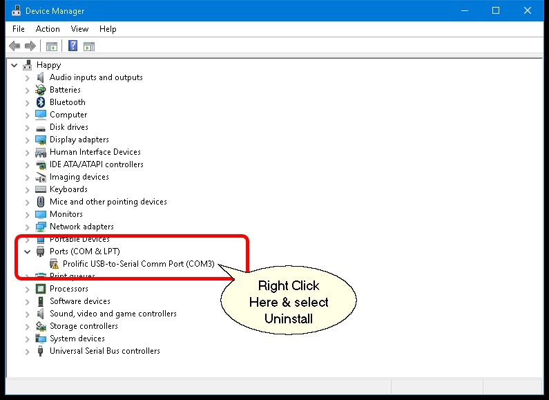
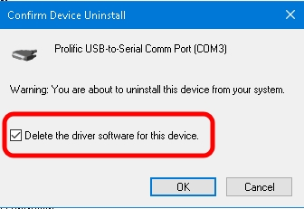
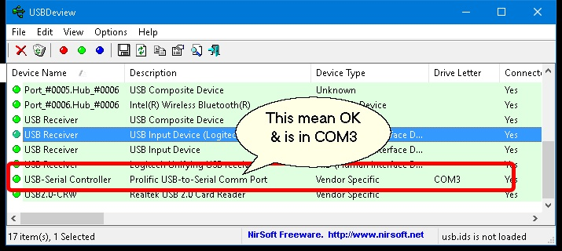
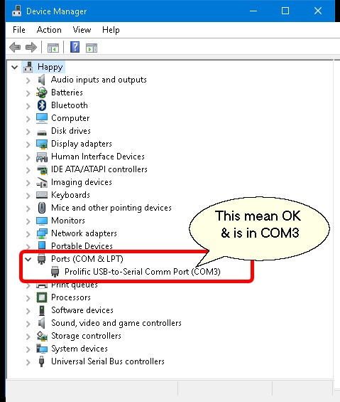

## Introduction

If you had upgrade you windows to Windows 10 & using this Display Pole - VFD-800-U (might happen on other model), you might had problem in communicate with SQL Accounting.
The problem is because the build in or Original driver provided is incompatible with windows 10.

## Tools & Driver Required

1. **[USBDeView](http://www.nirsoft.net/utils/usb_devices_view.html)** - To check USB Status & Com Port Number
2. **Driver** (Select Either 1 below which is match with your Display Pole Model)
    - VFD-800-U
    - CD-7220 - *Select Install Simulation to COM Port USB Driver option*

## Problem

When you run the USBDeview.exe you will see the above problem.

## Solution

1. Right Click **This PC | Properties**
2. Click **Device Manager**
3. Right Click at the Com had problem

    

4. Select Delete the driver for software for this device

    

5. Click OK
6. Install New/Update driver (May refer to the Display Pole Provider)
7. Click Action | Scan for hardware changes
8. Done & will look like below screen

In **USBDeView**

In **Device Manager**

