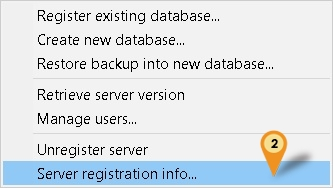
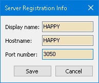

## Introduction

This is an External Firebird Console Application.

:::warning
Using this Application is at your own risk.
Estream will not responsible on any data corrupt or missing due to usage of this application.
:::

## Requirement

1. Firebird Server

## Program

1. [Flame Robin Homepage](http://www.flamerobin.org/)
2. [Alternative Download](https://download.sql.com.my/customer/Fairy/FlameRobin(x64).zip)
3. MD5 : DCF5938386D92FE858803923CD171841 (Alternative Link Only)

## Installation

1. **Using Official download**: Just Double Click the Setup & Follow the Setup wizard.
2. **Using Alternative Download**: Just Unzip/Extract the file to the location you wanted.

## Steps

### Server Information

Only 1 time setting for each Firebird Version

1. Right Click Here

    

2. Select Server registration info...

    

3. Enter as following

    - **Display name**: Can be anything (eg Happy)
    - **Hostname**: Server Name/IP Address
    - **Port Number**: Firebird Port number (Default is **3050**)

    

4. Click **Save** button

### Register New Database

Can add more then 1 database if you wanted to but if can just register only 1 & you can just keep reuse the same setting

1. Click *Database | Register existing database...*

    

2. Enter as following

    - **Display name**: Can be anything (eg ACC-0038)
    - **Database path**: The Firebird FDB file path
    - **Authentication**: Use only Use saved user name and password
    - **User name**: Firebird user name (Default is SYSDBA)
    - **Password**: Firebird password (Default is masterkey)
    - **Charset**: Set to UTF8 (For FB3.0 & above)
    - **Role**: Leave it empty

3. Click **Save** button
4. Click **Database | Connect**

### Update/Reuse Registered Database

1. Select here

    

2. Click **Database | Database Registration Info...**
3. You will see same as Steps 2 Register New Database at above
4. Just change the **Display name** (optional) & **Database path**
5. Click **Save** button
6. Click **Database | Connect**

### Write Query

1. Select here

    

2. Click **Database | Run a query...**

    

3. You can enter/type your SQL Query here

    

4. Press **F4** to Execute your Query
5. Press **F5** to Commit your Query
