## Introduction

This is External Utility to Fixing & Managing SQL Firebird Database.

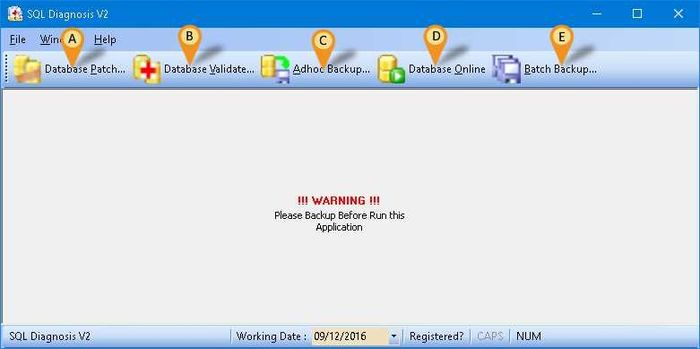

## Program

1. [SQLDiagnosisV2](https://download.sql.com.my/customer/Fairy/SQLDiagnosisV2-setup.exe)

## Requirement

1. Firebird Server (even is Standalone user)

## Database Patch

1. A min console use to manipulate the data including edit, delete and append data.
2. There are 2 type of patch
    - Patch From Estream
    - Build In Patch

### Database Patch Steps

1. Click **Database Patch** button (**Icon A**).
2. Click This button to **select the SQL Firebird Database.**

    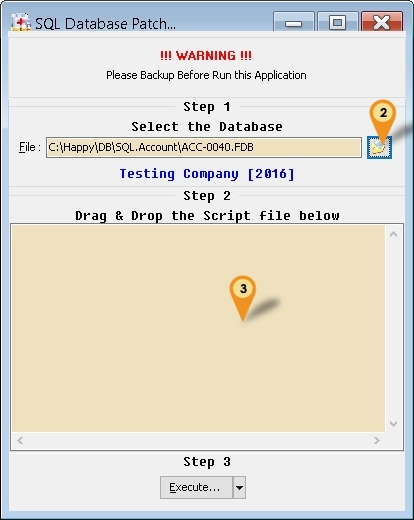

### Scenario 1 : Patch From Estream (Continue Database Patch Steps)

1. Right Click Here (under Step 2)
2. Select **Load From File 1...**

    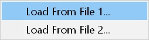

3. Look for patch file (Norm begin with Patch-XXXX.sql2)
4. Click **Open** button.

    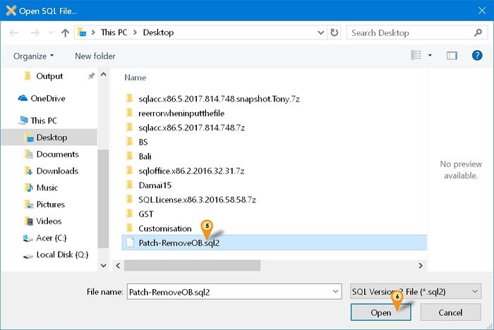

5. Click **Execute...** button (In Step 3 Section).

    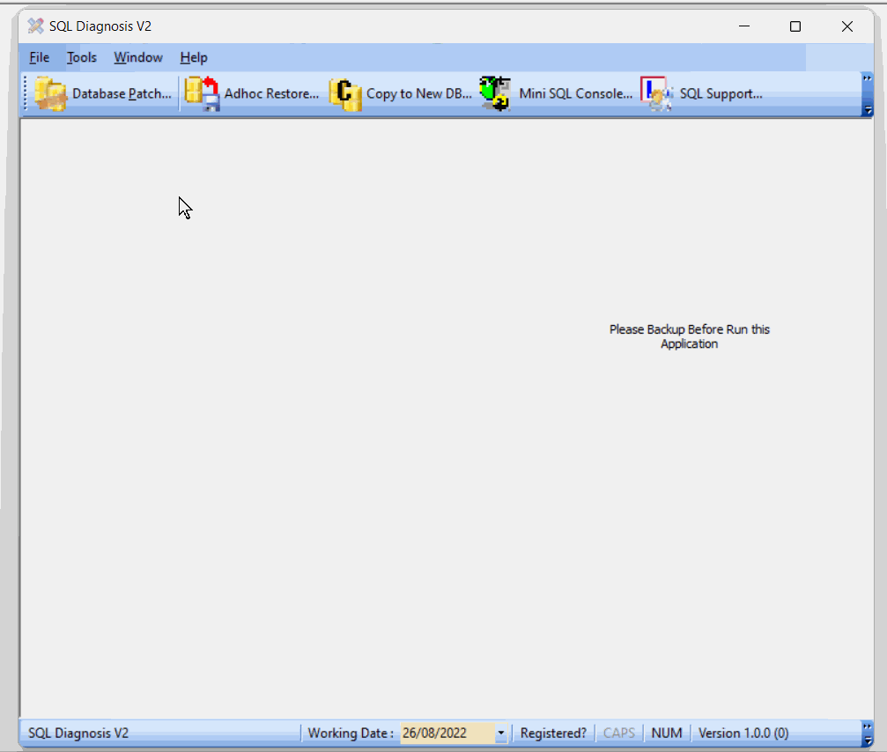

### Scenario 2 : Build In Patch (Continue Database Patch Steps)

1. Click the **Arrow** down button near the **Execute...** button.
2. Select the Patch from the available list.
3. Click **Execute...** button (In **Steps 3** Section).

#### Patch File type & description

| Patch File Type | Description |
|------------------|-------------|
| **AR/AP Copy Paste Error** | - Updates Customer or Supplier Code based on the code provided by the user.   - Sets the invalid transaction code to the provided Customer or Supplier code.   - After patching, go to the respective document number, Maintain Customer & Maintain Supplier to delete it or use CN to contra it. |
| **Change → Cash To Bank Type** | - Changes Account Type from Cash to Bank type.   - Ensure the Account Code is changed to **CH2BA** before running this patch. |
| **Change → Agent Code** | Changes all transactions from Agent Code A to Agent Code B. |
| **Change → Area Code** | Changes all transactions from Area Code A to Area Code B. |
| **Reset Grid Layout** | Resets all grid layouts to default. |
| **YED QT & PQ Purge** | Batch deletes Sales Quotation and Purchase Request records. |
| **Add Browse/Detail Form Mode** | Adds Form Mode (like SQL Accounting Version 775 and below) for SQL Accounting 776 and above. |
| **Update → Non Stock Control to Fixed Cost** | Sets all Non-Stock Control items to Fixed Cost. |
| **Update → Generators** | Updates all generators for SQL Accounting. |
| **Update → GL Account Special A/c Type Null to Empty** | Sets “Maintain Account Special Account Type” field from **Null** to **Empty**. |
| **Update → Batch Null to Empty** | Sets all Batch fields from **Null** to **Empty**. |
| **Update → Trim Empty Space - Payroll** | Removes empty spaces from all fields due to import. |
| **Remove → Invalid Payment Method** | Deletes invalid records in Maintain Payment Method. |
| **Remove → Non-Stock Control Opening Balance** | Deletes all Non-Stock Control Opening Balance records. |
| **Remove → All Customer** | Deletes all Maintain Customer records. |
| **Remove → All Supplier** | Deletes all Maintain Supplier records. |
| **Remove → All Stock Item** | Deletes all Maintain Item records. |
| **Remove → All Other Stock Maintenance** | Deletes all other Stock Maintenance data, including:   - Stock Group   - Stock Location   - Stock Price Tag   - Stock Batch   - Stock Category |
| **Remove → Default Currency Code** | Deletes the Default Currency. |
| **Remove → Invalid Credit Note** | Removes redundant AR/AP Credit Note Detail records in GL Ledger. |
| **Remove → Duplicate GL Stock Value** | Removes duplicate (double) amounts shown in GL Maintain Stock Value. |
| **Remove → Invalid GST Transactions** | Removes "ghost" transactions in GST Listing (`GST_TR`). |
| **Remove → Inactive Users** | Removes all users where *Active* = False. |
| **Remove → Invalid Stock Category** | Removes invalid Stock Category codes set in Maintain Item (usually due to import). |

## Database Validate

The Database Validate function helps repair and maintain the integrity of your database. It is especially useful when you encounter database corruption or errors that prevent normal operations. By validating the database, you can identify and fix issues to ensure smooth performance and reliability.

### Database Validate Steps

1. **Stop** the **Firebird Service.**
2. **Copy** the database & **Paste** to Desktop or any folder you wanted.
3. **Start** the **Firebird Service.**
4. Click **Database Validate** button (Icon B).

    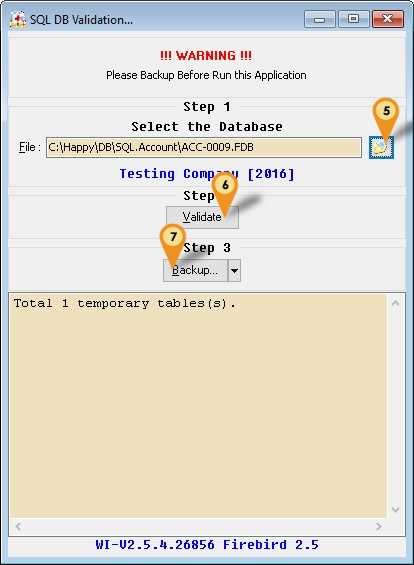

5. Click This button to select the **Copied** SQL Firebird Database.
6. Click **Validate** button.

    :::info
    You can Click few times **Validate** button to make sure it can maximise the database fixing
    :::

7. Click **Backup**... button.

    - **Backup Metadata...**: To Extract Empty Database Structure for IB Pump to copy to New Database.
    - **SQL DB Copy Table...**: Open the Database Pump which use to Copy data to New Database.
    - **Direct Zip...**: Use this to Zip & upload to Estream if still unable to fix the problem.

### Backup MetaData

Use this option when normal backup is fail.

1. Click the arrow down button at **Backup...** button.
2. Select **Backup MetaData....**

    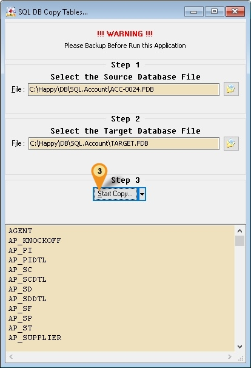

3. Click Start Copy to begin copy

    1. **Start Copy...**: Using Single Connection to copy the table to New Database.
    2. **Start Multi Copy...**:
        - Using 2 Connections in same time to copy the table to New Database.
        - Connection 1 - AUDIT, AUDITDTL, GST_TR & ST_TR
        - Connection 2 - Other then Connection 1

:::warning
Using **Start Multi Copy...** might will cause following problem:

- Application User Interface will scramble
- Will prompt out of memory
- Access Violation on close window or Exit Application

If above happen just Restart the SQL Diagnosis
Refer below picture after done copy using **Start Multi Copy...**
:::

    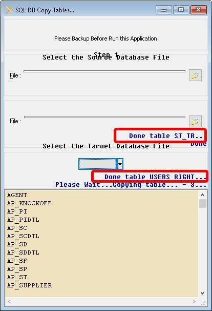

4. Click OK when see Done message
5. Click Close Button.
6. Click **Backup...** Button.

:::info
Wanted to Import Specific Table Only?
Just Delete the table which you don't wanted to Import from the list.
:::

:::warning
Be careful if you just wanted to Import Specific table Only as might cause more error.
:::

## Adhoc Backup

Adhoc Backup allows you to manually create a backup of your SQL Firebird database at any time. This feature is useful for safeguarding your data before performing major changes, troubleshooting, or simply as part of your regular backup routine. Backups can be saved to your preferred location for easy restoration if needed.

### Adhoc Backup Steps

1. Click **Adhoc Backup** button (Icon C).
2. Click This button to select the SQL Firebird Database.
3. Click **Backup** button.

    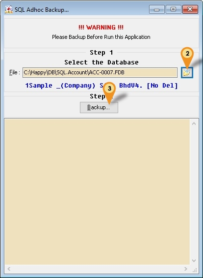

4. Select the Backup Folder (Default will Save to Desktop).
5. Click OK to Start Backup.

    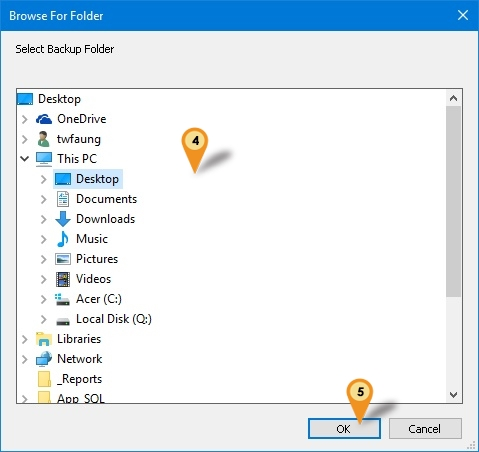

## Database Online

The Database Online function is designed to bring your database back online when it has been shut down due to errors or maintenance. If you encounter a **"Database Shutdown"** message, this feature helps you quickly restore access and resume normal operations without extensive troubleshooting.

### Database Online Steps

1. **Restart** the Firebird.
2. Click **Database Online** button (Icon D).
3. Click This button to select the SQL Firebird Database.

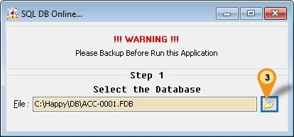

## Batch Backup

A function that allows you to back up all databases with 1 click or through a scheduled backup. This feature is especially useful when managing multiple databases that require regular backups.

1. Click Batch Backup... button(Icon E)
2. Click New button.
3. Enter the Server Name/IP Address

    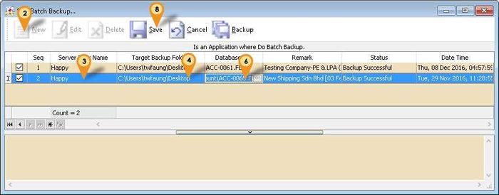

4. Click on 3 dot button for Target Backup Folder field

    

5. Select the folder where you wanted to backup to & click OK
6. Click on 3 dot button for Database File field

    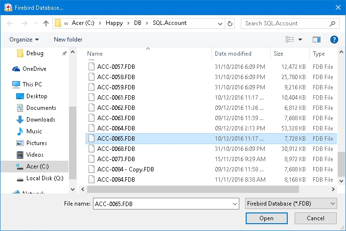

7. Select the SQL Accounting/Payroll Database & Click Open
8. Click Save Button.
9. Repeat Step 2 to 8 for additional database

| Field               | Description                                                   |
|---------------------|---------------------------------------------------------------|
| Check Box           | Tick = Backup & UnTick = Not Backup                           |
| Seq                 | System Auto run record number sequence                        |
| Server IP or Name   | Server Name/IP Address                                        |
| Target Backup Folder| A folder path where the database is backup to                 |
| Database File       | SQL Accounting/Payroll Firebird Database                      |
| Remark              | System Auto Shown the selected Database Company Name & Remark |
| Status              | Last Backup Status                                            |
| Date Time           | Last Backup Date & Time                                       |

### Schedule Backup

Using Windows Schedule to Automatically run Batch Backup.

1. Open Windows **Control Panel | Administrative Tools | Task Scheduler**

    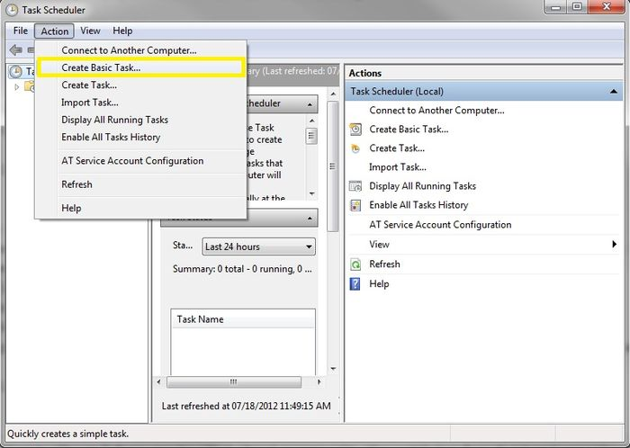

2. Click Action | Create Basic Task...

    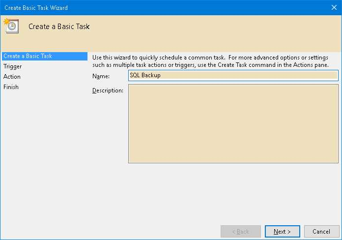

3. Enter Task Name (eg SQL Backup) & Click Next

    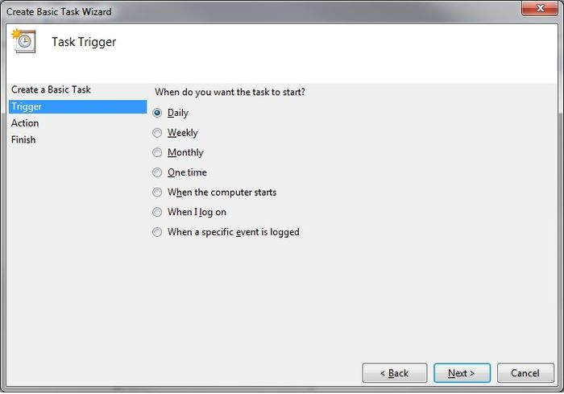

4. Select Daily & Click Next

    

5. Set the Start Date & Time to Start
6. Set 1 for Recur every field & Click Next

    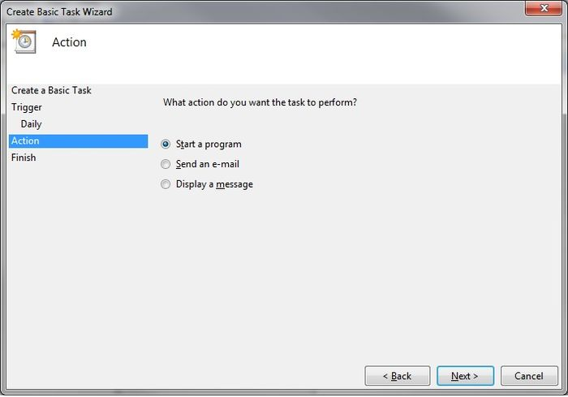

7. Select Start a program & Click Next

    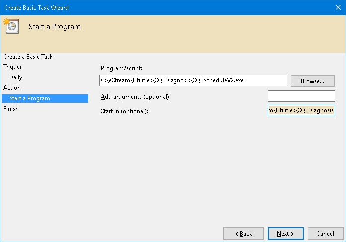

#### For Build 32 & above (Following Steps)

1. Click Browse button & find the **SQLDiagnosisV2.exe** (Default at `C:\eStream\Utilities\SQLDiagnosis`)

2. Set the Add arguments(optional) as **-Auto**

#### For Build till 31 (Following Steps)

1. Click Browse button & find the **SQLScheduleV2.exe** (eg. `C:\eStream\Utilities\SQLDiagnosis\SQLScheduleV2.exe`)
2. Set the Start in(optional) path to the Exe folder (eg. `C:\eStream\Utilities\SQLDiagnosis`) & Click Next
3. Tick the option Open the Properties dialog for this task when I click Finish
4. Click Finish

    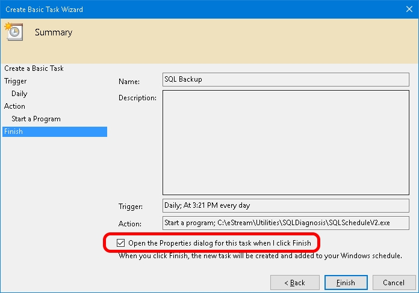

5. Select the option Run whether user is logged on or not

    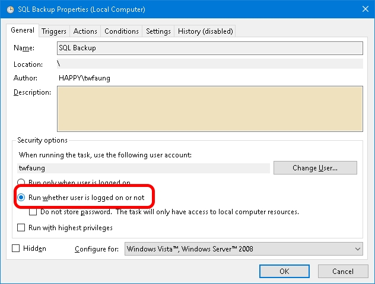

6. Click Triggers tab at top
7. Click Edit... button

    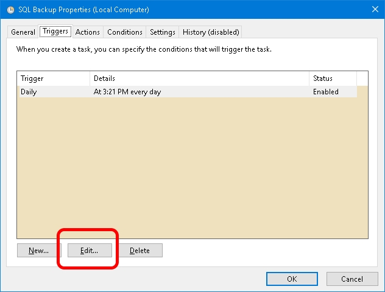

8. Change the time to run

    

9. Click OK 2 times
10. Enter the window User Name & Password

    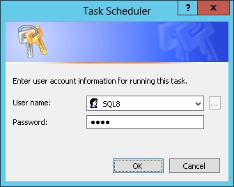

11. Click Ok

:::info
You can set below command for Schedule Stop & Start Firebird:

- Stop Firebird => `C:\WINDOWS\SYSTEM32\NET.EXE` stop "Firebird Server - DefaultInstance"
- Start Firebird => `C:\WINDOWS\SYSTEM32\NET.EXE` start "Firebird Server - DefaultInstance"

:::

## History New/Updates/Changes

#### --Build 32--

- Mini Console - Add Get Generator List Function.
- Fix still unable to backup FDB if no SY_Profile table.
- Mini Console - Add Get Table Records Count Function.
- Change Schedule Backup using command instead exe.
- Enable support restore without zip.
- Remove Verbose on Schedule Backup.
- Update High Resolution Icon.
- Add "Non System Document Number Set..." Patch.

#### --Build 31--

- Add New Application Window function.
- Add Sweep Database in Validate function.
- Add Trim Empty Space - Payroll function in DB Patch.
- Update Copy Paste Error function to allow user enter Valid Company Code.
- Fix Memo not scroll down when remove temp table.
- Add Remove InValid Stock Category... Patch
- Fix unable to backup FDB if no SY_Profile table.

#### --Build 30--

- Add Option Use Full name for batch backup.
- Enable support FB3.0.2.

#### --Build 29--

- Add Update Generator to DB Patch function.
- Add Update Non Stock Control to Fixed Cost...to DB Patch function.
- Add Remove InActive User to DB Patch function.
- Add Change Agent & Area code to DB Patch function.
- Add Update GL Account Special A/c Type Null to Empty to DB Patch function.
- Add Update Batch Null to Empty to DB Patch function.

#### --Build 28--

- Upgrade to Version 2.8.
- Change New Icon.
- Fix InValid GST Transactions not working.
- Add Update Generators... Patch.

#### --Build 27--

- Fix patch Error string literal with 19890 characters exceeds the maximum length of 16383 characters for the utf8 character set.
- Add Multi Copy function for SQL DB Copy Table...

#### --Build 26--

- Add YED QT && PQ Purge...
- Add InValid GST Transations.

#### --Build 25--

- Upgrade to Version 2.7.
- Remove -l -g -ig from Schedule & Batch Backup.
- Replace IB Pump with SQL DB Copy Table...function.

#### --Build 24--

- Add Remark for Batch Backup filename.
- Add Load From File 2 for DB Patch function.

#### --Build 23--

- Upgrade to Version 2.6.
- Fixed DB Patch will auto remove & in the script.
- Fixed Load Build-In Patch Error in some pc.
- Add Remove Duplicate GL Stock Value Patch.
- Enable Proper Installation.

#### --Build 22--

- Internal release.

#### --Build 21--

- Upgrade to Version 2.5.
- Fix unable open fdb in LocalHost.
- Add Batch Backup.
- Add Schedule Backup.
- Fix AR/AP Copy Paste Patch not working in some situation.
- Fix still unable to backup in some situation.
- Fix Backup Metadata setting not correct for FB3.0 unicode
- Add Firebird Version label for Patch, Validate & Adhoc Backup.

#### --Build 20--

- Fix Application Name Error.
- Add DB Online function.
- Add Remove InValid CN Patch.

#### --Build 19--

- Fix unable to backup.
- Add Load From File... for DB Patch...

#### --Build 18--

- Upgrade to Version 2.4.
- Enable Support Firebird 3.0.
- Enhance Validate to support IBPump.
- Find Tune SQL Patch for New Patch Generator.
- Add Remove Maintain Customer, Supplier, Stock Item & Other Stock Maintenance.
- Add AR/AP Copy Paste Error Patch.
- Add Change Cash To Bank Type Patch.
- Add Reset Grid Layout Patch.
- Add Delete Default Currency Patch.
