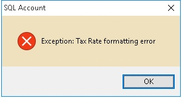
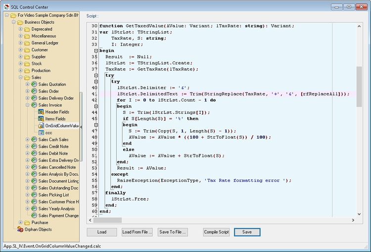

## Introduction

This happen if you had write script to get the **TaxRate** from Maintain Tax on

- **OnGridColumnValueChange** Script and/or
- **OnBeforeSave** Script

This due to changing SQLAccounting Coding Structure to cater future Changes in Tax Rate.

## Problem

You will get below error when you either selecting itemcode or changes value in you UDF which trigger the function.



## Solution

Below is example error happen at **Sales Invoice**:

1. Click **Tools | DIY | SQL Control Center...**
2. At the left panel look for **Sales Invoice | OnGridColumnValuechange** and/or **OnBeforeSave**



3. Look for the script like **function GetTaxedValue(AValue: Variant; lTaxRate: string): Variant;**
4. Change all to below new script

**For OnGridColumnValueChange Script:**

```pascal
function GetTaxedValue(AValue: Variant; lTaxRate: string): Variant;
var lStrLst: TStringList;
    TaxRate, S: string;
    I: Integer;
begin
  Result  := Null;
  lStrLst := TStringList.Create;
  TaxRate := DataSet.FindField('TaxRate').AsString;
  try
    try
      lStrLst.Delimiter := '&'; 
      S := Trim(StringReplace(TaxRate, '+', '&', [rfReplaceAll]));
      lStrLst.DelimitedText := Trim(StringReplace(s, 'E', '', [rfReplaceAll])); 
      for I := 0 to lStrLst.Count - 1 do
      begin
        S := Trim(lStrLst.Strings[I]);
        if S[Length(S)] = '%' then
        begin
          S := Trim(Copy(S, 1, Length(S) - 1));
          AValue := AValue * ((100 + StrToFloat(S)) / 100);
        end
        else
          AValue := AValue + StrToFloat(S);
      end;
      Result := AValue;
    except
      RaiseException(ExceptionType, 'Tax Rate formatting error ');
    end;
  finally
    lStrLst.Free;
  end;
end;
```

**For OnBeforeSave Script:**

```pascal
function GetTaxedValue(AValue: Variant; lTaxRate: string): Variant;
var lStrLst: TStringList;
    TaxRate, S: string;
    I: Integer;
begin
  Result  := Null;
  lStrLst := TStringList.Create;
  TaxRate := D.DataSet.FindField('TaxRate').AsString;
  try
    try
      lStrLst.Delimiter := '&'; 
      S := Trim(StringReplace(TaxRate, '+', '&', [rfReplaceAll]));
      lStrLst.DelimitedText := Trim(StringReplace(s, 'E', '', [rfReplaceAll])); 
      for I := 0 to lStrLst.Count - 1 do
      begin
        S := Trim(lStrLst.Strings[I]);
        if S[Length(S)] = '%' then
        begin
          S := Trim(Copy(S, 1, Length(S) - 1));
          AValue := AValue * ((100 + StrToFloat(S)) / 100);
        end
        else
          AValue := AValue + StrToFloat(S);
      end;
      Result := AValue;
    except
      RaiseException(ExceptionType, 'Tax Rate formatting error ');
    end;
  finally
    lStrLst.Free;
  end;
end;
```