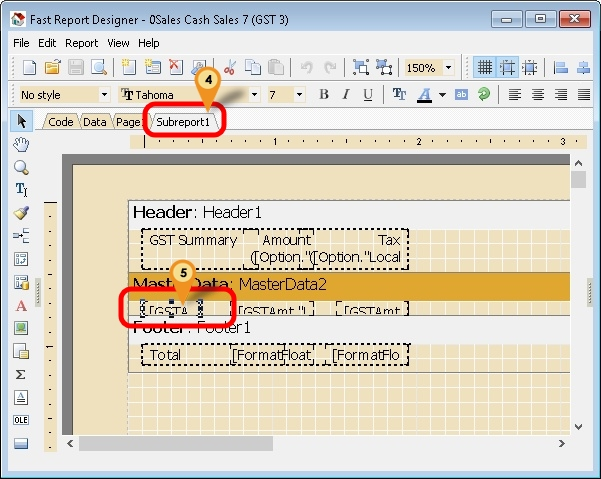

## Introduction

This happen if you had write script to get the **TaxRate** from Maintain Tax in the report.

This due to changing SQLAccounting Coding Structure to cater future Changes in Tax Rate.

## Problem

You will get below error when you preview the report.


## Solution

1. Click **Code** Tab
2. Scroll down & look for **procedure SetUp;**
3. Replace this script with below script


```pascal
SQL := 'SELECT Dockey, Tax, TaxRate, Sum(CAST(LocalTaxAmt AS REAL)) LocalTaxAmt, Sum(CAST(LocalAmount AS REAL)) LocalAmount '+
       'FROM Document_Detail ' +
       'WHERE Tax <> '''' ' +
       'GROUP BY Dockey, Tax, TaxRate';
AddDataSet('GSTAmt', ['Tax', 'TaxRate', 'LocalTaxAmt', 'LocalAmount'])
```

4. Click on **Subreport1** tab



5. Double Click the Tax Rate memo
6. Replace this script with below script


```pascal
[IIF(Trim(<GSTAmt."TaxRate">)='',<GSTAmt."Tax">,<GSTAmt."Tax"> +' @ ' + <GSTAmt."TaxRate">)]
```

7. Click **OK** button
8. **Save** the report