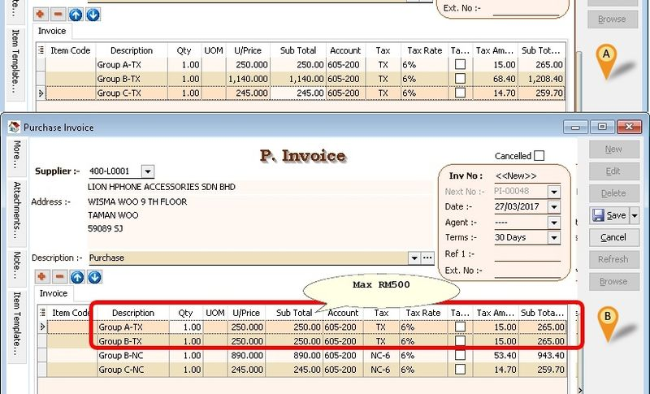
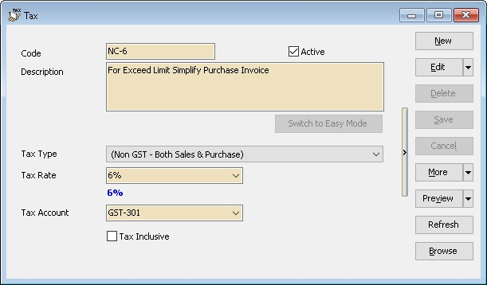
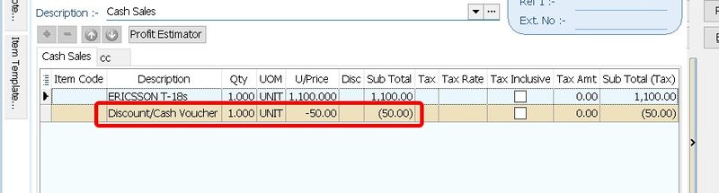

## SQL Accounting Linking

We had 4 Methods to Integrate/Link to SQL Accounting

- [Restful API](https://wiki.sql.com.my/wiki/Restful_API) (Recommended - For two way communication & SQL Public Connect User)
- [SDK Live](/integration/sdk-live/basic-guide#documentation) (Recommended - For two way communication)
- [SQL Acc XLS n MDB Import](../../miscellaneous/acc-xls-mdb-import) - XLS, XLSX, Json & CSV/TXT File (Format 2 - Bar(|),Comma(,),Semi Comma(;),Tilde(~))
- [SQL XML Import](../../miscellaneous/import-export-guide.md) - XML File
- [SQL Text Import](../../miscellaneous/text-import.md) - CSV/TXT File (Format 1 - Semi Comma (;) Only)

### Choosing Method

SQL Accounting had 3 Environment Setup & below is available method option

1. Public Cloud ([SQL Public Connect](https://connect.sql.com.my/))

    Data is Host at our Public Server

    - [Restful API](https://wiki.sql.com.my/wiki/Restful_API)
    - [SQL Acc XLS n MDB Import](../../miscellaneous/acc-xls-mdb-import)

2. On Premise Cloud ([SQL Private Connect](https://private.sql.com.my/))

    Data is Host at User own Office

    - [Restful API](https://wiki.sql.com.my/wiki/Restful_API)
    - [SDK Live](https://wiki.sql.com.my/wiki/SDK_Live)
    - [SQL Acc XLS n MDB Import](../../miscellaneous/acc-xls-mdb-import)

3. On Premise(Offline)

    Data is Host at User own Office

    - [SDK Live](https://wiki.sql.com.my/wiki/SDK_Live)
    - [SQL Acc XLS n MDB Import](../../miscellaneous/acc-xls-mdb-import)
    - [SQL Accounting](https://www.sql.com.my/download/demo/sqlacc-setup.exe)
    - [Firebird 64 bit](https://github.com/FirebirdSQL/firebird/releases/download/R3_0_7/Firebird-3.0.7.33374_1_x64.exe)
    - [Installation Guide](https://download.sql.com.my/customer/Fairy/Steps-InstallnCreateSampleDB.gif)

### SQL Accounting & Firebird Program

    - [SQL Accounting](https://www.sql.com.my/download/demo/sqlacc-setup.exe)
    - [Firebird 64bit](https://github.com/FirebirdSQL/firebird/releases/download/v5.0.3/Firebird-5.0.3.1683-0-windows-x64.exe)
    - [Installation Guide](https://download.sql.com.my/customer/Fairy/Steps-InstallnCreateSampleDB.gif)

### Sample DB

    - [GSTnSST-SampleDB](https://download.sql.com.my/customer/Fairy/Testing-2022-05-18.zip)
    - [Restore DB Guide](https://download.sql.com.my/customer/Fairy/Steps-RestoreDB.gif)

### Empty DB

1. At the Login Screen Click 2 dot Button
2. Click Create New Database
3. Follow the wizard

**\*Default UserName & Password is ADMIN**

### Things To Consider Before Import/Post

Before wanted to Import/Post to SQL Accounting Database, below information/setting must set in the SQL Accounting

1. Click *Menu: View*

    Untick(UnSelect) the option

    - Command Navigator
    - Tabbed Docking
    - Allow Multiple Windows
    - Enable Windows Task Bar

2. Click _Menu: `Tools | Options... | Customer`

    Tick(Select) the option

    - Use Cash Sales No. for Payment Received

    Untick(UnSelect) the option

    - Perform Tax / Local Amount Rounding
    - 5 Cents Rounding (Sales Invoice)
    - 5 Cents Rounding (Cash Sales)

3. Click _Menu: `Tools | Options... | Miscellaneous`

    Untick(UnSelect) the option

    - Prompt Negative Stock Quantity Dialog Box
    - Prompt Duplicate Cheque Number

4. Click _Menu: `Tools | Maintain User... | New`

    Create New User (eg POS)

5. Click _Menu: `Tools | Maintain User... | Access Right`

    Tick (Select) the option

    - Override Customer Credit Control under the Group : Customer
    - Override Sales Min/Max Price under the Group : Sales
    - Override Acceptable Transaction Date under the Group : Tools
    - Save on Negative Quantity under the Group : Stock

    Untick (UnSelect) the option

    Under the Group : Sales

    - Prompt Replace Unit Price Dialog
    - Show Payment / Change Dialog in Cash Sales

6. Must be had/valid in SQL Accounting

    | Field | In SQL Accounting |
    | --- | --- |
    | Customer Code | Customer => Maintain Customer |
    | Supplier Code | Supplier => Maintain Supplier |
    | Terms Code | Tools => Maintain Terms |
    | Project Code | Tools => Maintain Project |
    | Sales/Purchase Account Code | GL => Maintain Account |
    | Sales/Purchase Return Account Code | GL => Maintain Account |
    | Cash/Bank Account Code | Tools => Maintain Payment Method (Created from Maintain Account) |
    | Agent Code | Tools => Maintain Agent |
    | Area Code | Tools => Maintain Area |
    | Currency Code | Tools => Maintain Currency |
    | Tax Code | Tools => Maintain Tax (if had SST / GST) |

7. Below is Optional (i.e. if had post/import item code to SQL Accounting)

| Field | Location/Form |
| --- | --- |
| Item Code | Stock => Maintain Stock Item |
| Location Code | Stock => Maintain Location |
| Batch Code | Stock => Maintain Batch |

**\**ALWAYS do backup the database First before Import/Post to SQL Accounting**

## Table/Fields Detail

- Updated 15 Jan 2025
- [DetailSpec](https://docs.google.com/spreadsheets/d/1K-eWqe-NHfJfqn9kaoJc4m5YZCvKmGw7WmHqV5Hj6XU/edit?usp=sharing)

### Normal Used Table/Biz Object Name

#### Sales Side

| Biz Object | Description |
| --- | --- |
| `AR_Customer` | Maintain Customer |
| `SL_IV` | Sales Invoice |
| `SL_CS` | Cash Sales |
| `SL_CN` | Sales Credit Note |
| `SL_DN` | Sales Debit Note |
| `AR_PM` | Customer Payment |
| `AR_IV` | Customer Invoice |
| `AR_DN` | Customer Debit Note |
| `AR_CN` | Customer Credit Note |

#### Purchase Side

| Biz Object | Description |
| --- | --- |
| `AP_Supplier` | Maintain Supplier |
| `PH_PI` | Purchase Invoice |
| `PH_CP` | Cash Purchase |
| `PH_SC` | Purchase Return |
| `PH_SD` | Purchase Debit Note |
| `AP_SP` | Supplier Payment |
| `AP_PI` | Supplier Invoice |
| `AP_SD` | Supplier Debit Note |
| `AP_SC` | Supplier Credit Note |

### Posting Information

- Detail Data should Group by Stock Group/Category & TaxType (ZRL or SR) & Itemcode (if wanted import itemcode)
- Eg. Cafe can be group by
        - Food - SR
        - Food - ZRL
        - Beverage
        - Service Charges
        - Rounding

- Detail Data should Group by Stock Group/Category & TaxType (ZRL or SR) & Itemcode (if wanted import itemcode)
- Eg. Cafe can be group by
        - Food - SR
        - Food - ZRL
        - Beverage
        - Service Charges
        - Rounding

- Eg. Today got 10 transactions
        - 8 is Simplified Invoice - Group as 1 Doc No - POS-00001
        - 2 is Full Tax Invoice/Credit Sales Invoice - 1 by 1 in - POS-00002, POS-00003

- All can post to `SL_CS` & `AR_PM`
- Below is example Today Total Simplified Invoice Sales is RM1000

#### Method 1 (Recommended)

It will be had 4 transactions

1. RM1000 - Post to `SL_CS` & (`P_DocNo`, `P_PaymentMethod` field is empty & `P_Amount`, `P_PaidAmount` field is 0)

2. RM700 by Cash - Post to `AR_PM`

3. RM200 by MasterCard - Post to `AR_PM`

4. RM100 by CreditCard - Post to `AR_PM`

**Pros** : Easy to Edit or Delete the transactions

**Cons** : Many Posting document

#### Method 2

It will be had 3 transactions

1. RM700 by Cash - Post to `SL_CS` `P_PaymentMethod` field

2. RM200 by MasterCard - Post to `AR_PM`

3. RM100 by CreditCard - Post to `AR_PM`

**Pros** : Less Posting document

**Cons** :

- Not Easy to Edit or Delete the transactions
- Cash Sales OR number unable to override (i.e. System Auto set/assign)

## Extra Notes

- Both Full Tax & Simplified IV can use same Debtor Code as Not mention required Customer GST ID
- Government 5 cents Rounding Mechanism - NO Tax/GST Code
- Deposit for Non Refundable can use Customer Payment `AR_PM` & set *NONREFUNDABLE* field to *1*
        - Default is `SR`
        - Will auto reverse once it being Knock-Off

- Doc Disc should proportion by sub total amt for mix tax code (See Cash Sales POS-DocDisc)

    Example
        - Doc Discount = 10% of Document Discount
        - Sub Total for SR = 150.24 => Disc (150.24 \* 10%) = 15.02
        - Sub Total for ZR = 988.88 => Disc (988.88 \* 10%) = 98.89

    Or

        - Doc Discount = 113.91
        - Sub Total for SR = 150.24 => Disc ((150.24/1139.12) \* 113.91) = 15.02
        - Sub Total for ZR = 988.88 => Disc ((988.88/1139.12) \* 113.91) = 98.89

- Mixed Supplies Tax Code
        - ES
        - TX-ES (Replace TX-N43)
        - TX-RE

- Realise Bad Debts Use CN as Normal
        - System will contra the provision bad debts done at GST-03 by 6 mth bad debts
        - Make sure Knock the actual Bad debts Invoice

- For Purchase Invoice(PI) MUST 1 by 1 post in (i.e. can't Group multi PI in 1 PI)

**Prompt Invalid class string, ProdID: "SQLAcc.BizApp" error while try to link to SQL Accounting.**

1. Login SQL Accounting
2. Click `Tools | Options | General`
3. Click Register & follow wizard
4. Exit SQL Accounting
5. Login SQL Accounting
6. Try run you application to link again

If still prompt after above steps

1. Uninstall SQL Accounting
2. Stop Anti Virus
3. Reinstall SQL Accounting
4. Run the above steps again

**Prompt Access Violation when import.**

This happen due to

The fieldname is not match with SQL Accounting (eg, SQLAcc fieldname `UDF_Width`, but you had call for `UDF_Weight`)

1. Old version of SQL Acc Import program, try update the SQL Acc Import program
2. The fieldname had the empty space at the beginning and/or end (norm happen if import from Excel) eg 'DocNo ' or ' DocNo' instead of 'DocNo'

## SQL Accounting Linking FAQ

### Prompt Invalid class string, ProdID: "SQLAcc.BizApp" error while try to link to SQL Accounting

- Login SQL Accounting
- Click Tools | Options | General
- Click Register & follow wizard
- Exit SQL Accounting
- Login SQL Accounting
- Try run you application to link again

If still prompt after above steps

- Uninstall SQL Accounting
- Stop Anti Virus
- Reinstall SQL Accounting
- Run the above steps again

### Prompt Access Violation when import

This happen due to

The fieldname is not match with SQL Accounting (eg SQLAcc fieldname `UDF_Width` yr had call for `UDF_Weight`)

- Old version of SQL Acc Import program, try update the SQL Acc Import program
- The fieldname had the empty space at the beginning and/or end (norm happen if import from Excel) eg 'DocNo ' or ' DocNo' instead of 'DocNo'

### Why after import the DO still had outstanding even the Invoice had imported?

Yes all import will loss the *Transfer* status (i.e. if import DO & IV will treat as different) except using SDK import with condition

### Which field should I map/insert to for Credit Note & Debit Note for Invoice Number, Invoice Date & Reason?

In Generally(Recommended) you can use below field (All in Header Field)

| SQL Accounting Field | Mapping Field | Description |
| --- | --- | --- |
| DocNoEx | Invoice Number | Field Size : 20 |
| DocRef1 | Invoice Date | Field Size : 25 |
| Description | Reason | Field Size : 200 |

If you wanted posted in Detail Field also can

| SQL Accounting Field | Mapping Field | Description |
| --- | --- | --- |
| Remark1 | Invoice Number | Field Size : 200 |
| Remark2 | Invoice Date | Field Size : 200 |
| Description2 | Reason | Field Size : 200 |

### Can I post/import to SQL Accounting in Monthly Basis?

No for GST/SST Era. It advice able to do **Daily** Basis posting/import as user had more time to verify if posting/import had Error/Problem

Below is the proper steps to do posting/import

- Backup
- Post/Import to SQL Accounting
- Compare Listing in SQL Accounting with the POS/External Program Listing

### In my system had multiple level document discount, how to post to SQL Accounting?

You can insert 2 or more rows(depend how many level you had) of item as negative unitprice.

But as mention above [**Extra Notes**](./tips-&-tricks.md#extra-notes) proportion by sub total amt for mix tax code.

### Can I do like this, DR Bank/Cash In hand/Debtor & CR Sales Account using Journal?

No. The correct Double Entry is as following

- **Invoice/Cash Sales**

  - DR - Debtor
  - CR - Sales Account

- **Payment Received**

  - DR - Bank/Cash In Hand
  - CR - Debtor

### Can I use just ADMIN ID to Import/Posting?

No. *ADMIN* had full Access Right & if had problem user might had problem trace back who doing the importing...

It adviceable to create Another ID with less Access Right

### Can SQL Accounting & External Program(eg POS) Import/Posting doing Stock Control in same time?

Yes, but we Recommended External Program(eg POS) to do all the Stock Control if the External Program(eg POS) able to do all the report Required by the User.

Reason :

01. Faster Import time

02. Timing issue as in SQL Acc the Qty is *ALWAYS* outdated cause real *Stock In/Out* is from the External Program(eg POS)

03. Data redundancy as 2 same data for different system

04. Avoid wasting time on Sync correctness stock data between 2 system

Related Ref : [Can I control my Stock when I link with other Application?](https://wiki.sql.com.my/wiki/SDK_Live#Can_I_control_my_Stock_when_I_link_with_other_Application.3F)

### Can SQL Acc accept negative amount?

Yes if for Item Row Amount

No all document amount(DocAmt field) must not below 0

### Is there any setting for transaction without Tax?

No there is no special setting. All you had to do is to set the following field to

| Field | Value |
| --- | --- |
| Tax | ''  |
| TaxInclusive | 0   |
| TaxAmt | 0   |

### How to post If supplier given is Simplified Invoice but exceed RM500?

It advisable to ask the user to Request **Full Tax Invoice** from their supplier as user might pay double Tax due to add back for non claimable amount to the company profit by their Audit/Accountant.

Below is example(suggest) how we post to Simplified Invoice from supplier

### Prompt could not convert variant of type (Null) into type (Integer) error while try to post (eg Invoice)

Make sure the database you login is had Started the GST.

### How to post SR with 6% for issue document after 01 Jun 2018?

There are 2 solutions

#### Solution 1

Add TaxRate Field Script/Code

#### Solution 2

Create New Tax SR tax code with 6%(eg SR6) in SQL Accounting

**Is there any changes in Linking for the SST?**

- GST to No SST

May follow [Non GST](https://wiki.sql.com.my/wiki/SQL_Accounting_Linking#Is_there_any_setting_for_transaction_without_Tax?)

- GST to SST

There is no much changes. Just treat is like normal GST only different is the Tax Code

| Tax Code | Description | Rate | Required Tariff Code |
| --- | --- | --- | --- |
| ST5 | Sales Tax | 5%  | Y   |
| ST  | Sales Tax | 10% | Y   |
| SV  | Service Tax | 6% (8% From 01 Mar 2024) | Y   |
| STE | Sales Tax Exempted |     | N   |
| SVE | Service Tax Exempted |     | N   |

New Field added

| **Field Name** | **Field Type** | **Field Size** | **Mandatory** | **Default Value** | **Remarks** |
|----------------|----------------|----------------|----------------|------------------|--------------|
| **TARIFF** | String | 20 | C |  | Tariff or HS Code **Mandatory** – If posting to: - GL Payment Voucher & GL Official Receipt - Customer Invoice, Debit Note & Credit Note - Supplier Invoice, Debit Note & Credit Note - All Sales & Purchase Module without Item Code **Not Required** – If posting Sales & Purchase with Item Code |

### How to SQL Accounting handle if had Discount/Cash Voucher?

You can treat the Discount/Cash Voucher as Part of item row but is in Negative UnitPrice

### Begin 11 Oct 2019 the Company ROC/BRN will increase to 12 digit characters. Any changes in Linking?

Yes if user is upgrade to Version 875.782 & above.

Table Affected

- `SY_PROFILE` => File | Company Profile

- `AR_CUSTOMER` => Customer | Maintain Customer

- `AP_SUPPLIER` => Supplier | Maintain Supplier

Field Changes

- Original Name **REGISTERNO** change to BRN

- New Field BRN2

- New Field Size for both Fields 30

[SSM Announcement](https://www.ssm.com.my/Lists/Announcement/AnnouncementDetails.aspx?ID=134) or [PDF](https://download.sql.com.my/customer/Fairy/Announcement-NewROC.pdf)

### Is there any changes in Linking for the E-Invoicing?

New Field Added
Available in Version 5.2024.983.848 & above

#### Maintain Customer & Maintain Supplier

| **Field Name** | **Field Type** | **Field Size** | **Remarks** |
|----------------|----------------|----------------|--------------|
| **TIN** | String | 14 | Company Tax Register Number |
| **IDTYPE** | Integer |  | 0 - Empty 1 - Reg No 2 - NRIC (New) 3 - Passport 4 - ARMY 5 - NRIC (Old) |
| **IDNO** | String | 20 | This field will depend on the ID Type selected |
| **TOURISMNO** | String | 17 | This is only applicable to tourism tax registrant, which may consist of hotel operators and online travel operators |
| **SIC** | String | 10 | Malaysia Standard Industrial Classification (MSIC) Codes [https://sdk.myinvois.hasil.gov.my/codes/#msic-codes](https://sdk.myinvois.hasil.gov.my/codes/#msic-codes) Available in Version (TBA) Maintain Supplier Only |
| **SUBMISSIONTYPE** | Integer | 0 | Available in Version 5.2024.992.854 & above 0 = None 17 = E-Invoice/Self Billing (for Maintain Supplier) 18 = Consolidate |
| **IRBM_CLASSIFICATION** | String | 3 | Maintain Supplier Only Category of products or services being billed as a result of a commercial transaction. More than 1 classification code can be added for goods / services included in the e-Invoice. [https://sdk.myinvois.hasil.gov.my/codes/classification-codes/](https://sdk.myinvois.hasil.gov.my/codes/classification-codes/) Available in Version 5.2024.990.852 & above |
| **POSTCODE** | String | 10 | The identifier for an addressable group of properties according to the relevant postal service |
| **CITY** | String | 50 | The common name of the city, town, or village, where the Customer/Supplier address is located. |
| **STATE** | String | 50 | The state of a country. [https://sdk.myinvois.hasil.gov.my/codes/state-codes/](https://sdk.myinvois.hasil.gov.my/codes/state-codes/) |
| **COUNTRY** | String | 2 | A code that identifies the country. May refer to [Country List](https://docs.google.com/spreadsheets/d/1TcFVqH1VCJ5SjHAt2VCHIeTTcQVUjtIBxLaZGGM0E5k/edit?gid=1859696683#gid=1859696683) |

#### Maintain Stock Item

| **Field Name** | **Field Type** | **Field Size** | **Remarks** |
|----------------|----------------|----------------|--------------|
| **IRBM_CLASSIFICATION** | String | 3 | Category of products or services being billed as a result of a commercial transaction. More than 1 classification code can be added for goods / services included in the e-Invoice. [https://sdk.myinvois.hasil.gov.my/codes/classification-codes/](https://sdk.myinvois.hasil.gov.my/codes/classification-codes/) |

Available in Version 5.2024.990.852 & above

#### Sales & Purchase Data Entry - Header

| **Field Name** | **Field Type** | **Field Size** | **Remarks** |
|----------------|----------------|----------------|--------------|
| **EIVDATETIME** | DateTime | 0 | For below version 5.2024.1001.858 E-Invoicing Submitted Date time in the UTC timezone e.g. 19/07/2024 7:17:43 AM |
| **EIV_UTC** | DateTime | 0 | For version 5.2024.1001.858 & Above E-Invoicing Submitted Date time in the UTC timezone e.g. 19/07/2024 7:17:43 AM |
| **IRBM_UUID** | String | 26 | E-Invoicing Submitted response UUID e.g. FSEP22A4Y5BFGGWAX95N943811 |
| **IRBM_LONGID** | String | 50 | E-Invoicing Submitted response Long UUID e.g. TM9AFNQ0M76T07BTX95NX43J10CzvSE31712365482 |
| **IRBM_STATUS** | Integer | 0 | E-Invoicing Submitted Status [https://sdk.myinvois.hasil.gov.my/faq/](https://sdk.myinvois.hasil.gov.my/faq/) e.g. 2 |
| **POSTCODE** | String | 10 | The identifier for an addressable group of properties according to the relevant postal service |
| **CITY** | String | 50 | The common name of the city, town, or village where the Customer/Supplier address is located. |
| **STATE** | String | 50 | The state of a country. [https://sdk.myinvois.hasil.gov.my/codes/state-codes/](https://sdk.myinvois.hasil.gov.my/codes/state-codes/) |
| **COUNTRY** | String | 2 | A code that identifies the country. May refer to Country List Here |
| **DPOSTCODE** | String | 10 | The identifier for an addressable group of properties according to the relevant postal service |
| **DCITY** | String | 50 | The common name of the city, town, or village where the Customer/Supplier address is located. |
| **DSTATE** | String | 50 | The state of a country. [https://sdk.myinvois.hasil.gov.my/codes/state-codes/](https://sdk.myinvois.hasil.gov.my/codes/state-codes/) |
| **DCOUNTRY** | String | 2 | A code that identifies the country. May refer to Country List Here |
| **SALESTAXNO** | String | 25 |  |
| **SERVICETAXNO** | String | 25 |  |
| **TIN** | String | 14 | Company Tax Register Number |
| **IDTYPE** | Integer |  | 0 - Empty 1 - Reg No 2 - NRIC (New) 3 - Passport 4 - ARMY 5 - NRIC (Old) |
| **IDNO** | String | 20 | This field will depend on the ID Type selected |
| **TOURISMNO** | String | 17 | This is only applicable to tourism tax registrant, which may consist of hotel operators and online travel operators |
| **SIC** | String | 10 | Malaysia Standard Industrial Classification (MSIC) Codes [https://sdk.myinvois.hasil.gov.my/codes/#msic-codes](https://sdk.myinvois.hasil.gov.my/codes/#msic-codes) Maintain Supplier Only |
| **INCOTERMS** | String | 20 | A set of international trade rules that define the responsibilities of buyers and suppliers. The input of special characters is not allowed. |
| **SUBMISSIONTYPE** | Integer | 0 | Available in Version 5.2024.992.854 & above 0 = None 17 = E-Invoice/Self Billing (for Purchase Only) 18 = Consolidate |

#### Sales & Purchase Data Entry - Detail

| **Field Name** | **Field Type** | **Field Size** | **Remarks** |
|----------------|----------------|----------------|--------------|
| **TAXEXEMPTIONREASON** | String | 300 | Available in Version 5.2024.992.854 & above For Tax Exemption Code use only |
| **IRBM_CLASSIFICATION** | String | 3 | Category of products or services being billed as a result of a commercial transaction. More than 1 classification code can be added for goods / services included in the e-Invoice. [https://sdk.myinvois.hasil.gov.my/codes/classification-codes/](https://sdk.myinvois.hasil.gov.my/codes/classification-codes/) |

Available in Version 5.2024.990.852 & above

#### Maintain Currency

| **Field Name** | **Field Type** | **Field Size** | **Remarks** |
|----------------|----------------|----------------|--------------|
| **ISOCODE** | String | 3 | [https://sdk.myinvois.hasil.gov.my/codes/countries/](https://sdk.myinvois.hasil.gov.my/codes/countries/) |

Available in Version 5.2024.995.855 & above

#### GL Cash Book - Payment Voucher & Office Receipt - Header

| **Field Name** | **Field Type** | **Field Size** | **Remarks** |
|----------------|----------------|----------------|--------------|
| **EIV_UTC** | DateTime | 0 | E-Invoicing Submitted Date time in the UTC timezone e.g. 19/07/2024 7:17:43 AM |
| **COMPANYNAME** | String | 100 |  |
| **ADDRESS1** | String | 60 |  |
| **ADDRESS2** | String | 60 |  |
| **ADDRESS3** | String | 60 |  |
| **ADDRESS4** | String | 60 |  |
| **POSTCODE** | String | 10 | The identifier for an addressable group of properties according to the relevant postal service |
| **CITY** | String | 50 | The common name of the city, town, or village where the Customer/Supplier address is located. |
| **STATE** | String | 50 | The state of a country. [https://sdk.myinvois.hasil.gov.my/codes/state-codes/](https://sdk.myinvois.hasil.gov.my/codes/state-codes/) |
| **COUNTRY** | String | 2 | A code that identifies the country. May refer to Country List Here |
| **PHONE1** | String | 200 |  |
| **SALESTAXNO** | String | 25 |  |
| **SERVICETAXNO** | String | 25 |  |
| **TIN** | String | 14 | Company Tax Register Number |
| **IDTYPE** | Integer |  | 0 - Empty 1 - Reg No 2 - NRIC (New) 3 - Passport 4 - ARMY 5 - NRIC (Old) |
| **IDNO** | String | 20 | This field will depend on the ID Type selected |
| **TOURISMNO** | String | 17 | This is only applicable to tourism tax registrant, which may consist of hotel operators and online travel operators |
| **SIC** | String | 10 | Malaysia Standard Industrial Classification (MSIC) Codes [https://sdk.myinvois.hasil.gov.my/codes/#msic-codes](https://sdk.myinvois.hasil.gov.my/codes/#msic-codes) Maintain Supplier Only |
| **SUBMISSIONTYPE** | Integer | 0 | 0 = None 17 = Self Billing 18 = Consolidate 19 = E-Invoice Refund |
| **IRBM_UUID** | String | 26 | E-Invoicing Submitted response UUID e.g. FSEP22A4Y5BFGGWAX95N943811 |
| **IRBM_LONGID** | String | 50 | E-Invoicing Submitted response Long UUID e.g. TM9AFNQ0M76T07BTX95NX43J10CzvSE31712365482 |
| **IRBM_STATUS** | Integer | 0 | E-Invoicing Submitted Status [https://sdk.myinvois.hasil.gov.my/faq/](https://sdk.myinvois.hasil.gov.my/faq/) e.g. 2 |

#### GL Cash Book - Payment Voucher & Office Receipt - Detail

| **Field Name** | **Field Type** | **Field Size** | **Remarks** |
|----------------|----------------|----------------|--------------|
| **IRBM_CLASSIFICATION** | String | 3 | Category of products or services being billed as a result of a commercial transaction. More than 1 classification code can be added for goods / services included in the e-Invoice. [https://sdk.myinvois.hasil.gov.my/codes/classification-codes/](https://sdk.myinvois.hasil.gov.my/codes/classification-codes/) |

### Change to Boolean Type

Begin from SQL Acc Version 5.2024.1007.860 & above the follow field type will change to Boolean Type (True/False)

[SQL Accounting 860](https://download.sql.com.my/customer/Fairy/sqlacc.x86.5.2024.1008.860.exe)

| **For Version 859 & Below** | **For Version 860 & Above** |
|-----------------------------|------------------------------|
| - T   - 1                | True                        |
| - F   - 0                | False                        |

| FieldName | True Value | False Value |
| --- | --- | --- |
| TaxInclusive | 1   | 0   |
| SerialNumber | T   | F   |
| Cancelled | T   | F   |
| Cancelled | 1   | 0   |
| AddPDCToCRLimit | T   | F   |
| Transferable | T   | F   |
| IsActive | T   | F   |
| IsActive | 1   | 0   |
| NonRefundable | 1   | 0   |
| AllowExceedCreditLimit | T   | F   |
| Printable | T   | F   |
| StockControl | T   | F   |
| IsBase | 1   | 0   |
| IsDefault | 1   | 0   |
| IsDefault | T   | F   |

| Programming | Before (For Version 859 & below) | After (For Version 860 & Above) |
| --- | --- | --- |
| C#  | lDetail.FindField("TaxInclusive").value = 1;   lDetail.FindField("Printable").AsString = "T"; | lDetail.FindField("TaxInclusive").value = True;   lDetail.FindField("Printable").value = True; |
| PHP | \$lDetail->FindField("TaxInclusive")->value = 0;   \$lDetail->FindField("Printable")->AsString = "T"; | \$lDetail->FindField("TaxInclusive")->value = False;   \$lDetail->FindField("Printable")->value = True; |
| Python | lDetail.FindField("TaxInclusive").value = 1   lDetail.FindField("Printable").AsString = "T" | lDetail.FindField("TaxInclusive").value = True   lDetail.FindField("Printable").value = True |
| Query SQL | SELECT CODE, DESCRIPTION FROM AGENT   WHERE ISACTIVE='T'   or   SELECT CODE, DESCRIPTION FROM SHIPPER   WHERE ISACTIVE=1 | SELECT CODE, DESCRIPTION FROM AGENT   WHERE ISACTIVE   or   SELECT CODE, DESCRIPTION FROM SHIPPER   WHERE ISACTIVE |
| Query SQL | SELECT CODE, DESCRIPTION FROM AGENT   WHERE ISACTIVE='F'   or   SELECT CODE, DESCRIPTION FROM SHIPPER   WHERE ISACTIVE=0 | SELECT CODE, DESCRIPTION FROM AGENT   WHERE NOT ISACTIVE or   SELECT CODE, DESCRIPTION FROM SHIPPER   WHERE NOT ISACTIVE |
