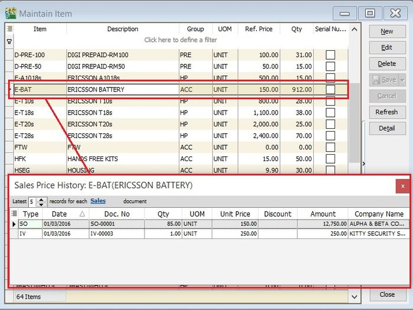
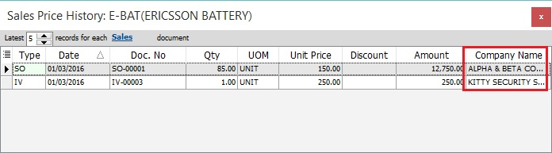
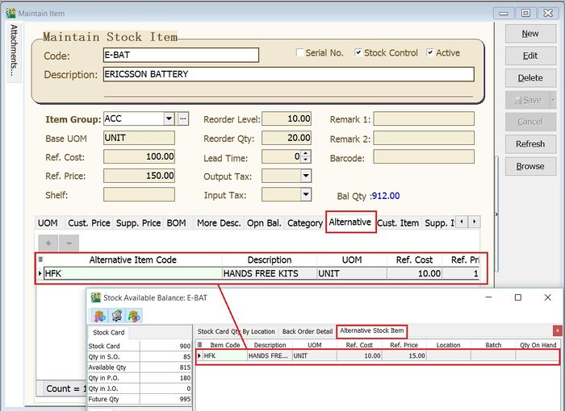
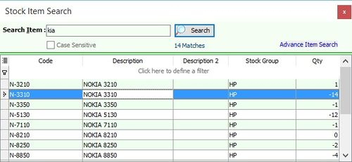
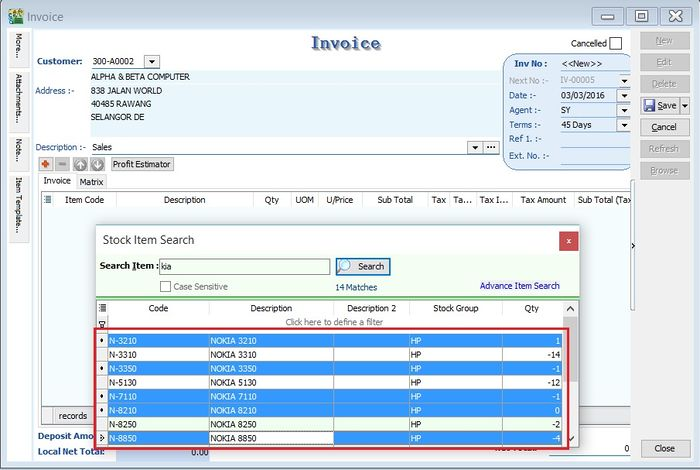
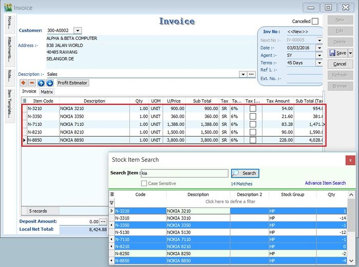

### Show Chart

_View | Show Chart_

This function is enabled to view the sales/purchase price history data in chart form.

- no shortcut.

1\. Apply the Sales / Purchase Price History from Sales | Print Sales Price History or Purchase | Print Purchase Price History .

2\. Highlight the data in the grids.

3\. Click on View | Show Chart.

4\. 3 different chart types (Bar Chart, Line Chart, Pie Chart) will be prompted. Seet the screenshot below.

Data transform into the chart depends on the data highlighted in the Sales/Purchase Price History grid.

### Sales Price History (Shift+Ctrl+S)

_View | Sales Price History..._

This function is to quick check on the sales price history during the sales, purchase, and stock documents creation.

- Shift + Ctrl + S

1\. As long you are highlight the item code, eg. at Maintain Stock Item or during the sales/purchase documents creation.

2\. Press Shift + Ctrl + S to check theSales Price History... for the item.

3\. Insert a Company Name column to compare the sales price history by company.

4\. Set the latest number of records to be displayed for each sales document type (QT, SO, DO, IV, CS, CN, DN).

5\. Click on Sales to exclude the sales document types.

Sales Price History always turns-on to quickly inquire the price history for customers.

### Purchase Price History (Shift+Ctrl+P)

_View | Purchase Price History..._

This function is to quickly check on the purchase price history during the sales, purchase, and stock documents creation.

- Shift + Ctrl + P

1\. As long you are highlight the item code, eg. at Maintain Stock Item or during the sales/purchase documents creation.

2\. Press Shift + Ctrl + P to check thePurchase Price History... for the item.

3\. Insert a Company Name column to compare the Purchase price history by company.

4\. Set the latest number of records to be display for each purchase document types (PQ, PO, GR, PI, CP, SC, SD).

5\. Click on Purchase to exclude the purchase document types.

Purchase Price History always turns-on to quickly inquire the price history for suppliers.

### Available Stock Balance (Ctrl+F11)

_View | Available Stock Balance..._

This function is to quick check on the stock status during the sales, purchase, and stock documents creation.

- Ctrl+F11

1\. As long you are highlight the item code, eg. at Maintain Stock Item or during the sales/purchase documents creation.

2\. Press Ctrl+F11 - Available Stock Balance....

### Stock Card Qty By Location

1\. Stock Card Qty By Location tab will show the stock status summary by location and batch.

2\. See the screenshot below.

| Column Name | Explanation |
| --- | --- |
| Location | Stock qty balances group by location. |
| Batch | Stock qty balances group by batch. |
| S.O.Qty | Outstanding SO Qty (Back Order). |
| P.O.Qty | Outstanding PO Qty (Back Order). |
| J.O.Qty | Outstanding JO Qty (Job Order Outstanding). |
| Qty | On hand Qty. |
| Avail.Qty | Future Qty. |
| Exp.Date | Batch expiry date. |

### Back Order Detail

1. To check the S.O.Qty, P.O.Qty and J.O.Qty in detail.
2. Click on Back Order Detail tab. See the screenshot below.

### Alternative Stock Item

1. Click on the Alternative Stock Item tab to check the alternative item code.
2. See the screenshot below.

Available Stock Balance always turn-on to quickly inquire about the stock status.

### Price Tag (Ctrl+T)

_View | Price Tag..._

This function is to quickly check on the Price Tag set for the item.

- Ctrl + T

1. As long you are highlight the item code, eg. at Maintain Stock Item or during the sales/purchase documents creation.
2. Press Ctrl + T to check the Price Tag... for the item.

Price Tag always turns-on to quickly inquire the price tag info for the item.

### Stock Item Picture

_View | Stock Item Picture_

This function is to quickly view the picture of the stock item selected.

- None.

1. As long you are highlight the item code, eg. at Maintain Stock Item or during the sales/purchase documents creation.
2. Click on View | Stock Item Picture.

Stock Item Picture always turns-on to quickly view the picture of the stock item.

### Stock Item Search (F9)

_View | Stock Item Search_

This function is to quickly search for the items by entering a keyword. It is easy to apply the item found into the sales/purchase/stock documents.

- F9

1. Enter a keyword to search the item out.

2. You can highlight multiple items.

3. Drag and drop the items highlighted into the invoice detail grid.

4. Items will be inserted into the invoice detail grid. See the screenshot below.

Item Search always turns-on to search the item when creating the next document.

### Advance Search (Ctrl+F)

_Edit | Find_

This function is to find record by selected field(s) and parameters....

- Ctrl + F

| Field Name | Properties |
| --- | --- |
| Display Fields | Fields to be displayed on the Result Screen |
| Tick Button | Select all. |
| Cross Button | Unselect all. |
| Plus Button | Add Condition |
| Minus Button | Remove Selected Condition |
| Match any of the following | Is OR condition. Find ANY Match Value on the Selected Condition. |
| Match all of the following | Is an AND condition. Find ALL Match Value on the Selected Condition. |
| Fields | Available Field(s) can Search for. |
| Operator | Type of Search. |
| Check Box | Selected Conditions which need to run/execute. |
| Value 1 | Parameter 1 or What to Value to Find. |
| Value 2 | Parameter 2 or What to Value to find and only Available for Operators between and not between. |
| Search | Apply or Search the Value. |
| Clear | To Clear All Conditions(Default Action) or All Value. |
| Case Sensitive | Tick if you want to find the value is Case Sensitive. |

## SQL Accounting Linking

We had 4 Methods to Integrate/Link to SQL Accounting

- [Restful API](https://wiki.sql.com.my/wiki/Restful_API) (Recommended - For two way communication & SQL Public Connect User)
- [SDK Live](https://wiki.sql.com.my/wiki/SDK_Live) (Recommended - For two way communication)
- [SQL Acc XLS n MDB Import](https://wiki.sql.com.my/wiki/SQL_Acc_XLS_n_MDB_Import) - XLS, XLSX, Json & CSV/TXT File (Format 2 - Bar(|),Comma(,),Semi Comma(;),Tilde(~))
- [SQL XML Import](https://wiki.sql.com.my/wiki/SQL_XML_Import) - XML File
- [SQL Text Import](https://wiki.sql.com.my/wiki/SQL_Text_Import) - CSV/TXT File (Format 1 - Semi Comma (;) Only)

**Choosing Method**

SQL Accounting had 3 Environment Setup & below is available method option  
1\. Public Cloud ([SQL Public Connect](https://connect.sql.com.my/))

Data is Host at our Public Server

- [Restful API](https://wiki.sql.com.my/wiki/Restful_API)
- [SQL Acc XLS n MDB Import](https://wiki.sql.com.my/wiki/SQL_Acc_XLS_n_MDB_Import)

2\. On Premise Cloud ([SQL Private Connect](https://private.sql.com.my/))

Data is Host at User own Office

- [Restful API](https://wiki.sql.com.my/wiki/Restful_API)
- [SDK Live](https://wiki.sql.com.my/wiki/SDK_Live)
- [SQL Acc XLS n MDB Import](https://wiki.sql.com.my/wiki/SQL_Acc_XLS_n_MDB_Import)

3\. On Premise(Offline)

Data is Host at User own Office

- [SDK Live](https://wiki.sql.com.my/wiki/SDK_Live)
- [SQL Acc XLS n MDB Import](https://wiki.sql.com.my/wiki/SQL_Acc_XLS_n_MDB_Import)
- [SQL Accounting](https://www.sql.com.my/download/demo/sqlacc-setup.exe)
- [Firebird 64 bit](https://github.com/FirebirdSQL/firebird/releases/download/R3_0_7/Firebird-3.0.7.33374_1_x64.exe)
- [Installation Guide](https://download.sql.com.my/customer/Fairy/Steps-InstallnCreateSampleDB.gif)

**Sample DB**

- [GSTnSST-SampleDB](https://download.sql.com.my/customer/Fairy/Testing-2022-05-18.zip)
- [Restore DB Guide](https://download.sql.com.my/customer/Fairy/Steps-RestoreDB.gif)

**Empty DB**

1. At the Login Screen Click 2 dot Button
2. Click Create New Database
3. Follow the wizard

\*Default UserName & Password is ADMIN

### Things To Consider Before Import/Post

Before wanted to Import/Post to SQL Accounting Database, below information/setting must set in the SQL Accounting

1. Click _Menu: View_

Untick(UnSelect) the option

- Command Navigator
- Tabbed Docking
- Allow Multiple Windows
- Enable Windows Task Bar

2. Click _Menu: Tools | Options... | Customer_

Tick(Select) the option

- Use Cash Sales No. for Payment Received

Untick(UnSelect) the option

- Perform Tax / Local Amount Rounding
- 5 Cents Rounding (Sales Invoice)
- 5 Cents Rounding (Cash Sales)

3. Click _Menu: Tools | Options... | Miscellaneous_

Untick(UnSelect) the option

- Prompt Negative Stock Quantity Dialog Box
- Prompt Duplicate Cheque Number

4. Click _Menu: Tools | Maintain User... | New_

Create New User (eg POS)

5. Click _Menu: Tools | Maintain User... | Access Right_

Tick (Select) the option

- Override Customer Credit Control under the Group : Customer
- Override Sales Min/Max Price under the Group : Sales
- Override Acceptable Transaction Date under the Group : Tools
- Save on Negative Quantity under the Group : Stock

Untick (UnSelect) the option

Under the Group : Sales

- Prompt Replace Unit Price Dialog
- Show Payment / Change Dialog in Cash Sales

6. Must be had/valid in SQL Accounting

| Field | In SQL Accounting |
| --- | --- |
| Customer Code | Customer => Maintain Customer |
| Supplier Code | Supplier => Maintain Supplier |
| Terms Code | Tools => Maintain Terms |
| Project Code | Tools => Maintain Project |
| Sales/Purchase Account Code | GL => Maintain Account |
| Sales/Purchase Return Account Code | GL => Maintain Account |
| Cash/Bank Account Code | Tools => Maintain Payment Method (Created from Maintain Account) |
| Agent Code | Tools => Maintain Agent |
| Area Code | Tools => Maintain Area |
| Currency Code | Tools => Maintain Currency |
| Tax Code | Tools => Maintain Tax (if had GST) |

7. Below is Optional (i.e. if had post/import item code to SQL Accounting)

| Field | Location/Form |
| --- | --- |
| Item Code | Stock => Maintain Stock Item |
| Location Code | Stock => Maintain Location |
| Batch Code | Stock => Maintain Batch |

**\*ALWAYS do backup the database First before Import/Post to SQL Accounting**

### Normal Used Table/Biz Object Name

\---Sales Side---

| Biz Object | Description |
| --- | --- |
| AR_Customer | Maintain Customer |
| SL_IV | Sales Invoice |
| SL_CS | Cash Sales |
| SL_CN | Sales Credit Note |
| SL_DN | Sales Debit Note |
| AR_PM | Customer Payment |
| AR_IV | Customer Invoice |
| AR_DN | Customer Debit Note |
| AR_CN | Customer Credit Note |

\---Purchase Side---

| Biz Object | Description |
| --- | --- |
| AP_Supplier | Maintain Supplier |
| PH_PI | Purchase Invoice |
| PH_CP | Cash Purchase |
| PH_SC | Purchase Return |
| PH_SD | Purchase Debit Note |
| AP_SP | Supplier Payment |
| AP_PI | Supplier Invoice |
| AP_SD | Supplier Debit Note |
| AP_SC | Supplier Credit Note |

- Detail Data should Group by Stock Group/Category & TaxType (ZRL or SR) & Itemcode (if wanted import itemcode)
- Eg. Cafe can be group by

    \- Food - SR
[]
    \- Food - ZRL

    \- Beverage

    \- Service Charges

    \- Rounding

- Eg. Today got 10 transactions

    \- 8 is Simplified Invoice - Group as 1 Doc No - POS-00001

    \- 2 is Full Tax Invoice/Credit Sales Invoice - 1 by 1 in - POS-00002, POS-00003

- All can post to SL_CS & AR_PM
- Below is example Today Total Simplified Invoice Sales is RM1000

#### Method 1 (Recommended)

It will be had 4 transactions

1. RM1000 - Post to SL_CS & (P_DocNo, P_PaymentMethod field is empty & P_Amount, P_PaidAmount field is 0)

2. RM700 by Cash - Post to AR_PM

3. RM200 by MasterCard - Post to AR_PM

4. RM100 by CreditCard - Post to AR_PM

Pros : Easy to Edit or Delete the transactions  
Cons : Many Posting document

#### Method 2

It will be had 3 transactions

1. RM700 by Cash - Post to SL_CS P_PaymentMethod field

2. RM200 by MasterCard - Post to AR_PM

3. RM100 by CreditCard - Post to AR_PM

Pros : Less Posting document  
Cons :

- Not Easy to Edit or Delete the transactions
- Cash Sales OR number unable to override (i.e. System Auto set/assign)
- Both Full Tax & Simplified IV can use same Debtor Code as Not mention required Customer GST ID
- Government 5 cents Rounding Mechanism - NO Tax/GST Code
- Deposit for Non Refundable can use Customer Payment (AR_PM) & set _NONREFUNDABLE_ field to _1_

    \- Default is SR

    \- Will auto reverse once it being Knock-Off

- Doc Disc should proportion by sub total amt for mix tax code (See Cash Sales POS-DocDisc)

    Example

    \- Doc Discount = 10% of Document Discount

    \- Sub Total for SR = 150.24 => Disc (150.24 \* 10%) = 15.02

    \- Sub Total for ZR = 988.88 => Disc (988.88 \* 10%) = 98.89

    0r

    \- Doc Discount = 113.91

    \- Sub Total for SR = 150.24 => Disc ((150.24/1139.12) \* 113.91) = 15.02

    \- Sub Total for ZR = 988.88 => Disc ((988.88/1139.12) \* 113.91) = 98.89

- Mixed Supplies Tax Code

    \- ES

    \- TX-ES (Replace TX-N43)

    \- TX-RE

- Realise Bad Debts Use CN as Normal

    \- System will contra the provision bad debts done at GST-03 by 6 mth bad debts

    \- Make sure Knock the actual Bad debts Invoice

- For Purchase Invoice(PI) MUST 1 by 1 post in (i.e. can't Group multi PI in 1 PI)

**Prompt Invalid class string, ProdID: "SQLAcc.BizApp" error while try to link to SQL Accounting.**

1. Login SQL Accounting
2. Click Tools | Options | General
3. Click Register & follow wizard
4. Exit SQL Accounting
5. Login SQL Accounting
6. Try run you application to link again

If still prompt after above steps

1. Uninstall SQL Accounting
2. Stop Anti Virus
3. Reinstall SQL Accounting
4. Run the above steps again

**Prompt Access Violation when import.**

This happen due to

The fieldname is not match with SQL Accounting (eg SQLAcc fieldname UDF_Width yr had call for UDF_Weight)

1. Old version of SQL Acc Import program, try update the SQL Acc Import program
2. The fieldname had the empty space at the beginning and/or end (norm happen if import from Excel) eg 'DocNo ' or ' DocNo' instead of 'DocNo'