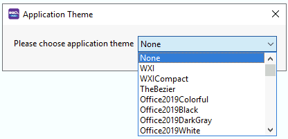
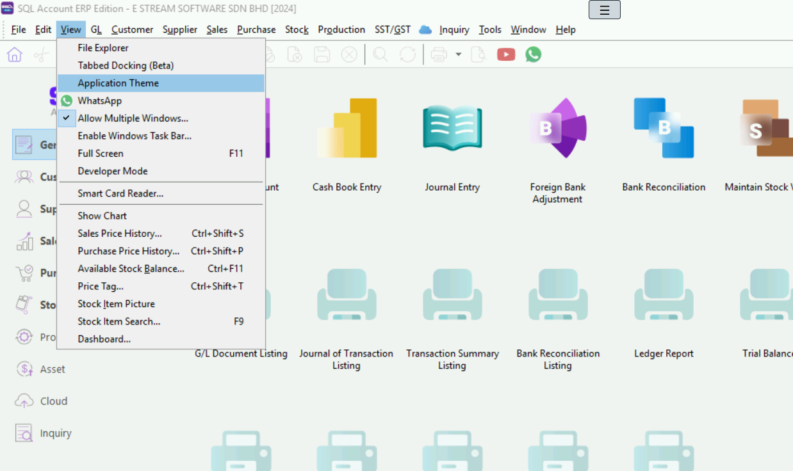
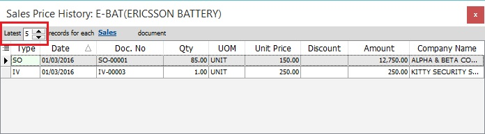
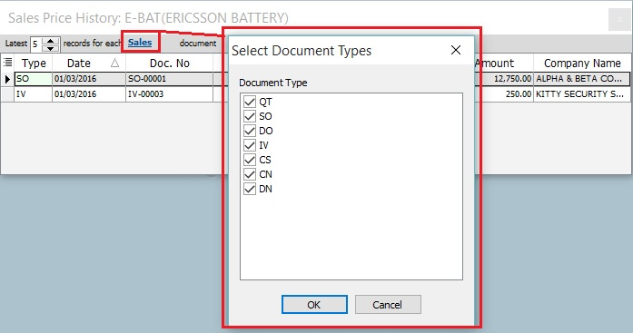
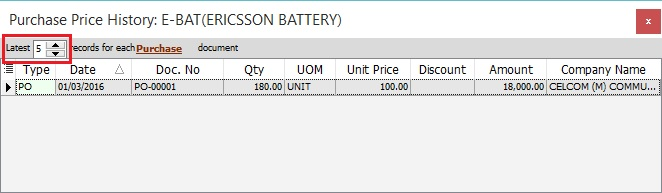
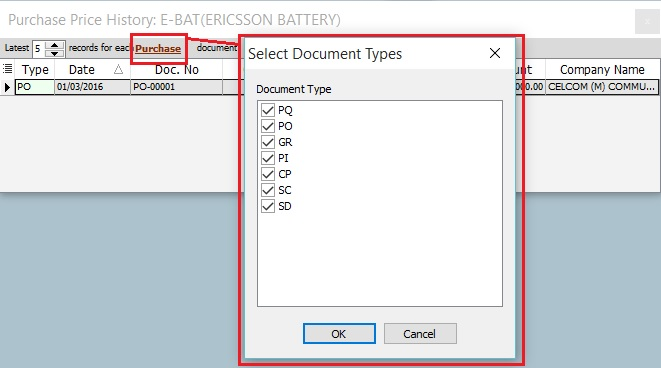
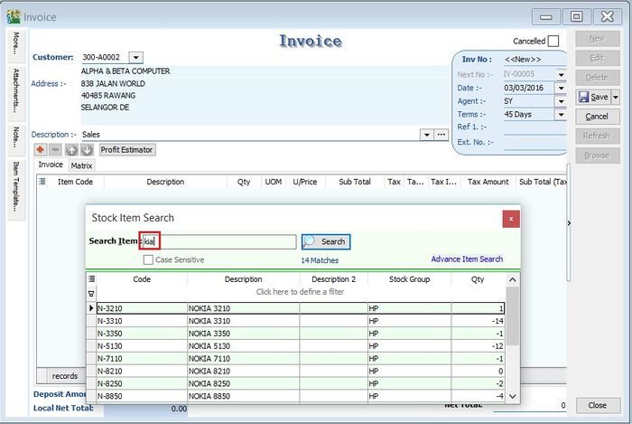
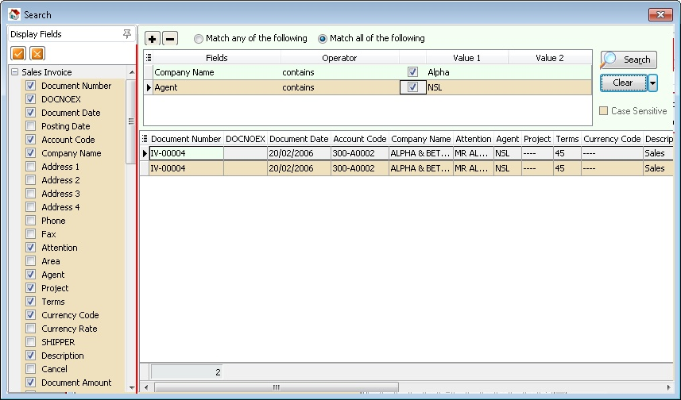

## Tabbed Docking

Similar with Internet Explorer or Google Chrome layout, user can view the window in Tab style layout instead of Windows style layout.

## Application Theme

Is a function which allow user to change the SQL Product Application Skin/Layout to suit the user favorite. It will consume more resource if the Theme is Enable .

## Show Chart

`View | Show Chart`

This function is enabled to view the sales/purchase price history data in chart form.

1. Apply the Sales / Purchase Price History from `Sales | Print Sales Price History or Purchase | Print Purchase Price History` .

2. Highlight the data in the grids.

    

3. Click on `View | Show Chart`.

4. 3 different chart types (Bar Chart, Line Chart, Pie Chart) will be prompted. Seet the screenshot below.

    

Data transform into the chart depends on the data highlighted in the Sales/Purchase Price History grid.

## Sales Price History (Shift+Ctrl+S)

`View | Sales Price History...`

This function is to quick check on the sales price history during the sales, purchase, and stock documents creation.

`Shift + Ctrl + S`

1. As long you are highlight the item code, eg. at Maintain Stock Item or during the sales/purchase documents creation.

2. Press Shift + Ctrl + S to check theSales Price History... for the item.

    

3. Insert a Company Name column to compare the sales price history by company.

    

4. Set the latest number of records to be displayed for each sales document type (QT, SO, DO, IV, CS, CN, DN).

    

5. Click on Sales to exclude the sales document types.

    

Sales Price History always turns-on to quickly inquire the price history for customers.

## Purchase Price History (Shift+Ctrl+P)

`View | Purchase Price History...`

This function is to quickly check on the purchase price history during the sales, purchase, and stock documents creation.

`Shift + Ctrl + P`

1. As long you are highlight the item code, eg. at Maintain Stock Item or during the sales/purchase documents creation.

2. Press Shift + Ctrl + P to check thePurchase Price History... for the item.

    

3. Insert a Company Name column to compare the Purchase price history by company.

    

4. Set the latest number of records to be display for each purchase document types (PQ, PO, GR, PI, CP, SC, SD).

    

5. Click on Purchase to exclude the purchase document types.

    

Purchase Price History always turns-on to quickly inquire the price history for suppliers.

## Available Stock Balance (Ctrl+F11)

`View | Available Stock Balance...`

This function is to quick check on the stock status during the sales, purchase, and stock documents creation.

`Ctrl+F11`

1. As long you are highlight the item code, eg. at Maintain Stock Item or during the sales/purchase documents creation.

2. Press Ctrl+F11 - Available Stock Balance....

    

### Stock Card Qty By Location

1. Stock Card Qty By Location tab will show the stock status summary by location and batch.

2. See the screenshot below.

    

    | Column Name | Explanation |
    | --- | --- |
    | Location | Stock qty balances group by location. |
    | Batch | Stock qty balances group by batch. |
    | S.O.Qty | Outstanding SO Qty (Back Order). |
    | P.O.Qty | Outstanding PO Qty (Back Order). |
    | J.O.Qty | Outstanding JO Qty (Job Order Outstanding). |
    | Qty | On hand Qty. |
    | Avail.Qty | Future Qty. |
    | Exp.Date | Batch expiry date. |

### Back Order Detail

1. To check the S.O.Qty, P.O.Qty and J.O.Qty in detail.
2. Click on Back Order Detail tab. See the screenshot below.

    

### Alternative Stock Item

1. Click on the Alternative Stock Item tab to check the alternative item code.
2. See the screenshot below.

    

Available Stock Balance always turn-on to quickly inquire about the stock status.

## Price Tag (Ctrl+T)

`View | Price Tag...`

This function is to quickly check on the Price Tag set for the item.

`Ctrl + T`

1. As long you are highlight the item code, eg. at Maintain Stock Item or during the sales/purchase documents creation.
2. Press Ctrl + T to check the Price Tag... for the item.

    

Price Tag always turns-on to quickly inquire the price tag info for the item.

## Stock Item Picture

`View | Stock Item Picture`

This function is to quickly view the picture of the stock item selected.

1. As long you are highlight the item code, eg. at Maintain Stock Item or during the sales/purchase documents creation.
2. Click on View | Stock Item Picture.

    

Stock Item Picture always turns-on to quickly view the picture of the stock item.

## Stock Item Search (F9)

`View | Stock Item Search`

This function is to quickly search for the items by entering a keyword. It is easy to apply the item found into the sales/purchase/stock documents.

`F9`

1. Enter a keyword to search the item out.

    

2. You can highlight multiple items.

    

3. Drag and drop the items highlighted into the invoice detail grid.

    

4. Items will be inserted into the invoice detail grid. See the screenshot below.

    

Item Search always turns-on to search the item when creating the next document.

## Advance Search (Ctrl+F)

`Edit | Find`

This function is to find record by selected field(s) and parameters....

`Ctrl + F`

| Field Name | Properties |
| --- | --- |
| Display Fields | Fields to be displayed on the Result Screen |
| Tick Button | Select all. |
| Cross Button | Unselect all. |
| Plus Button | Add Condition |
| Minus Button | Remove Selected Condition |
| Match any of the following | Is OR condition. Find ANY Match Value on the Selected Condition. |
| Match all of the following | Is an AND condition. Find ALL Match Value on the Selected Condition. |
| Fields | Available Field(s) can Search for. |
| Operator | Type of Search. |
| Check Box | Selected Conditions which need to run/execute. |
| Value 1 | Parameter 1 or What to Value to Find. |
| Value 2 | Parameter 2 or What to Value to find and only Available for Operators between and not between. |
| Search | Apply or Search the Value. |
| Clear | To Clear All Conditions(Default Action) or All Value. |
| Case Sensitive | Tick if you want to find the value is Case Sensitive. |
