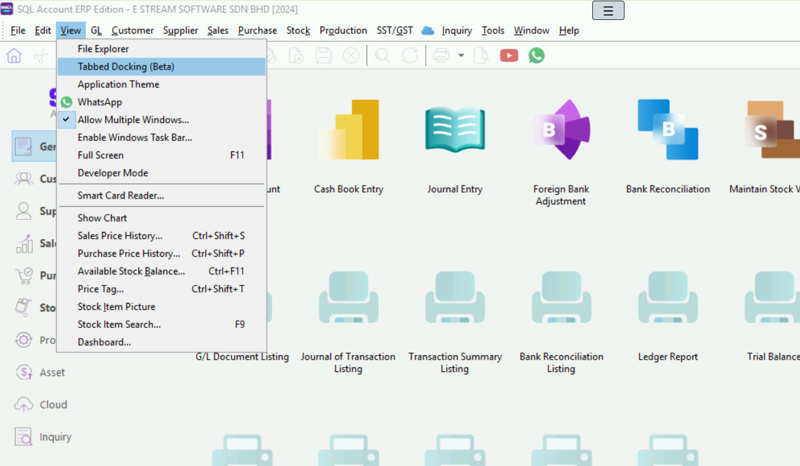

## Tabbed Docking

Similar with Internet Explorer or Google Chrome layout, user can view the window in Tab style layout instead of Windows style layout.

## Application Theme

Is a function which allow user to change the SQL Product Application Skin/Layout to suit the user favorite. It will consume more resource if the Theme is Enable .

