## SST Setup and Information

## SST Introduction

Introduced in September 2018, SST replaced the former 6% Goods and Services Tax (GST) system. SST comprises two parts: Sales tax and Service tax. Sales tax is a single-stage tax levied on all taxable goods manufactured in and imported into Malaysia; whereas Service tax is a single-stage tax charged on any taxable services provided in Malaysia by a registered person in conducting the business. Malaysia has a few special designated areas that are exempted from service tax, namely Langkawi Island, Tioman Island and Federal Territory of Labuan.

### Sales and Service Tax 2018 Model and Scope

Sales and Service Tax model are structured as below:

## Open SST Return

### Tax code and SST-02 mapping

SST tax code structures and mapping to SST-02:

### Example of SST-02

:::info
SQL Account process SST02 step : [Youtube](https://youtu.be/laLjRJWh2j8)
:::

1. Process SST Return from SST | New SST Return

   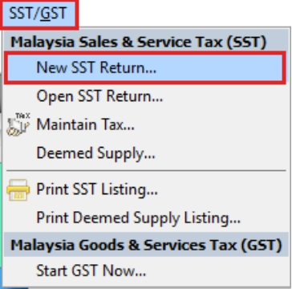

2. Enter your taxable period

3. Key in declaration, this declaration will appear in SST02 form part F, this is required to key in 1 time only, in the following return will automatic show out.

4. click on Process

   

5. click on SST-02

   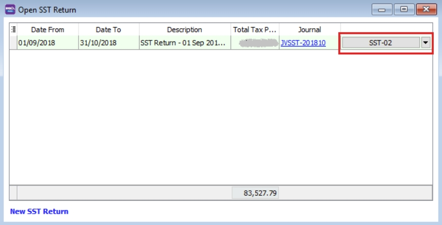

   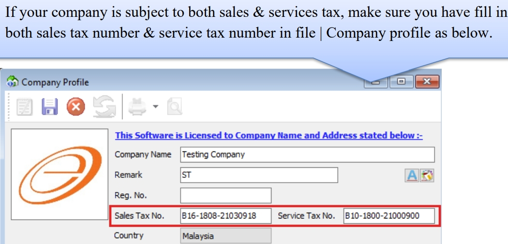

   

:::info
Understand SST02 27 Column : [Video](https://www.facebook.com/SQLEstream/videos/2216806511940307/)
:::

---

1. Part A

   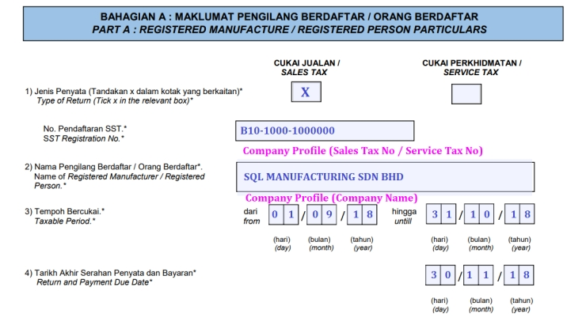

2. Part B1

   

3. Part B2

   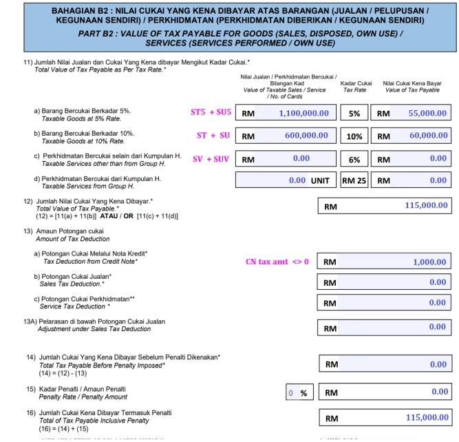

4. Part C

   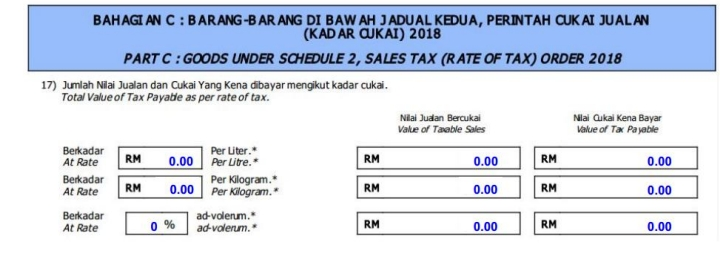

5. Part D

   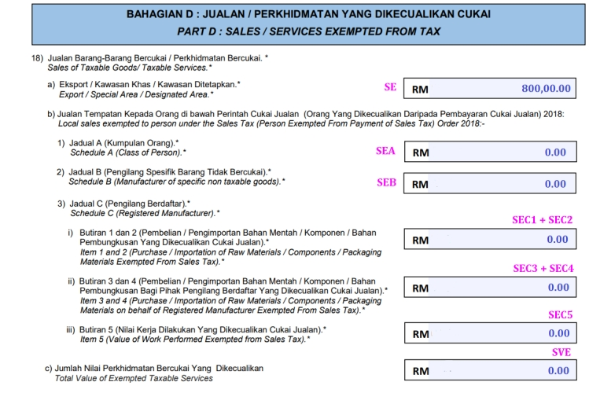

6. Part E

   

7. Part F

   

8. Part G

   

## New SST Return

To process and close the SST returns period. You can generate the SST-02.

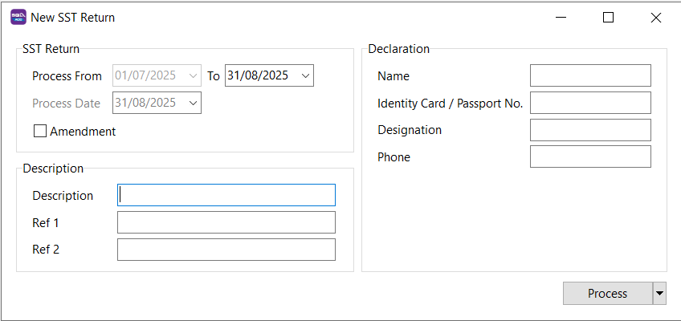

| Field Name          | Field Type | Explanation                                                                                  |
|--------------------|------------|----------------------------------------------------------------------------------------------|
| Process From to     | Date       | SST Taxable Period, e.g., every 2 months.                                                    |
| Process Date        | Date       | Date to process the SST Return.                                                              |
| Amendment           | Boolean    | Ticked. In SST-02, the "Amendment" checkbox will be marked X.                                |
| C/F Refund for SST  | Boolean    | Ticked. In SST-02, the Item 9 "Do you choose to carry forward refund for SST?" will be marked X in Yes checkbox. |
| Description         | String     | SST Return - Process From Date to Date (by default).                                         |
| Ref 1               | String     | Key-in any reference no.                                                                     |
| Ref 2               | String     | Key-in any reference no.                                                                     |

## Draft SST Return 

You are able to draft the SST-02 before the final SST-02 submission by process as draft.
1. Click on the arrow key down at the Process button (Y).
2. See below screenshot.

3. **DRAFT** Status showed for the SST Returns period.

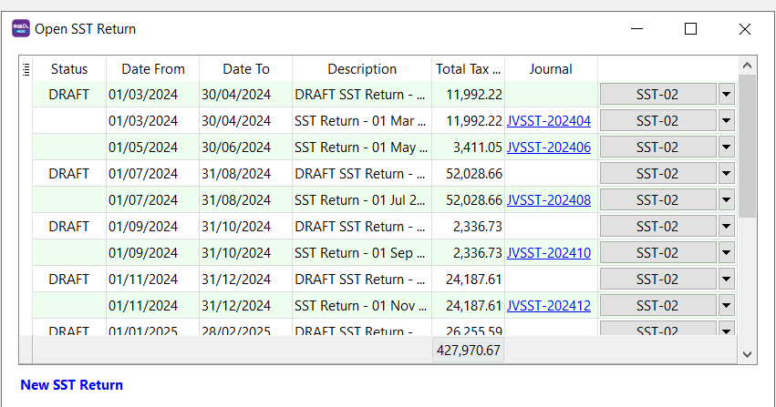

:::note Note:
You still can amend the documents where the DRAFT SST return has generated. You can draft as many before FINAL process the SST Returns for the period.
:::

## Final SST Return

1. Click on the Process button.
2. See below screenshot.

3. Final SST Return will not show the word DRAFT in the status column.

:::note Note:
You cannot amend the documents anymore where the FINAL SST return has generated.
:::

## Posting

1. Sales Tax (Accrual Basis)

   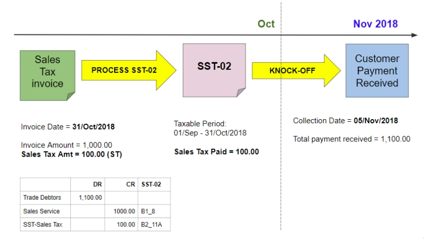

2. Service Tax (Payment Basis)

   In SST 2.0, the service tax is due and payable when payment is received for any taxable service.

      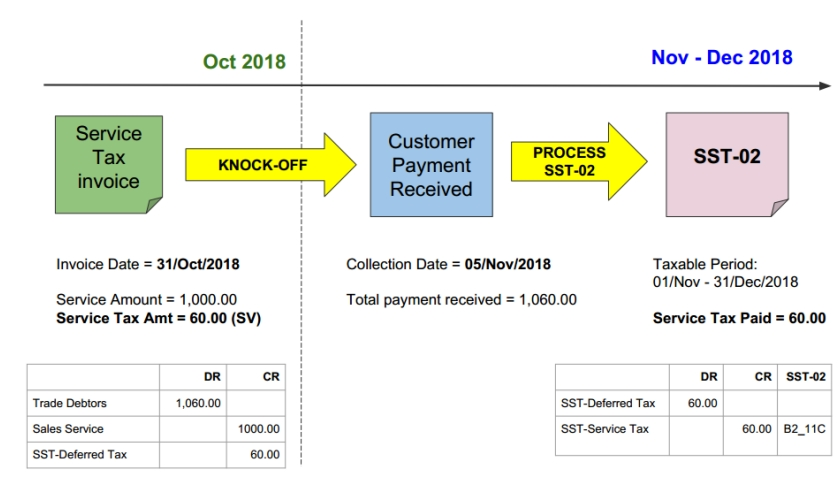

   1. Issue sales invoice with service tax 6%, date 31/10/2018, Amount RM 1,000.00 & Tax Amount RM 60.00.

      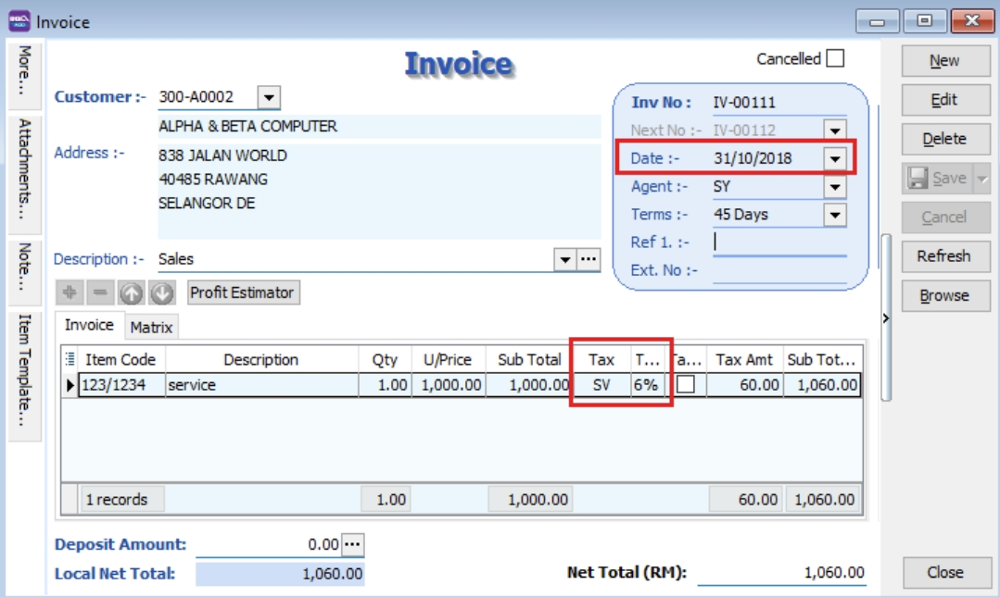

   2. Process SST Return from 01/09/2018 to 31/10/2018. Total Tax Payable is RM 0. Due to no payment is receive for the invoices issued.

      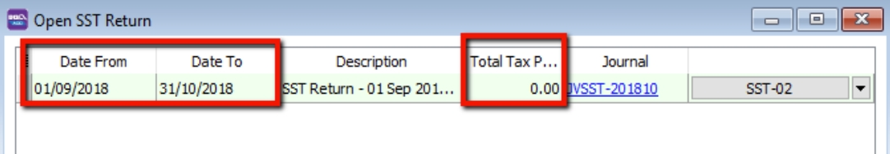

   3. Payment is received on 05/11/2018, knocked-off on IV-00111.

      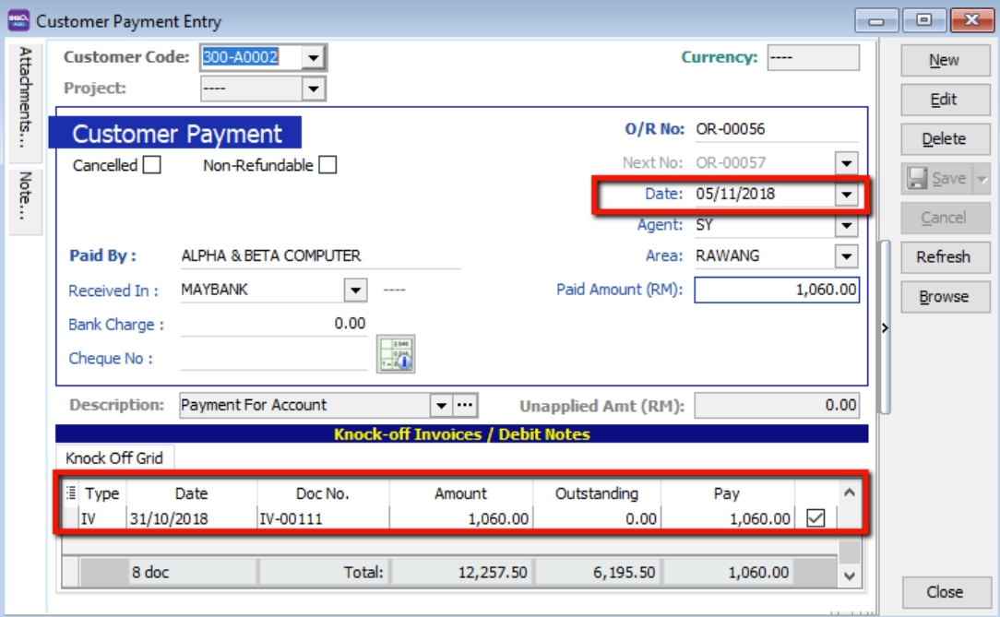

   4. Process second cycle of taxable period, the tax payable will be capture as payment is received.

      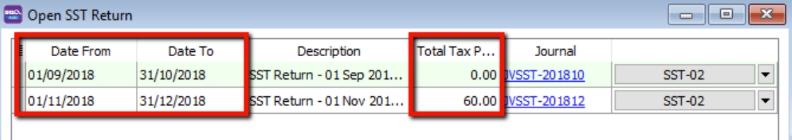

   5. SQL Account will auto Credit to SST- Deferred Tax account during invoice issue but no payment. Once payment is received, a Debit will be auto reversed at SST-Deferred Tax Account.

      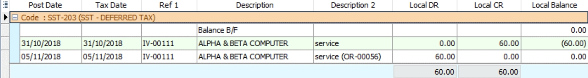

   6. the taxable amount of RM 1,000.00 and Tax Amount of RM 60.00 will also capture in SST-02 Part B2, number 11c.

      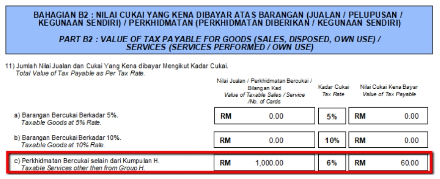

## Sales Tax Legislation

### Act

   1. Sales Tax 2018

### Regulations

   1. Sales Tax Regulations 2018

   2. Sales Tax (Customs Ruling) Regulations 2018

   3. Sales Tax (Determination of Sale Value of Taxable Goods) Regulations 2018

   4. Sales Tax (Compounding of Offences) Regulations 2018

### Order

   1. Appointment of Date of Coming into Operation

   2. Sales Tax (Person Exempted From Payment Of Tax) Order 2018

   3. Sales Tax (Imposition Of Tax In Respect Of Designated Area) Order 2018

   4. Sales Tax (Imposition Of Tax In Respect Of Special Area) Order 2018

   5. Sales Tax (Exemption From Registration) Order 2018

   6. Sales Tax (Goods Exempted From Tax) Order 2018

   7. Sales Tax (Rates Of Tax) Order 2018

   8. Sales Tax (Total Sale Value Of Taxable Goods) Orders 2018

## Scope and Charge

Sales Tax is a tax charged and levied -

- on taxable goods manufactured in Malaysia by a taxable person and sold, used or disposed by him;

- on taxable goods imported into Malaysia

**Definition of:**

◆ Goods means all kind of movable property.

◆ Taxable goods means goods of a class or kind not exempted from sales tax; i.e goods which are not listed in Sales Tax (Goods Exempted From Sales Tax) Order 2018.

◆ Sales includes barter, disposal of goods with a right of purchase or on terms providing that the seller retains an interest in the goods, and delivery of goods under any conditions as to future payment.

Sales Tax is not charged on-

- Goods listed under Sales Tax (Goods Exempted From Sales Tax) Order 2018;

- Certain manufacturing activities are exempted by Minister of Finance through Sales Tax (Exemption from Registration) Order 2018.

:::note
Malaysia excludes designated area (DA) and special area (SA).
:::

## Sales Tax Mechanism

Overview of Sales Tax flow chart:-

## Meaning of Manufacture

Manufacture defines as **a conversion of materials** by manual or mechanical means into a new product by changing the following:

1. size

2. shape

3. composition

4. nature

5. quality

of such materials and includes the assembly of parts into a piece of machinery or other products.

However, manufacture does not include the installation of machinery or equipment for the purpose of construction.

In relation to petroleum, any process of:-

1. separation

2. purification

3. conversion

4. refining

5. Blending

For goods other than petroleum

1. By conversion

   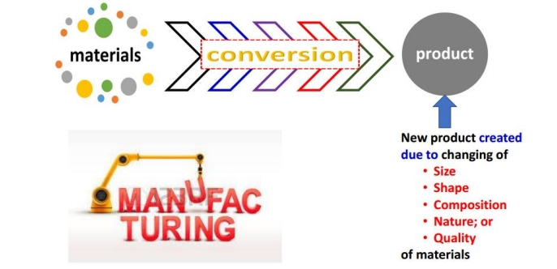

2. The assembly

   

3. For petroleum

   

## Meaning of Taxable Person

Taxable person is a person who manufacturing taxable goods and is:

1. Liable to be registered

   - Reached sales threshold

      - Manufacturer - RM 500,000.00

      - Sub-contractor - RM 500,000.00

2. Registered under Sales Tax Legislation

   - Mandatorily registered

   - Voluntarily registered

## Sales Tax Registration

### Liability To Register

Taxable goods manufacturers are required / liable to be registered when SALES VALUE OF TAXABLE GOODS has exceeded RM 500,000 for 12 months period.

Manufacturers who carry out sub-contract work on taxable goods where the VALUE of work performed exceeds RM500,000 for 12 months period.

Taxable goods belong to:

- Registered manufacturer;

- Non-registered manufacturer

- Manufacturer in special area (FIZ and LMW)

:::note
Registered Person will known as Registered Manufacturers.
:::

### Voluntary Registration

Conditions are:

- Sales value of taxable goods below threshold (ie. < RM 500,000).
- Person who are exempted from registration

### Determination of Turnover

Manufacturers should calculate the sales value of taxable goods for a period of 12 months using the following methods:

1. Historical Method

    The total value of taxable goods in that month and the 11 months immediately preceding the month;

2. Future Method

    The total value of taxable goods in that month and the 11 months immediately succeeding the month.

### Exemption from Registration

- Manufacturer of non taxable goods. (Not eligible for voluntary registration).

- Manufacturer below threshold (ie. < RM 500,000).

- Sub-contractor manufacturer below threshold.

- Manufacturing activities that have been exempted from registration. E.g :

  - Tailoring

  - Installation incorporation of goods into building

### Transitional Registration

   Manufacturer who is liable to be registered is required to register before 1 September 2018. Registration commencement date will be on 1 September 2018.

   1. Automatic Registration

      - Manufacturers who are GST Registered Persons which have been identified and fulfilled the required criteria will be registered automatically as Registered Manufacturer under Sales Tax.

      - Registered Manufacturer need to charge tax beginning 1 September 2018.

   2. Person Not Registered Automatically

      - GST registered person who fulfilled the required criteria to be registered but were not registered by 1 September 2018 need to apply for registration within 30 days from the commencement date.

## Taxable vs Exempted Goods

### Taxable Goods

Taxable goods means goods of a class or kind of **not exempted** from sales tax.

In another words, goods which are not listed in **Sales Tax (Goods Exempted From Sales Tax) Order 2018.**

Example of taxable goods are:

It is chargeable with a tax rate of

- 10% - standard sales tax rate

- 5% - reduced sales tax rate

  - First Schedule in the Sales Tax (Rate of Tax) Order 2018

- Specific rate - for petroleum product (eg. RM0.30 per litre)

  - Second Schedule in the Sales Tax (Rate of Tax) Order 2018

How to determine the rate of sales tax for goods?

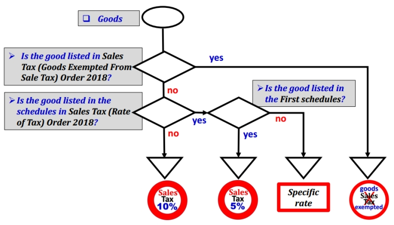

### Exempted Goods

   **Exempted goods** means goods of a class or kind of exempted from sales tax which are listed in **Sales Tax (Goods Exempted From Sales Tax) Order 2018**.

   Example of exempted goods are:

   

## Value of Taxable Goods

Refer to **Sales Tax (Rules of Valuation) Regulation 2018**, value of taxable goods that:

- sold by taxable person

- manufactured and used by the manufacturer for other purpose than as materials in manufacturing; or

- disposed by manufacturer.

For goods belongs to another manufacturer is known as sub-contract work.

- Sale value of the goods = Amount of the work performed and charged by **sub-contractor**.

The sale value of the goods shall be determined on the basis of the **transactions value of the goods** as the primary basis of valuation.

Transaction value of the goods,

- The **actual price** the goods are sold, without any conditions or restrictions imposed to purchaser.

- Purchaser is not required to give parts of proceed on subsequent sale to the manufacturer.

- Purchaser and manufacturer are not related or if related the relationship did not influence the price.

## Responsibility of Registered Manufacturer

   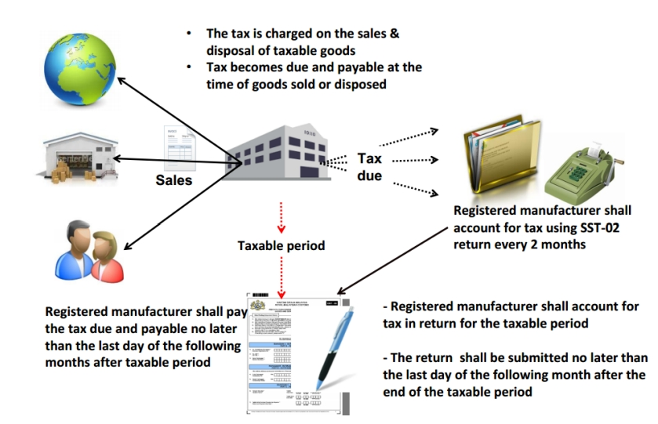

## Exemption and Facilities

### Goods Exemption from Sales Tax

**Goods** refer to Sales Tax (Goods Exempted From Sales Tax) Order 2018.

- E.g. live animals, unprocessed food, vegetables, medicines, machinery, chemicals, etc.

### Person Exempted from Sales Tax

Person refer to Sales Tax (Person Exempted From Sales Tax) Order 2018.

- Schedule A: Class of person, e.g. Ruler of States, Federal or State Government Department, Local Authority, Inland Clearance Depot, Duty Free Shop.

- Schedule B: Manufacturer of specific non-taxable goods, e.g. any manufacturer of

    1. Controlled goods under Control of Supplies Act 1961

    2. Pharmaceuticals products

    3. Solely manufacture milk products

    4. Solely manufacture of exempted goods for export to import/purchase raw materials, components and packaging materials.

       - Schedule C: Registered Manufacturer, exemption of tax on the acquisition of raw materials, components, packaging to be used in manufacturing of taxable goods (previously known as CJ5, CJ5A, CJ5B).

### Field Exempted from Sales Tax

   Manufacturing activities exempted from registration regardless of turnover.

- E.g. tailor, jeweller, optician, engraving, vanishing table top, etc.

## Special Rules

### Treatment in Designated Area (DA)

:::note
SA = Special Area, e.g. Free Zone (FZ), Licensed Warehouse, Licensed Manufacturing Warehouse (LMW) and Joint Development Area (JDA).

PCA = Principal Customs Area
:::

### Treatment in Special Area (SA)

## Accounting of Tax

### Invoices

Issuance of Invoice:

- Mandatory for registered manufacturer who sell taxable goods.

- Hard copy or electronically.

- Containing prescribed particulars.

- Bahasa Melayu or English.

   **Prescribed particulars** are:

   1. The invoice serial number;

   2. The date of the invoice;

   3. The name, address and identification number of the registered manufacturer (Sales Tax Number);

   4. The name and address of the person to whom the taxable goods is sold;

   5. Description and quantity of the goods;

   6. Any discount offered;

   7. For each description, distinguish the type of goods, quantity and amount payable excluding tax;

   8. The total amount payable excluding tax, the rate of tax and the total tax chargeable shown as a separate amount or total amount payable inclusive of total of tax chargeable;

   9. Any amount expressed in a currency other than ringgit shall also be expressed in ringgit at the selling rate of exchange prevailing in Malaysia at the time of sale.

## Credit Note & Debit Note

A credit note is allowed to issue by registered manufacturer under the situation where the goods are returned by the purchaser due to :

- Wrong quantity, poor or defective quality or uncontracted goods, provided that the goods have not been subsequently sold or disposed of by the purchaser.

- Discount given in respect of goods sold and which are freely available to all who are willing to conduct business.

A debit note is allowed to issue by registered manufacturer under the situation where there is an additional of sales tax to be paid for any price adjustment.

Both credit note and debit note shall contains the following particulars:

- The word “credit note” or “debit note” in a prominent place.

- The serial number and date of issue.

- The name, address and Sales Tax identification number of the supplier.

- The name and address of the customer.

- The **reason** for issuance.

- Description which identifies the description of goods, the quantity and amount for which CN or DN is given.

- The total amount excluding tax.

- The rate and amount of tax.

- The number and date of the original invoice.

If changes related to amount of tax payable:

- Adjustment in the return for the taxable period in which the credit note or debit note is issued.

- Adjustment in the return for the last taxable for person who has ceased to be a taxable person.

If deduction for taxable period exceeds the amount of sales tax payable, the balance is to be carried forward to the next taxable period. Refund is not allowed on balance carried forward if taxable person has ceased to carry on business.

## Accounting Basis and Taxable Period

### Accounting Basis

Sales Tax is based on accrual basis and it is required to be accounted at the time when the goods are sold, disposed or first used.

### Taxable Period

Regular interval period where a taxable person accounts and remits sales tax to Government. Default taxable period for the registered manufacturer to be **bimonthly (2 months)** period.

Registered manufacturer may apply for taxable period other than the default taxable period.

In summary,

## Furnishing Sales Tax (SST-02) Return & Payment of Tax

Registered manufacturer has to declare SST return every 2 months according to the taxable period.

- Sales tax return has to be submitted not later than the last day of the following month after the taxable period ended.

- Sales tax return has to be submitted regardless of whether there is any tax to be paid or not.

- Sales tax return has to be submitted electronically or by cheque, bank draft and posted to SST Processing Centre.

Payment for tax due and payable declared in SST-02. Failure to submit return is an offence.

## Miscellaneous (Remission, Refund of Overpaid Tax, Drawback. Penalty)

### Remission

Minister may remit the whole or any part of sale tax due and payable.

Director General may remit the whole or any part of:

- Surcharge

- Penalty

- Fee

- Other money payable under the Act

### Refund of overpaid tax

Any person who has overpaid or erroneously paid of sales tax, penalty, surcharge, fee; or If any person who has paid sales tax and then exemption or remission of sales tax has granted by Minister.

Claim to be made in form JKDM No. 2 within one year from the date of over payment or erroneously payment; or entitlement of refund.

### Drawback

Director General may allow drawback of the full amount of sales tax paid by a person in respect of taxable goods which are subsequently exported. This is not applicable to petroleum.

Conditions:

- Goods must be exported within six months from Sales Tax paid on import or date of invoice issued.

- Application made within three months from the date of export in JKDM Form no. 2

- Other conditions with regards to documentation and declaration.

Submission to sales tax office at applicants’ place of business.

Illustration:

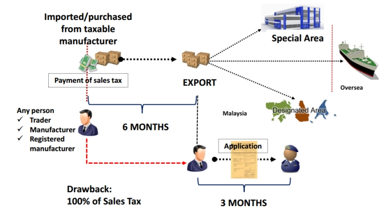

### Penalty for late payment of tax

Late payment penalty on the amount of sales tax not paid as shown in the table below.

### Other penalty for offences

Evasion of sales tax:

- 1st offence - either or both

  - Fine

    - Minimum 10x Sales Tax Amount

    - Maximum 20x Sales Tax Amount

  - Imprisonment not exceeding 5 years

- 2nd offence - either or both

  - Fine

    - Minimum 20x Sales Tax Amount

    - Maximum 40x Sales Tax Amount

  - Imprisonment not exceeding 7 years

## Service Tax Legislation

### Act

   1. Service Tax 2018

### Regulations

   1. Service Tax Regulations 2018

   2. Service Tax (Customs Ruling) Regulatons 2018

   3. Service Tax (Compounding of Offences) Regulations 2018

### Order

   1. Appointment of Date of Coming into Operation

   2. Appointment of Effective Date for Charging and Levying of Service Tax

   3. Service Tax (Imposition Of Tax For Taxable Service in Respect of Designated Areas and Special Areas) Order 2018

   4. Service Tax (Rates Of Tax) Order 2018

## Scope and Charge

Service tax is charged on:

- any provision of taxable services;

- made in the course or furtherance of any business;

- by a taxable person; and

- In Malaysia

Service tax is not chargeable on:

- Imported services

- Exported services

## Service Tax Mechanism

Overview of Service Tax flow chart:-

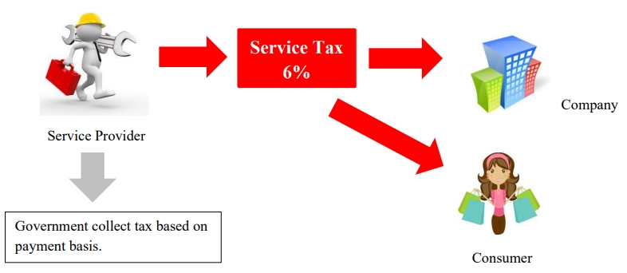

## Meaning of Taxable Person

A service provider who is liable to be registered or registered under the Service Tax Act 2018. The service provider provides taxable services in the course or furtherance of business in Malaysia.

## Taxable Service

Value of taxable service provided by a service provider for a period of 12 months that exceed a threshold of RM 500,000 is liable to be registered. Except the following taxable service group:

- Food and Beverages (exceed RM 1,500,000)

- Credit card / charge card (no threshold)

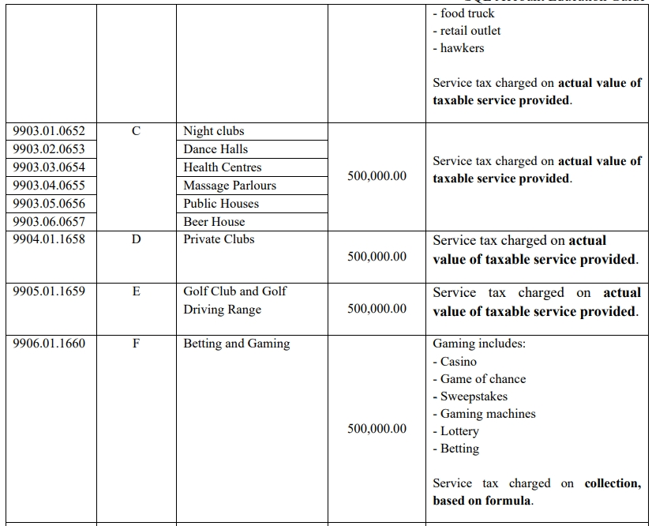

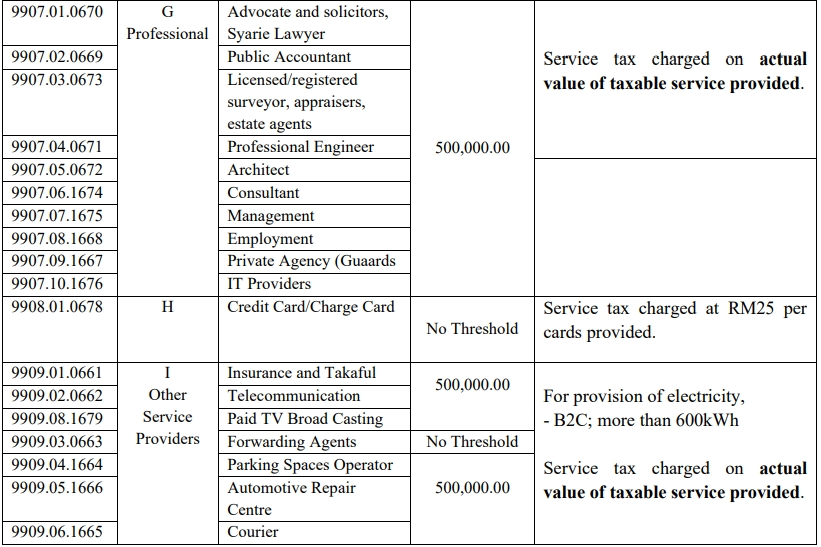

## Rate of Services

All taxable services are fixed charged at a rate of 6%, except the provision of credit card/charge card services are charged at a specific rate of tax of RM25 is imposed upo issuance of principal or supplementary card and every subsequent year or part thereof.

## Service Tax Registration

### Types of Registration list

### Determination of Taxable Turnover

Service provider should calculate the value of taxable services provided for a period of 12 months using the following method:

1. Historical Method

    The total value of taxable supplies in that month and the 11 months immediately preceding the month.

2. Future Method

    The total value of taxable supplies in that month and the 11 months immediately succeeding the month.

### Transitional Registration

   Any person who liable to register are required to register before 1 September 2018 and registration commencement date will be on 1 September 2018.

   1. Automatic Registration

      - Service provider who is a GST Registrant which have been identified and fulfilled the required criteria will be registered automatically as a registered person.

   2. Person Not Registered Automatically

      - Service provider who is a GST Registered person that fulfilled the required criteria to be registered but was not registered by 1 September 2018 need to apply for registration within 30 days from the commencement date.

## Contra System Facility

Registered person is allowed to deduct service tax in his return for any cancellation and termination of services or any other reasons such as reducing premiums or discounts.

## Special rules for specific areas

### Treatment in Designated Area (DA)

:::note

1. SA = Special Area, e.g. Free Zone (FZ), Licensed Warehouse, Licensed Manufacturing Warehouse (LMW) and Joint Development Area (JDA).

2. PCA = Principal Customs Area

:::

### Treatment in Special Area (SA)

## Accounting

### Issuance of Invoice

- Mandatory for registered person who provides any taxable services..

- Hard copy or electronically.

- Containing prescribed particulars.

- Bahasa Melayu or English.

    **Prescribed particulars** are:

    1. The invoice serial number;

    2. The date of the invoice;

    3. The name, address and identification number of the registered person (Service Tax Number);

    4. The name and address of the person to whom the taxable service is provided;

    5. Description of service provided;

    6. Any discount offered;

    7. For each description, distinguish the type of service and amount payable excluding tax;

    8. The total amount payable excluding tax, the rate of tax and the total tax chargeable shown as a separate amount or total amount payable inclusive of total of tax chargeable;

    9. Any amount expressed in a currency other than ringgit shall also be expressed in ringgit at the selling rate of exchange prevailing in Malaysia at the time of sale.

### Credit Note & Debit Note

   Both credit note and debit note are allowed to issue by registered person. It shall contained the prescribed particular and make an adjustment in his SST-02 return.

## Accounting Basis and Taxable Period

### Accounting Basis

Service Tax is based on payment basis and it is required to be accounted at the time when the payment has received. On the day following period of twelve months when any whole or part of the payment is not received from the date of the invoice for the taxable service provided.

### Taxable Period

Regular interval period where a taxable person accounts and remits service tax to Government. Default taxable period for the registered person to be bimonthly (2 months) period.

Registered person may apply for taxable period other than the default taxable period.

In summary,

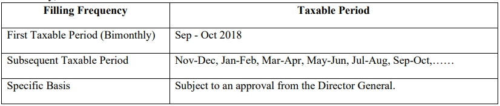

## Furnishing Service Tax (SST-02) Return & Payment of Tax

Registered person has to declare service tax return every 2 months according to the taxable period.

- Service Tax return has to be submitted not later than the last day of the following month after the taxable period ended.

- Service Tax return has to be submitted regardless of whether there is any tax to be paid or not.

- Service Tax return has to be submitted electronically or by cheque, bank draft and posted to SST Processing Centre.

Payment for tax due and payable declared in SST-02. Failure to submit return is an offence.

## SST-Tax Code

Explain the importance and usage of SST Tax Code reflect to SST-02.

### SST Tax Code (More Detailed)

SST tax code mapping to SST-02.

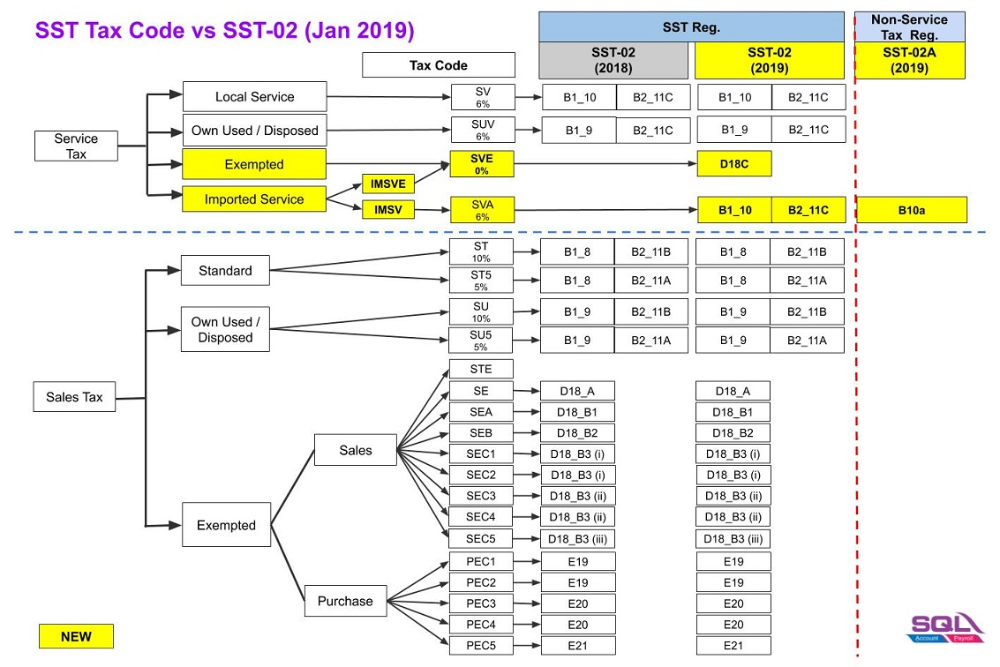

### Sales Tax Code

1) **Standard**

| No | Tax Code | Description                                                            | Tax Rate | SST-02   |
|----|----------|------------------------------------------------------------------------|----------|----------|
| 01 | ST       | Sales Tax 10% charged to the taxable goods based on accrual/billing basis | 10%      | B1_8, B2_11B |
| 02 | ST5      | Sales Tax 5% charged to the taxable goods based on accrual/billing basis  | 5%       | B1_8, B2_11A |

2) **Deemed Supply (Own Used/Disposed)**

| No | Tax Code | Description                                                                 | Tax Rate | SST-02   |
|----|----------|-----------------------------------------------------------------------------|----------|----------|
| 01 | SU       | Goods Own Used/Disposed deemed taxable and charged at 10% based on accrual/billing basis | 10%      | B1_9, B2_11B |
| 02 | SU5      | Goods Own Used/Disposed deemed taxable and charged at 5% based on accrual/billing basis  | 5%       | B1_9, B2_11A |

3) **Sales - Exempted**

| No | Tax Code | Description | Tax Rate | SST-02 |
|----|----------|-------------|----------|--------|
| 01 | STE  | Sales Tax Exempted on goods as prescribed in the Sales Tax (Goods Exempted From Tax) Order 2018 |  |  |
| 02 | SE   | Sales Tax Exempted to Export, Special Area (SA), e.g. Free Zone, LMW and Designated Area (DA), e.g. Langkawi, Tioman, Labuan |  | D18_A |
| 03 | SEA  | Sales Tax Exempted-Schedule A (Class of Person), e.g. Government, Local Authority Dept, etc. Detail refer to Schedule A in Sales Tax (Person Exempted From Payment Of Tax) Order 2018 |  | D18_B1 |
| 04 | SEB  | Sales Tax Exempted-Schedule B (Manufacturer of specific non-taxable goods), e.g. control products, medical. Detail refer to Schedule B in Sales Tax (Person Exempted From Payment Of Tax) Order 2018 |  | D18_B2 |
| 05 | SEC1 | Sales Tax Exempted-Sch C (Item 1) on raw materials, components and packaging materials EXCLUDING PETROLEUM imported/purchased from a reg. manufacturer/licensed warehouse by any reg. manufacturer |  | D18_B3 (i) |
| 06 | SEC2 | Sales Tax Exempted-Sch C (Item 2) on raw materials, components and packaging materials imported/purchased from a reg. manufacturer/licensed warehouse by any reg. manufacturer of PETROLEUM products |  | D18_B3 (i) |
| 07 | SEC3 | Sales Tax Exempted-Sch C (Item 3) on raw materials, components and packaging materials EXCLUDING PETROLEUM imported/purchased from a reg. manufacturer by any agent on behalf of a reg. manufacturer |  | D18_B3 (ii) |
| 08 | SEC4 | Sales Tax Exempted-Sch C (Item 4) on raw materials, components and packaging materials imported/purchased from a reg. manufacturer by any agent on behalf of a reg. manufacturer of PETROLEUM products |  | D18_B3 (ii) |
| 09 | SEC5 | Sales Tax Exempted-Sch C (Item 5) on semi-finished taxable goods or finished taxable goods which are subsequently returned by a subcontractor to a reg. manufacturer after completion of subcontract work |  | D18_B3 (iii) |

4) **Purchase - Exempted**

| No | Tax Code | Description | Tax Rate | SST-02 |
|----|----------|-------------|----------|--------|
| 01 | PEC1 | Purchase Tax Exempted-Sch C (Item 1) on raw materials, components and packaging materials EXCLUDING PETROLEUM imported/purchased from a reg. manufacturer/licensed warehouse by any reg. manufacturer |  | E19 |
| 02 | PEC2 | Purchase Tax Exempted-Sch C (Item 2) on raw materials, components and packaging materials imported/purchased from a reg. manufacturer/licensed warehouse by any reg. manufacturer of PETROLEUM products |  | E19 |
| 03 | PEC3 | Purchase Tax Exempted-Sch C (Item 3) on raw materials, components and packaging materials EXCLUDING PETROLEUM imported/purchased from a reg. manufacturer by any agent on behalf of a reg. manufacturer |  | E20 |
| 04 | PEC4 | Purchase Tax Exempted-Sch C (Item 4) on raw materials, components and packaging materials imported/purchased from a reg. manufacturer by any agent on behalf of a reg. manufacturer of PETROLEUM products |  | E20 |
| 05 | PEC5 | Purchase Tax Exempted-Sch C (Item 5) on semi-finished taxable goods or finished taxable goods which are subsequently returned by a subcontractor to a reg. manufacturer after completion of subcontract work |  | E21 |

### Service Tax Code

1) **Standard**

| No | Tax Code | Description | Tax Rate | SST-02 |
|----|----------|-------------|----------|--------|
| 01 | SV  | Service Tax 6% charged to the taxable services based on payment basis | 6% | B1_10, B2_11C |
| 02 | SVA | Service Tax 6% charged to the taxable service based on accrual/billing basis. It is used in IMSV tax code to report in SST-02A | 6% | B1_10, B2_11C |

2) **Deemed Supply (Own Used/Disposed)**

| No | Tax Code | Description | Tax Rate | SST-02 |
|----|----------|-------------|----------|--------|
| 01 | SUV | Service Own Used charged at 6% on accrual/billing basis | 6% | B1_9, B2_11C |

3) **Service Exempted**

Applicable to same service provider under:  

   1) Group G to Group G (all except Employment and Guards protection service provider).  
   2) Group I to Group I (ie. advertising service provider).  

| No | Tax Code | Description | Tax Rate | SST-02 |
|----|----------|-------------|----------|--------|
| 01 | SVE | Service Tax Exempted between same service providers in Group G (excluding item j and k) or in Group I item 8 only. Refer to Service Tax (Person Exempted From Payment of Tax) Order 2018 |  | D18C |

4) **Imported Service**

   1) For non-Service Tax Registered must declare using **SST-02A**.  
   2) For Service Tax Registered must declare using **SS-02**.  

| No | Tax Code | Description | Input Tax | Output Tax | SST-02 | SST-02A (for imported service) |
|----|----------|-------------|-----------|------------|--------|--------------------------------|
| 01 | IMSV  | Imported Service Tax, any company in Malaysia who acquire the taxable service from company outside Malaysia. Non-SST & Sales Tax reg. must report in SST-02A. Service tax reg. remains report in SST-02 | PSV (6%) | SVA (6%) | B1_10 B2_11C | B10a |
| 02 | IMSVE | Imported Service Tax Exempted between same service providers in Group G (excluding item j and k) or in Group I item 8 only. Refer to Service Tax (Person Exempted From Payment of Tax) Order 2018 | PSVE | SVE | D18C |  |

## SST-Tariff Code

- Tariff classification is a complex yet extremely important aspect of cross-border trading.  
- Goods imported from or to Malaysia are classified by the Harmonized Tariff Schedule (HTS) or commonly referred to as HS Codes.  
- The codes, created by World Customs Organization (WCO), categorize up to 5,000 commodity  
- HS Codes are made of 6-digit numbers that are recognized internationally, though different countries can extend the numbers by two or four digits to define commodities at a more detailed level.  
- Click [here](https://ezhs.customs.gov.my/) to search the tariff code list from Kastam system.  

### Quick Setup for Tariff Code

1. Create the tariff code applicable to your product at [Maintain Tariff](../../usage/Tools/Tools.md#maintain-tariff).

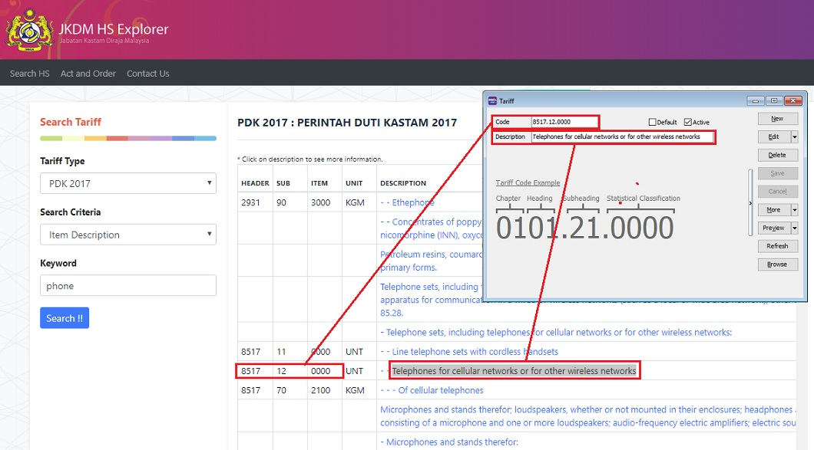

2. Pick a tariff code for an items at [Maintain Stock Item](../../usage/stock/stock-guide#maintain-stock-item).

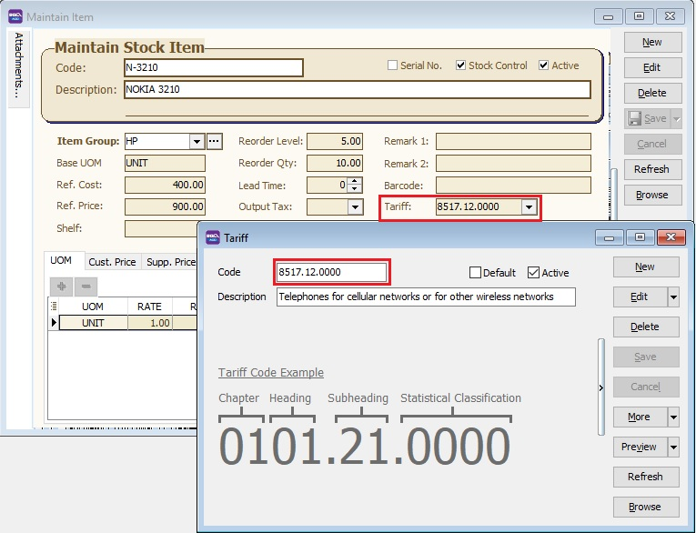

3. For exemption certificate case (under Schedule A, B, C), a tariff and tax code (SEA, SEB, SEC1, SEC2, SEC3, SEC4, SEC5) should set in [Maintain Customer](../../usage/customer/guide#maintain-customer) and [Maintain Supplier](../../usage/supplier/Setup#maintain-supplier) (Tariff code setting under Tax Tab).

## SST-Imported Service (SST-02A)

### Imported Service Tax (IMSV)

Purchase service from oversea by any companies in Malaysia and it is subject to **imported service tax 6%**.

- for **Service Tax registered ONLY**, declare together with other service tax in SST-02  
- for **non-SST registered**, declare imported service in **SST-02A**  
- for **Sales Tax registered ONLY**, declare imported service in **SST-02A**  
- Enter at **Cash Book Entry (PV)** or at **Supplier/Purchase Invoice**. See the illustration below.  
- use Tax code : **IMSV**  

### Imported Service Tax Exempted (IMSVE)

Any company in Malaysia who acquires taxable services of Group G item (a), (b), (c), (d), (e), (f), (g), (h) and (i) from any company within the same group of companies outside Malaysia. It is **Exempted**.

- Need to declare in SST-02  
- Enter at **Cash Book Entry (PV)** or at **Supplier/Purchase Invoice**. See the illustration below.  
- use Tax code : **IMSVE**  

### How to get print SST-02A

1. Go to **File | Company Profile**...
2. Make sure the **Service Tax No** field is **BLANK**.

:::note Note:
For **Service Tax Registered company**, it is declare together with other service tax in SST-02
:::

3. Save it.
4. Logout and login again.
5. Go to menu : **SST/GST | Print SST-02A**...

## SST-Account for Pending Service Tax over 12 months

Service Tax required to be accounted if on the day following period of 12 month when any whole or part of the payment is not received from the date of the invoice for the taxable service provided.

### Journal Entry Adjustment

#### [Invoice] Pending Service Tax To Be Paid

1. For first time, create the following GL Account.

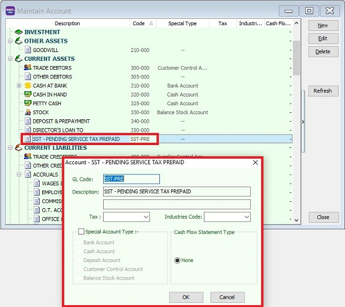

| GL Acc  | Description                          | Account Type    |
|---------|--------------------------------------|-----------------|
| SST-PRE | SST - PENDING SERVICE TAX PREPAID    | CURRENT ASSETS  |

2. Process SST Return, system will prompt the **Pending Service Tax > 12 months** if have found the outstanding service invoices has over 12 months.
3. Follow the Service Tax rules, click Pay Pending Service Tax button.

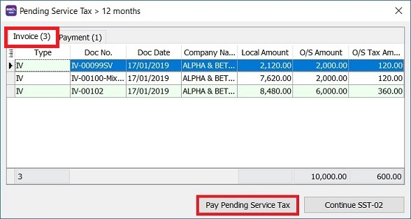

4. Right click on the grid column, select Print Grid.

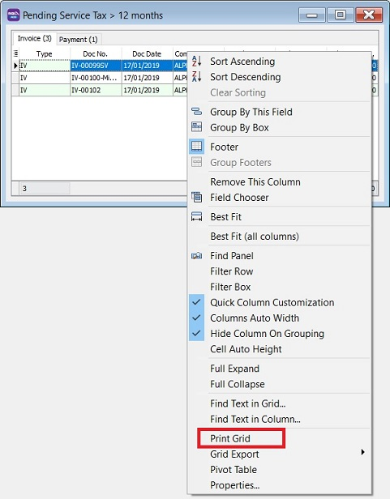

5. Print out the list of outstanding service invoices for record purpose.

6. Post the journal entry and follow the double entry below to account the service tax pending over 12 months to be paid.

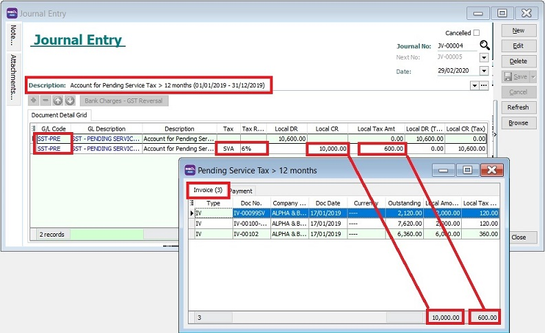

| GL Code | GL Description                     | Tax | Local DR  | Local CR | Tax Amount | Local DR (Tax) | Local CR (Tax) |
|---------|------------------------------------|-----|-----------|----------|------------|----------------|----------------|
| SST-PRE | SST - PENDING SERVICE TAX PREPAID  |     | 10,600.00 |          |            | 10,600.00      |                |
| SST-PRE | SST - PENDING SERVICE TAX PREPAID  | SVA |           | 10,000.00| 600.00     |                | 10,600.00      |

:::note NOTE:
For partial payment, should refer to **Outstanding Amount** instead of Local Amount. 

Active the tax code : SVA
1. Go to **SST/GST | Maintain Tax**.
2. Look for tax code: **SVA** or **SV**.
3. Edit and tick **Active**.
4. Save it.
:::

7. Next, go to New SST Return. Click Process.
8. At this time, click **Continue SST-02**.

#### [Payment] Recovery from Payment for Pending Service Tax Prepaid

1. Under the **payment tab**, system will list out the prepayment service invoice which has been paid when process SST return.
2. If you have follow the Service Tax rules, click Pay Pending Service Tax button.

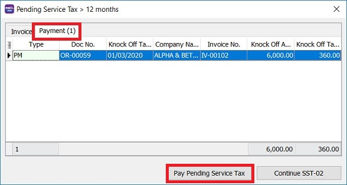

3. Right click on the grid column, select Print Grid.
4. Print out the list of the prepayment service invoice which has been paid for record purpose.
5. Post the journal entry and follow the double entry below to recover the service has been paid.

| GL Code | GL Description                    | Tax | Local DR | Local CR | Tax Amount | Local DR (Tax) | Local CR (Tax) |
|---------|-----------------------------------|-----|----------|----------|------------|----------------|----------------|
| SST-PRE | SST - PENDING SERVICE TAX PREPAID | SVA | 6,000.00 |          | 360.00     | 6,360.00       |                |
| SST-PRE | SST - PENDING SERVICE TAX PREPAID |     |          | 6,360.00 |            |                | 6,360.00       |

6. Next, go to New SST Return. Click Process.
7. At this time, click Continue SST-02.

## SST FAQ

## Can I Change the Service Tax Type to Accrual Basis?

**Solution:** 

By Default System will use as Payment Basis for Service Tax Type  
To change to Accrual Basis(i.e. Pay Kastam even no payment), Just Set as below  

## Why preview my SST-02 report is no value even at screen had amount?

**Solution:**

Make sure you had enter your **Service Tax** and/or **Sales Tax No.** in File | Company Profile

## Why does the tax code (ST5) used in my sales invoices not appear in SST-02, but it shows up in the SST-02 listing?

**Solution:**

Make sure you had enter your **Sales Tax no** instead of **Service Tax** no in File | Company Profile

## Why Some Service Tax Transaction not shown in SST-02 even the document is fully paid?

**Solution:**

Make sure you had select correct **Knock Off Date** in the Customer Payment

## Why does the service invoice that was knocked off (paid) in Sept 2018 not appear in SST-02 for the period Sept–Oct 2018?

**Issue:**

Knock-off tax date will follow the customer payment date if user has tick on an invoice.  
Change the customer payment date (eg. from 29/05/2019 to 29/09/2018), the knock-off date will remains unchanged.  

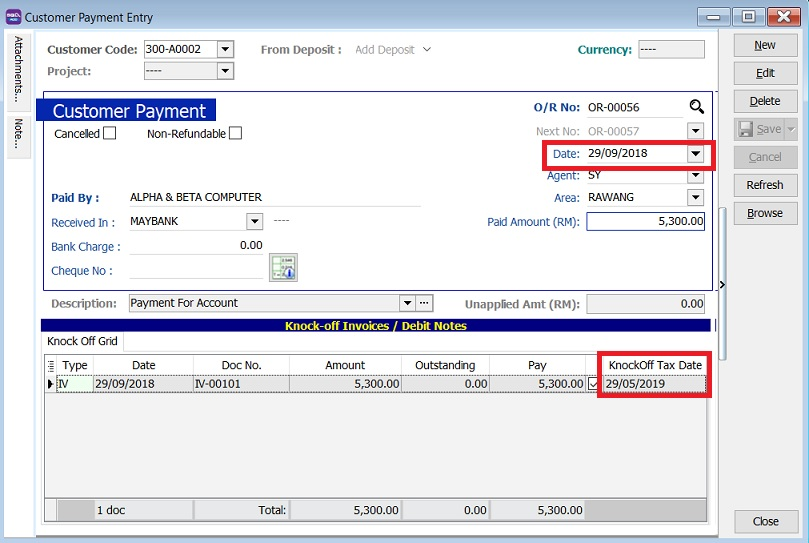

**Solution:**

Change the **Knock-off Tax Date** (follow the payment date)

## Can I mixed the sales tax and service tax in single invoice?

**Issue:**

Can I mixed the sales and service tax code in single document?

**Solution:**

1. Customs officer has recommended the company should raise the invoice, debit note and credit note separately for sales and service invoice.  
2. Indicate the sales and service tax registration no on the invoice letter head separately as well.  
3. This is to ease the Customs audit operation purpose.  

Sales tax and service tax having different accounting basis as explained below.

1. **SALES TAX**  
    - Billing / accrual basis  
    - Sales Tax required to be accounted at the time when the goods are sold, disposed or first used  

2. **SERVICE TAX**
    - Payment basis  
    - Service Tax required to be accounted at the time when the payments is received.  
    - On the day following period of twelve month when any whole or part of the payment is not received from the date of the invoice for the taxable service provided  

## What circumstanaces to use tax code SV and SVA for Credit Note?

**Issue:**

Service tax is based on payment basis.

**Solution:** 

There will be 2 cases of service tax where credit note has taken in place:

1. **Unpaid service tax**

    - Cancellation of service **before any payment**.  
    - use tax code: **SV** (follow the invoice tax code, eg. SV)  
    - system will **auto reverse the unpaid service tax amount** in the **SST - Deferred Tax (SST-203)**.  

2. **Paid service tax**

    - Cancellation of service **after payment and service tax has been paid** to RMCD.
    - Adjustment tax deduction for refund of service tax approved by RMCD.
    - use tax code: **SVA**
    - system will reduce the service tax payable to RMCD

## What is Digital Service Tax

New service tax effectively come into operation on **1 January 2020**.

**Characterics**

   - delivered or subscribed over the **internet or other electronic network**
   - delivered through **information technology medium** (human eye cannot see and touch)
   - minimal or no human **intervention** (eg. automation, click to subscribe and consume)

**Scope on Digital Service**

   - Software, application & video games
   - music, e-book and film
   - advertisement and online platform
   - search engine and social network (facebook)
   - database and hosting (eg. website hosting, online data, file sharing, cloud storage)
   - internet based telecommunication (eg. VOIP)
   - Online training
   - Subscription to online newspapers
   - payment process services (paypal)

**Taxable Person**

1. Foreign Service Provider (FSP)

    - any person who is **outside Malaysia providing** any digital service to a consumer directly
    - any person who is **outside Malaysia operating an online platform** for buying and selling goods
    - providing services (whether or not such person provides any digital services) who makes transactions for provision of digital services **on behalf of any person**

2. Threshold exceed RM500,000 (historical or future 12 months)

**Accounting Basis**

   - Default is **Payment basis** (same to service tax)
   - Accrual Basis (billing) must apply to DG upon registration

**Exchange Rate**

   - Can use any exchange rate to calculate tax payable

**Taxable Period**

   - Three months (quarterly)

**Returns Form**

   - Digital Service Return [DST-02](https://drive.google.com/file/d/1n2rrcnGrYms9RWki20Rg9vukzzRNtHll/view)

**Exemption**

   - No exemption announced

**Claim Refund**

   - Digital service tax overpaid allowed to claim refund.
   - Need fill-in [JKDM-2](https://mysst.customs.gov.my/assets/document/SST%20Form/JKDM%20No.%202.pdf)

## What invoice format should I use for service tax exempted services?

**Issue:**

What invoice format can be use for service tax exempted

**Solution:**

1. Download the invoice format by click to [Sales Invoice 8 SST 1 (Exempted Taxable Service)](https://www.sql.com.my/webstore/templates/template-detail/?id=4769)
2. Go to **Tools | Report Designer**...
3. Click import the invoice format file.

## What is the double entry for service tax invoice and CN issued using SV tax code?

**Issue:**

How should the double entry be recorded for a service tax invoice and credit note issued under the SV tax code?

**Solution:**

1. **Full Service Tax Invoice issue**

| GL Acc   | Desciption        | Tax | DR     | CR     |
|----------|-------------------|-----|--------|--------|
| 300-A0001| Customer ABC      |     | 1060.00|        |
| 500-000  | Service Sales     | SV  |        | 1000.00|
| SST-203  | SST - Deferred Tax| SV  |        | 60.00  |

2. **Partial Payment** knock-off with invoice

| GL Acc   | Desciption   | Tax | DR   | CR   |
|----------|--------------|-----|------|------|
| 330-000  | BANK         |     | 530.00|      |
| 300-A0001| Customer ABC |     |       | 530.00|

System auto reverse the SST-Deferred Tax after knock-off

| GL Acc  | Desciption        | Tax | DR   | CR   |
|---------|-------------------|-----|------|------|
| SST-203 | SST - Deferred Tax|     | 30.00|      |
| SST-202 | SST - Service Tax |     |      | 30.00|

3. Reduce/cancel the partly of the service amount. Issue CN using **tax code: SV**

| GL Acc   | Desciption     | Tax | DR    | CR    |
|----------|----------------|-----|-------|-------|
| 500-000  | Service Sales  | SV  | 500.00|       |
| SST-203  | SST - Deferred Tax | SV  | 30.00 |       |
| 300-A0001| Customer ABC   |     |       | 530.00|

Conclusion:

SST Deferred Tax account `=` **ZERO** if the **Full Service Tax Invoice** (eg. SV only) outstanding is **ZERO**.  
SST Deferred Tax account `<>` **ZERO** if the service tax invoice has **mixed tax type** (eg. ST, SV and empty tax code).   