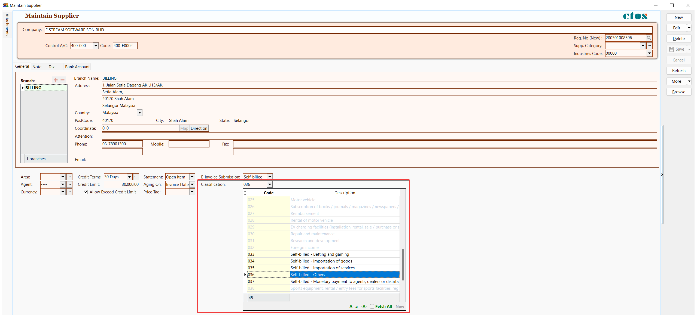

Before issuing an E-Invoice or self-billed E-Invoice, you will need to make sure some mandatory fields is updated correctly.

## Update Customer Info

Customer info will be used for issuing E-Invoice.

1. Go to **Customer** > **Maintain Customer** > **New** or **Edit** an existing customer.
2. Fill in the mandatory fields as shown below.

    

3. Select the default **submission type** to be used when issuing a document. This can be modified at the time of document creation if needed.

    :::info[SUBMISSION]
    - None – Documents created for this customer will be excluded from E-Invoice submission by default.
    - E-Invoice – Documents created for this customer will be submitted as E-Invoice by default.
    - Consolidate – Documents created for this customer will be submitted as consolidated E-Invoice by default.
    :::

    

4. Click on **Tax** tab, and fill in customer tax info according to [guide](#customer--supplier-tax-info).

## Update Supplier Info

Supplier info will be used for issuing self-billed E-Invoice.

1. Go to **Supplier** > **Maintain Supplier** > **New** or **Edit** an existing supplier.
2. Fill in the mandatory fields as shown below.

    

3. Select the default **submission type** to be used when issuing a document. This can be modified at the time of document creation if needed.

    :::info[SUBMISSION]
    - None – Documents created for this customer will be excluded from self-billed E-Invoice submission by default.
    - Self-billed – Documents created for this customer will be submitted as self-billed E-Invoice by default.
    - Consolidate – Documents created for this customer will be submitted as consolidated self-billed E-Invoice by default.
    :::

    

4. Select the default **classification** to be used for item detail when issuing a document.

    

5. Click on **Tax** tab, and fill in supplier tax info according to [guide](#customer--supplier-tax-info).

## Customer / Supplier Tax Info

### Local Business (Companies registered with local authorities)

If your customers / suppliers are a registered entity in Malaysia (e.g.: SSM registered), you must fill in the BRN & TIN of the customer in order to issue E-Invoice / self-billed E-Invoice to the buyer / supplier.

    

### Individual / Foreign Buyer

In facilitating a more efficient E-Invoice issuance process as well as to ease the burden of individuals in providing their Tax Identification Number (TIN) and identification number details, IRBM provides the following concession to individuals:

1. For Malaysian Individuals to provider either:
   1. TIN only
   2. MyKad / MyTentera identification number only
   3. Both TIN and MyKad / MyTentera identification number
2. For non-Malaysian individuals to provide either:
   1. TIN only (TIN assigned by IRBM or use General TIN **EI00000000020**)
   2. Both TIN and BRN of foreign company
   3. Both TIN and passport number / MyPR / MKAS identification number

For Malaysian Individuals:

|Scenario|In SQL Account|
|---|---|
|TIN only|**ID Type**: NRIC, **ID Value**: Leave Empty, **TIN**: Buyer / Supplier TIN|
|MyKad only|**ID Type**: NRIC, **ID Value**: Buyer / Supplier NRIC, **TIN**: General Public **EI00000000010** |
|Both TIN & MyKad|**ID Type**: NRIC, **ID Value**: Buyer / Supplier NRIC, **TIN**: Buyer / Supplier TIN|

For non-Malaysian Individuals:

|Scenario|In SQL Account|
|---|---|
|TIN only|**ID Type**: Passport, **ID Value**: Leave Empty, **TIN**: Buyer / Supplier TIN or General TIN **EI00000000020**|
|Both TIN & BRN of Foreign Company|**ID Type**: BRN, **ID Value**: Buyer / Supplier BRN, **TIN**: Buyer / Supplier TIN or General TIN **EI00000000020**|
|Both TIN & Passport|**ID Type**: Passport, **ID Value**: Buyer / Supplier Passport Number, **TIN**: Buyer / Supplier TIN or General TIN **EI00000000020**|

**Reference:**

1. List of ID Type in Maintain Customer / Supplier:

    

2. List of General TIN in Maintain Customer / Supplier:

    

### Batch TIN Lookup

:::info
This feature enables users to **quickly look up missing New BRN/TIN information for customers** and is exclusively available to those with an active SQL Account license
:::

1. Navigate to **Customer** > **Maintain Customer** or **Supplier** > **Maintain Supplier**.

    

2. Right click on the menu bar (located at the right side of the window), select **TIN Lookup**.

    

3. In the **Tin Lookup** window, you will be able to view all of your customers / suppliers details such as *Old BRN, New BRN, TIN* and etc. Click on the **🔍** to do a quick lookup on the missing fields, when you are done, click **Save** to apply.

    

## Update Stock Item

IRBM (LHDN) has introduced [Classification Codes](https://sdk.myinvois.hasil.gov.my/codes/classification-codes/) to define the category of products or services being billed as a result of a commercial transaction.

1. Go to **Stock** > **Maintain Stock Item** > **Edit** stock
2. Update the classification accordingly.

    

3. Repeat Step 1-2 for all stocks.

:::info
You can also override the stock item classification codes during sales invoice entry.

:::
