:::note
This is an additional module.
:::

:::info
    Watch tutorial video here: [Youtube](https://youtu.be/q97_s92bmZQ)
:::

## Setup

### Chart of Account

1. GL > Maintain Account

2. Create finished good, raw material, WIP's closing stock account in your balance sheet current asset account as below

    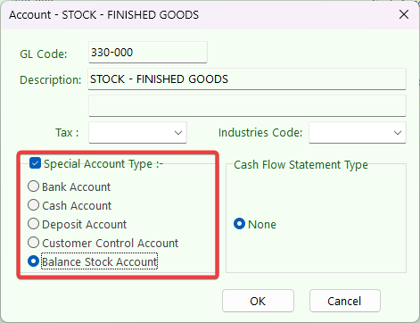

    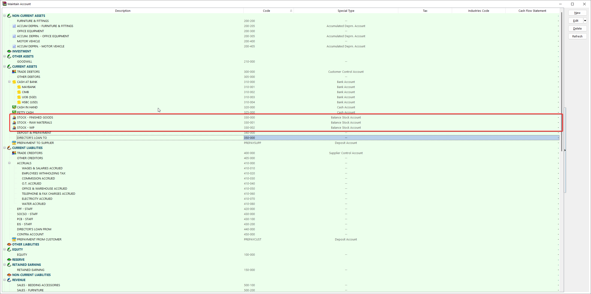

3. Create Manufacturing Account under Cost of Goods Sold (Profit & Loss)

    i. Highlight on Cost of Goods Sold and click on NEW Button, Insert GL Code, Description and make sure to tick on a special Account type Manufacturing Control Account.

    

    ii. Highlight on Cost of Goods Sold and click on NEW Button, Insert GL Code, Description and make sure to tick on a special Account type Manufacturing Control Account.
    
    

### Stock Group

Stock -> Maintain Stock Group

Used to differentiate the types of stocks and the costing method used for the stock, e.g. raw materials, finished goods, etc.

To produce a chemical products, the costing calculation based on stock group:-

    1. Raw Materials

        Assign your Raw Material Purchase code, Cash Purchase code, Purchase Return code.

        - Costing Method : FIFO

        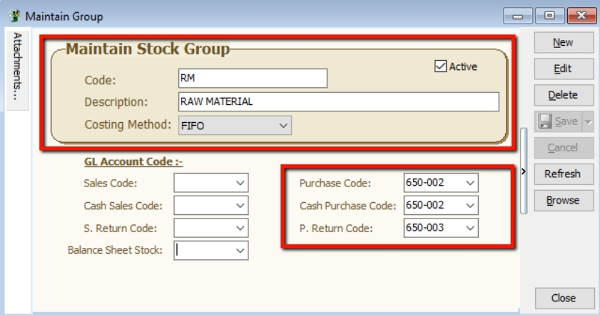
    
    2. Water

        Assigned your Raw Material Purchase code, Cash Purchase code, Purchase Return code.

        - Costing Method : Fixed Costing

        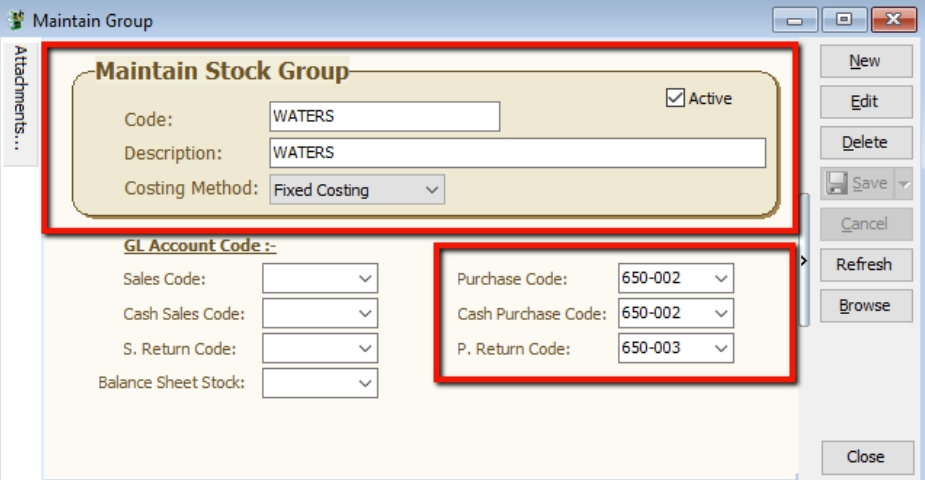

    3. Finished Goods
        
        Assigned your Finished Goods Purchase code, Cash Purchase code, Purchase Return code.
        
        - Costing Method : FIFO

        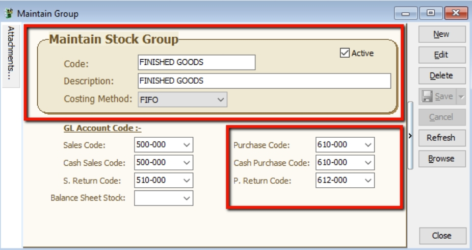

### Stock Item

Stock -> Maintain Stock Item

Setup the stock item master data for all types of stock. Eg. raw materials, end products, trading products, etc.

    1. Create all your raw materials items and assigned stock group respectively.

        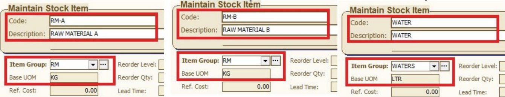

    2. Create your finished goods item and assign raw materials.

        1. assigned stock group, enter based UOM, ref cost and ref price.

        2. go to the BOM tab, choose this product as a BOM item, and assign all the raw materials, quantity needed.

        Location is the Raw Materials kept and deducted from which warehouse.
        
        Overhead Cost is a fixed additional cost to the material cost incurred during each material process.
        
        Assembly Cost is a fixed cost incurred to the entire process for final products.

        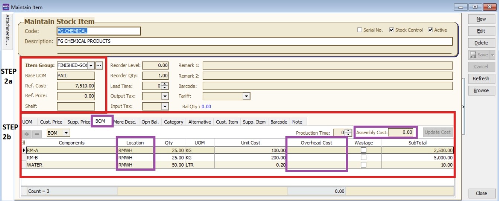

### Location (Warehouse)

Stock > Maintain Location

Define the warehouse code to identify the stock movement between the locations.

1. Receive raw materials from purchase and keep at the Raw Materials Warehouse.

2. Production uses the materials to produce the final products. Raw materials must be deducted from the Raw Materials Warehouse.

3. Final products will be kept at the Finished Goods Warehouse.

4. Work in progress stock kept in WIP Warehouse.

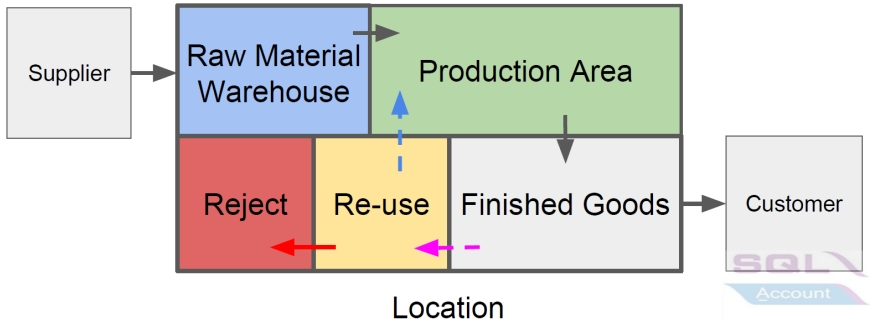

### Overview Workflow

Sales coordinator usually will input the Sales Order (SO) based on the customer PO received. The stock products will be updated into the system as ordered qty. If the stock is purchased from a supplier, then the purchaser has to transfer from SO to PO.

Unless the stock is manufactured, then you have to proceed to the Job Order process. How much of the materials/components required to meet the products ordered by the customer? This question was raised by the Material Planning department. Therefore, the Job Order takes place as the order to be input after the Sales Order. It will plan the materials/components required based on the qty ordered from Sales Order.

When products produce out, you have to transfer the Job Order to the Stock Assembly to commit the stock on hand.

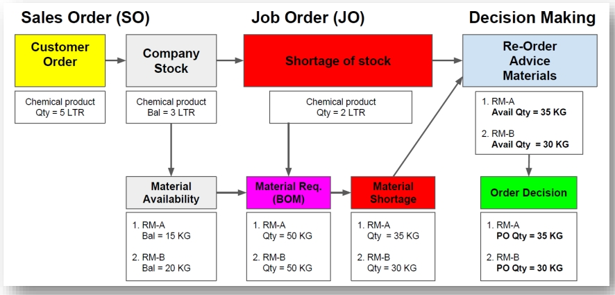

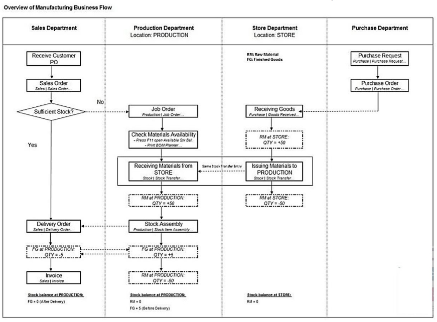

## Job Order

Sales coordinator usually will input the Sales Order (SO) based on the customer PO received. The stock products will be updated into the system as ordered qty.

How much of the materials/components required to meet the products ordered by the customer? This question was raised by the Material Planning department. Therefore, the Job Order takes place as the order to be input after the Sales Order. It will plan the materials/components required based on the qty ordered from Sales Order. When products produce out, basically you have to transfer the Job Order to the Stock Assembly to commit the stock on hand.

IMPORTANT: It is required for the Job Order module. For more information about price, please refer to our sales personnel.

:::important

It is required the SO -> PO and Job Order module. For more information about price, please refer to our sales personal.

:::

### Sales Order

    1. Create Sales Order (SO)
        
       Go to **Sales | Sales Order**

       Create and save the customer PO into Sales Order.

       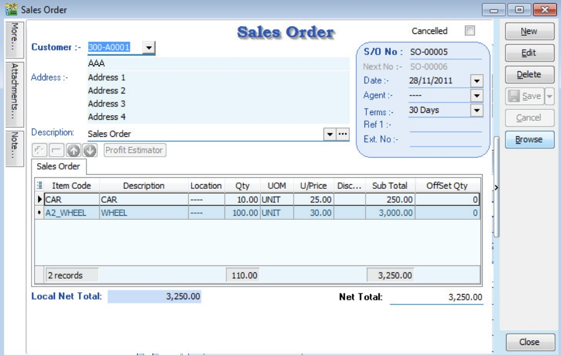

    2. SO Check the Available Stock Balance
       
       You can press F11 (Available Stock Balance) on the item code highlighted.

       Below is **CAR** stock available balance.

       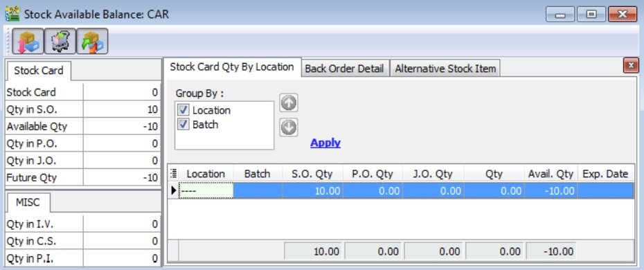

       :::note
       
       **Results for CAR Item:**

       SO Qty = -100.00

       PO Qty = 0.00

       JO Qty = 0.00

       Qty (On Hand) = 0.00

       Available Qty = -100.00
       
       :::

       Below is **WHEEL** stock available balance.

       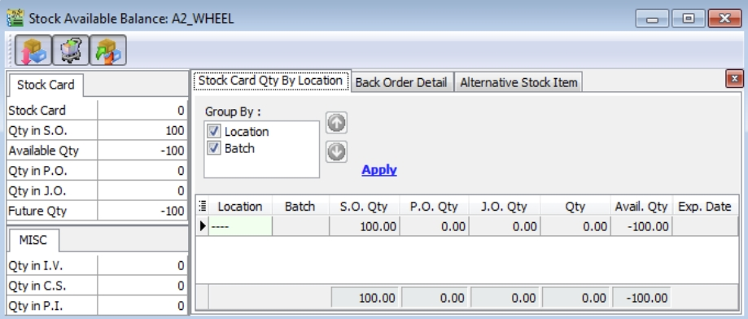

### Purchase Order (Transfer From So)

    1. Create New Purchase Order (PO)
       
       Go to Purchase | Purchase Order

       1.  Click on the NEW button to start with a new PO

       2. Select the Supplier

       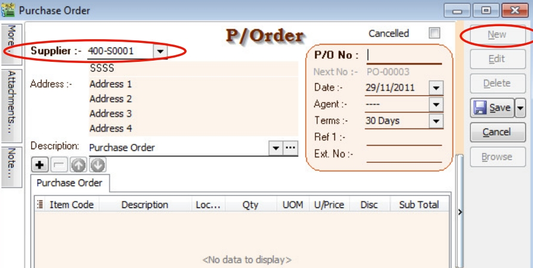

    2. PO Transfer From SO

       1.  Right click on P/Oder (Title)

       2. Click on Transfer From Sales Order in the menu

       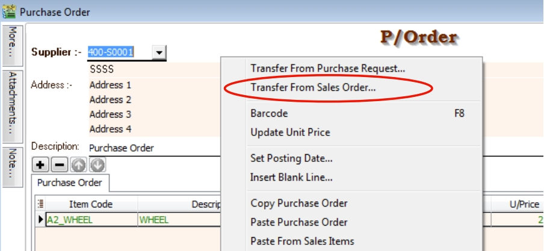

    3. Document Transfer (SO -> PO)

       1.   Pick the Item from the SO list

       2.  Input X/F Qty to transfer over PO

       3. Click OK to proceed

            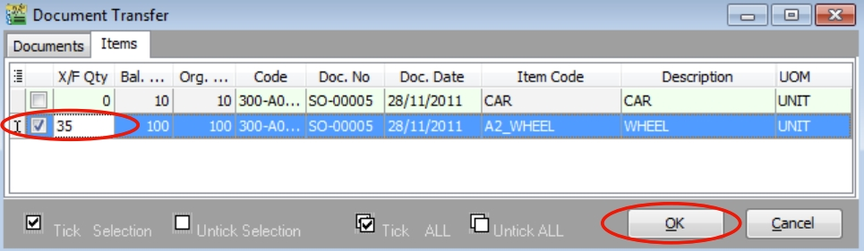

       4.  Save the PO Document

            Click on the SAVE button

            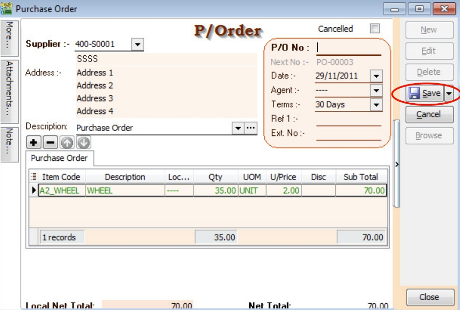

       5.   PO Check the Available Stock Balance
            
            You can press F11 (Available Stock Balance) on the item code highlighted.

            Below is WHEEL stock available balance

            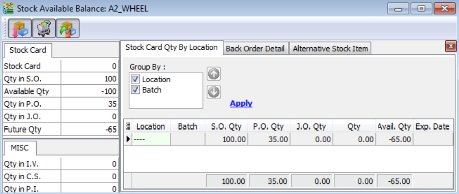

   :::note

   **Results for WHEEL Item:**

   SO Qty = -100.00

   PO Qty = -35.00

   JO Qty = 0.00

   Qty (On Hand) = 0.00

   Available Qty = -65.00
   
   :::

### Create New Job Order

CLICK on the NEW button and SELECT the Customer.

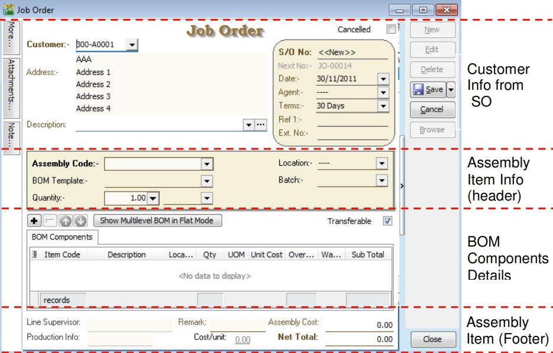

:::info

> **Customer Info from SO**

Basically, the customer and others information copy from SO.

> **Assembly Item Info (Header & Footer)**

Assembly item transferred from SO. It will determine the BOM Components required and the assembly unit cost.

> **BOM Components Details**

Total components quantity requirement to meet the total output.

:::

### Document Transfer (SO --> JO)

1. Create New Job Order (JO)

   Go to **Production | Job Order...**.

   1. Click on the NEW button to start with a new JO

   2. Select the Customer

   

2. JO Transfer From SO
   
   1.   Right click on Job Order (Title)

   2.  Click on Transfer From Sales Order in the menu

   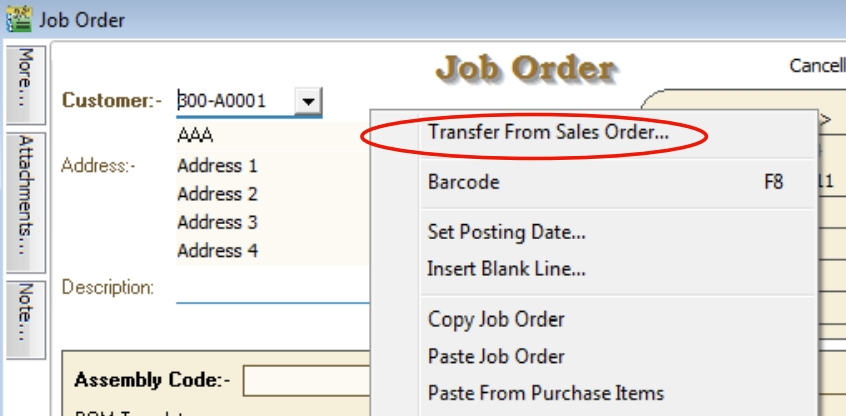

3. Document Transfer (SO --> JO)

   1.   Pick the Item from the SO list

   2.  Input X/F Qty to transfer over JO

   3. Click OK to proceed

   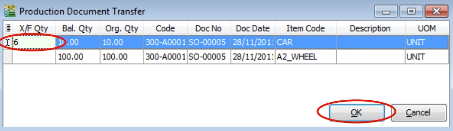

4. Show Multilevel BOM in Flat Mode

This function enables it to drill down to the flatten level of the multilevel BOM structure. For example, the CAR multilevel BOM structure.

|**Level 0** | **Level 1** | **Level 2** | **Level 3** |
|---|---|---|---|
|Car | Frame | Front Frame | Orange |
|Car | Frame | Front Frame | Screw |
|Car | Frame | Back Frame | Red Light |
|Car | Frame | Back Frame | Screw |
|Car | Wheel | Rim | 
|Car | Wheel | Tyres | 
|Car | Engine | Engine Block | Filter |
|Car | Engine | Engine Block | Screw |
|Car | Engine | Piston | Tube |
|Car | Engine | Piston | Cover |
|Car | Labour | 

Before FLAT MODE, BOM components show at **LEVEL 1**.

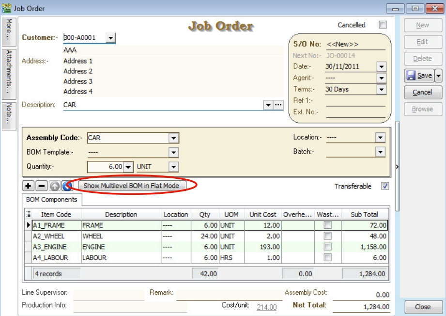

Click on Show Multilevel BOM in Flat Mode button.

It will prompt the below message.

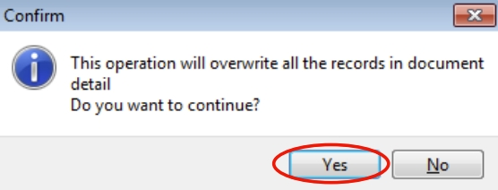

Press NO to keep the BOM components at **LEVEL 1**.

Press YES to continue flatten the multilevel BOM to **LEVEL 3**.

After FLAT MODE, BOM components show at **LEVEL 3**.

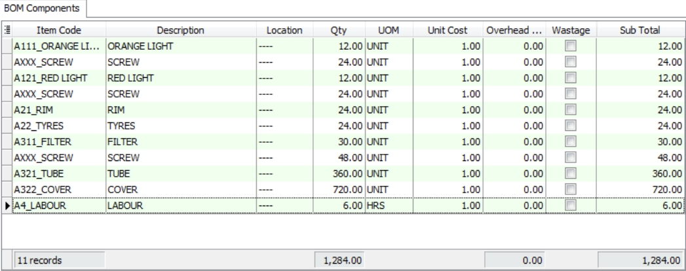

5. Save the JO Document

Click on the SAVE button.

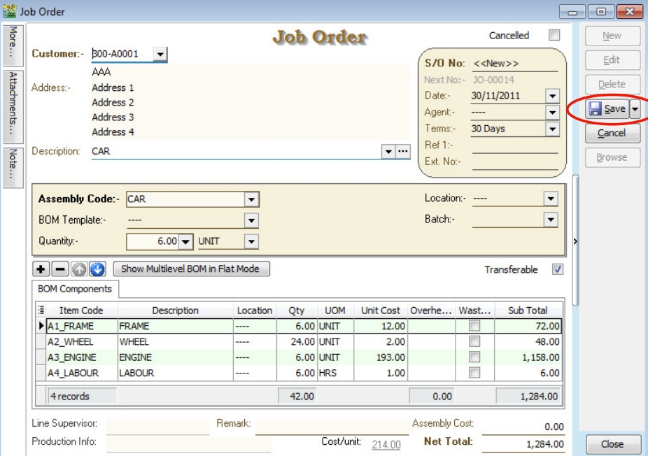

6. JO Check the Available Stock Balance

You can press F11 (Available Stock Balance) on the item code highlighted.

Below is component “FRAME” stock available balance.

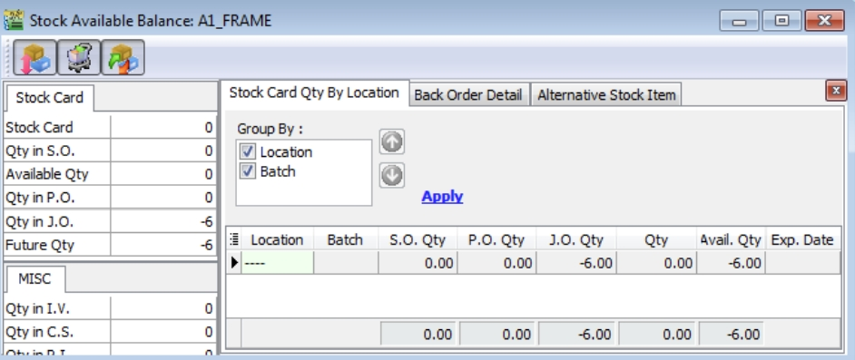

:::note

**Result for component "FRAME" Item:**

SO Qty = 0.00

PO Qty = 0.00

JO Qty = -6.00

Qty (On Hand) = 0.00

Available Qty = -6.00

:::

Below is component “WHEEL” stock available balance.

:::note

**Result for component "WHEEL" Item:**

SO Qty = -100.00

PO Qty = +35.00

JO Qty = -24.00

Qty (On Hand) = 0.00

Available Qty = -89.00

:::

Below is component "Engine" stock available balance.

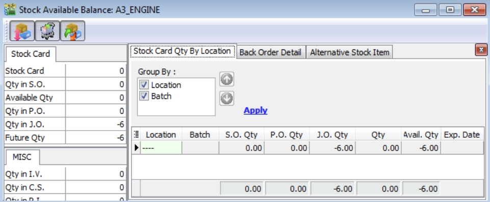

:::note

**Result for component "ENGINE" Item:**

SO Qty = 0.00

PO Qty = 0.00

JO Qty = -6.00

Qty (On Hand) = 0.00

Available Qty = -6.00

:::

### Offset Qty In Sales Order

What is the purpose of the OFFSET Qty in Sales Order? You will see a new column named “OffSet Qty”. It allows you to input a value to increase/reduce the original QTY to be transferred to Purchase Order and Job Order.

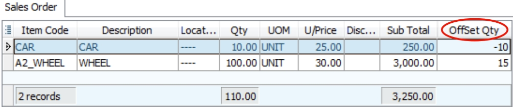

1. Positive Offset Qty

REDUCE the Transferable QTY to PO and JO.

For example,

|**SO Original Qty**|**Offset Qty**|**Transferable to PO/JO**|
|---|---|---|
|100.00 | 0.00 (default) | 100.00 |
|100.00 | +15.00 | 85.00 |

2. Negative Offset Qty

INCREASE the Transferable QTY to PO and JO.

For example,

|**SO Original Qty**|**Offset Qty**|**Transferable to PO/JO**|
|---|---|---|
|100.00 | 0.00 (default) | 100.00 |
|100.00 | -15.00 | 115.00 |

### Split to X Process

1. With this field, users are able to assign a number of processes/machines in one Job Order/Stock Item Assembly to produce the same End Products using the same range of BOM components.

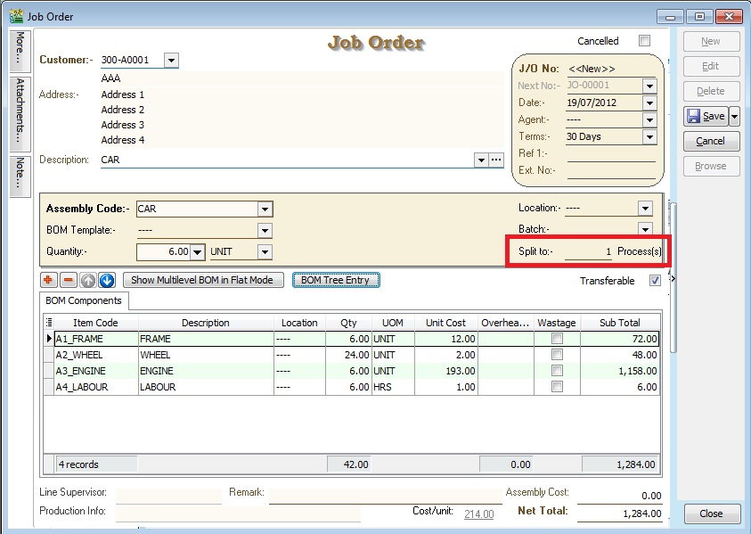

2. For example, To make a cup of MILO KAO KAO, it needs - MILO Powder x 5 spoons - Sugar x 0.5 spoon - Water x 100ml

In order to make 100 cups of milo from one Job Order created, we need 10 persons to make it more efficient. Therefore, we have to input "Split to 10 process(s)", it means 10 persons processing. Job Order will be break the BOM components into 10 processes like below:

|**No of process(s)** | **1** | **2** | **3** | **4** | **5** | **6** | **7** | **8** | **9** | **10** | **TOTAL** |
|---|---|---|---|---|---|---|---|---|---|---|---|
|MILO POWDER | 50 | 50 | 50 | 50 | 50 | 50 | 50 | 50 | 50 | 50 | 500 spoons |
|Sugar | 5 | 5 | 5 | 5 | 5 | 5 | 5 | 5 | 5 | 5 | 50 spoons |
|Water | 1000 | 1000 | 1000 | 1000 | 1000 | 1000 | 1000 | 1000 | 1000 | 1000 | 10000 ml |

NOTE: Preview and select the standard report name "Job Order 2 with Multiplier - 30 Columns (without cost)".

### BOM Tree Entry

1. Some manufacturing companies need to modify and overwrite the standard BOM structure during the entry stage. This button helps to add/remove the components to overwrite the BOM structure.

2. Click the "BOM Tree Entry" button.

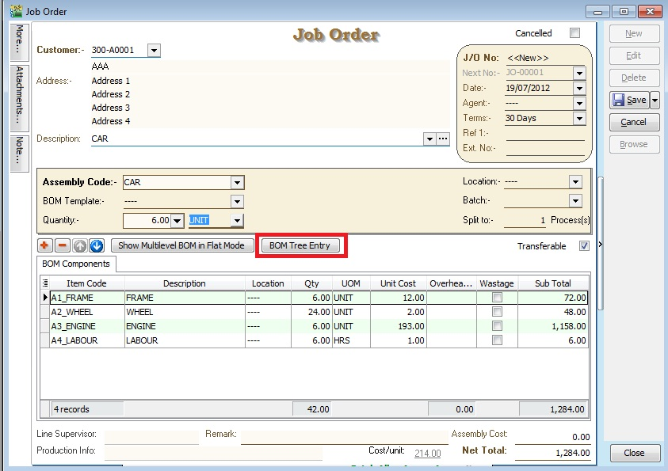

3. You can drill down all the BOM structures.

4. Tick the components in the tree you wish to insert into the Job Order/Stock Assembly/Disassembly.

5. Press OK to confirm.

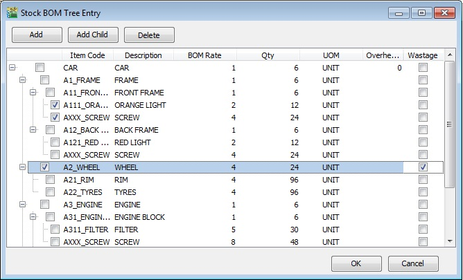

|**Button**|**Function**|
|---|---|
|Add | To add new components at LEVEL 1 ONLY |
|Add Child | To add new child components start from LEVEL 2 onwards |
|Delete | To remove the components at all LEVEL 1, 2, 3, 4, ... |

### Stock Batch

:::info

Watch tutorial video here: [Stock Maintain Batch](https://youtu.be/QUlp-Js_cnk)

:::

This module commonly used in food manufacturing, pharmaceutical, cosmetic/skin care product. It helps to trace the expiry date of the products. It can set the manufacturing date for label print purposes and easy to identify the stock expired to write off using stock adjustment.

1. **Stock** > **Maintain Batch** > **New**

   Insert the code, description, Expiry date, Manufacturing date & items that will expire on this expiry date.

   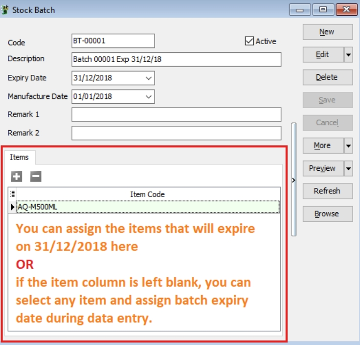

2. **Purchase** > **Purchase Invoice** > **New**

   You can enable Batch column from the hidden bar and assign your stock batch during purchase for every individual item.

   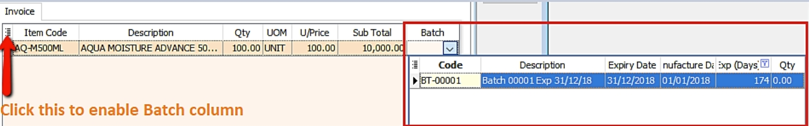

3. **Sales** > **Sales Invoice** > **New**

   In Sales Invoice, you can select the item issue out from which batch (expiry date), system will also show the expiry day & quantity available.

   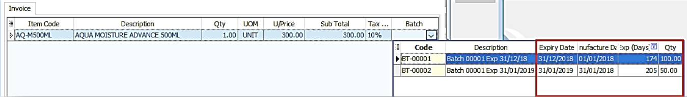

4. **Stock** > **Print Stock Batch Expiry**

   You can also check the listing of your product that will be expire soon as well as you can trace the product manufacture date.

   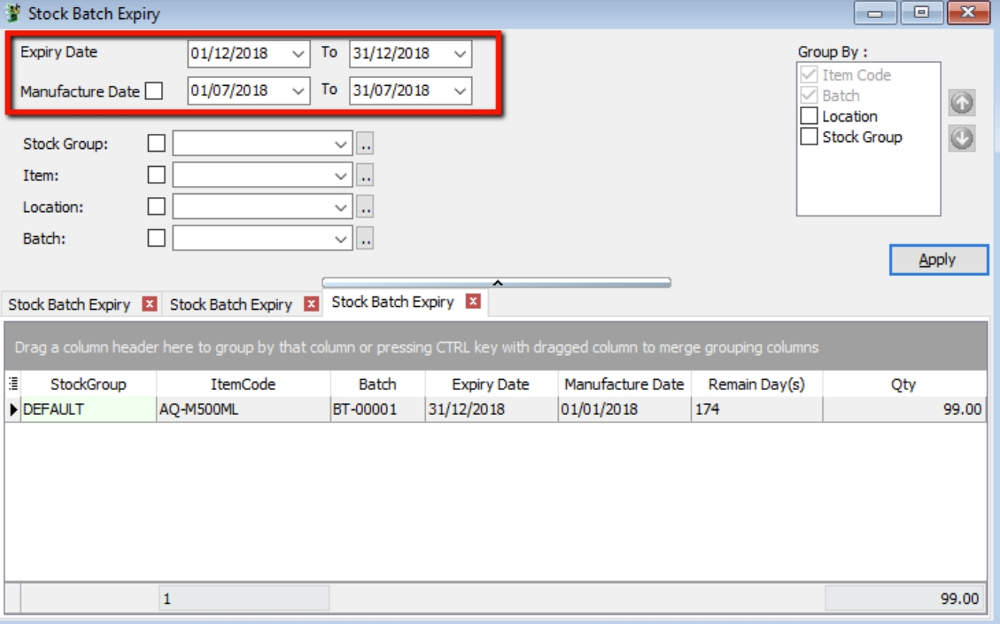

## Stock Item Assembly

Stock Item Assembly is an entry form to record the actual components (materials) usage to convert/produce the final product based on the actual output. Unit cost will be used to revalue the stock balance.

Actual components (materials) used will be deducted out from the stock balance. However, the final products will replenish the stock balance. You can always check the stock movement from the stock card report.

### Stock Item Assembly (Transfer From JO)

1. Create New Stock Item Assembly (AS)

    Go to **Production | Stock Item Assembly…**.

    Click on the NEW button to start with a new AS.

    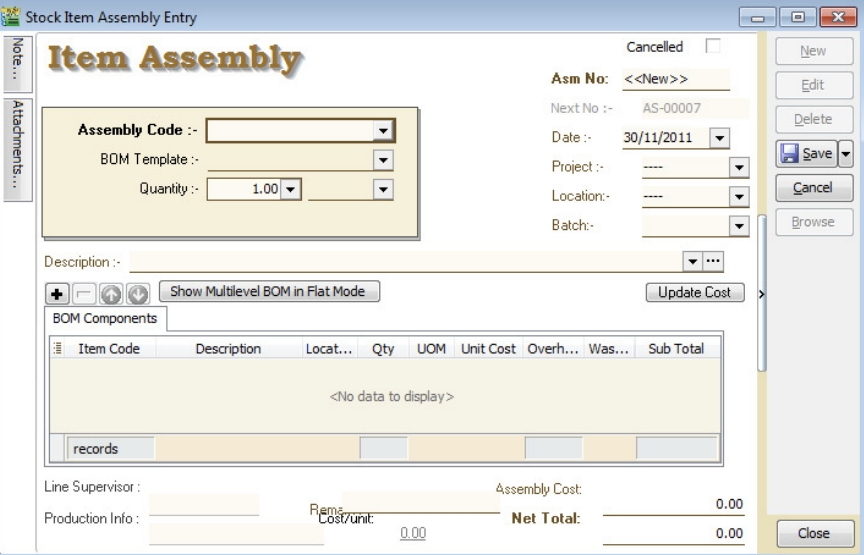

2. AS Transfer From JO

   1. Right click on Item Assembly (Title).

   2. Click on Transfer From Job Order in the menu.

   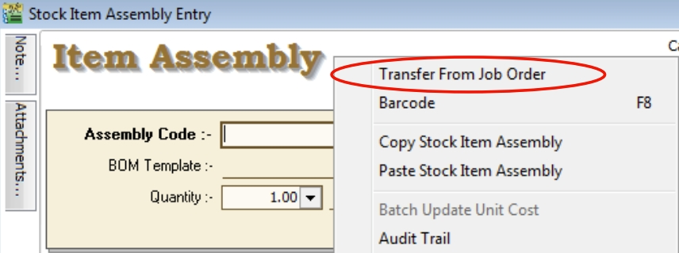

3. Document Transfer (JO → AS)

   1. Pick the Item from the JO list.

   2. Input X/F Qty to transfer over AS.

   3. Click OK to proceed.

   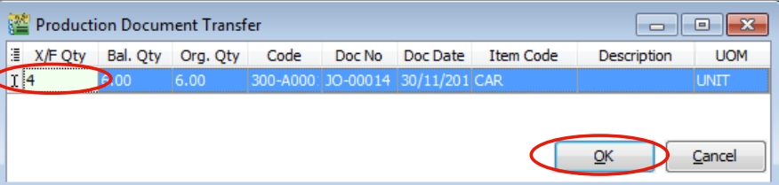

4. Save the AS Document

   Click on SAVE button.

   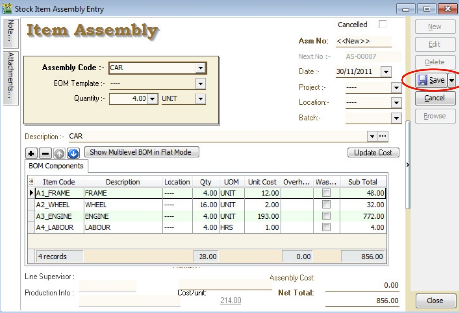

5. AS Check the Available Stock Balance

   You can press F11 (Available Stock Balance) on the item code highlighted.

   Below is **component “FRAME”** stock available balance.

   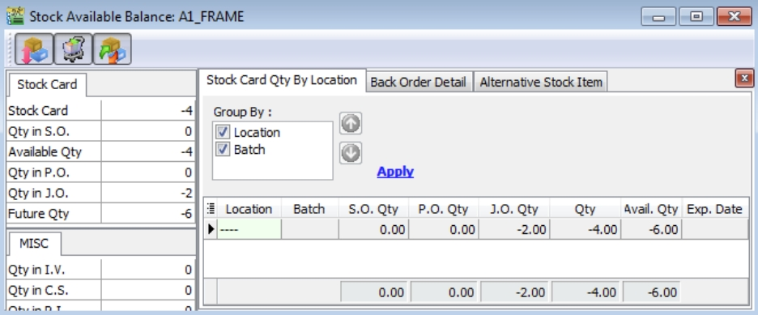

   :::note
   
   **Result for component "FRAME" item:**

   SO Qty = 0.00

   PO Qty = 0.00

   JO Qty = -2.00

   Qty (On Hand) = -4.00

   Available Qty = -6.00
   
   :::

   Below is **component “WHEEL”** stock available balance.

   

   :::note
   
   **Result for component "WHEEL" item:**

   SO Qty = -100.00

   PO Qty = +35.00

   JO Qty = -8.00

   Qty (On Hand) = -16.00

   Available Qty = -89.00
   
   :::

   Below is **component “ENGINE”** stock available balance.

   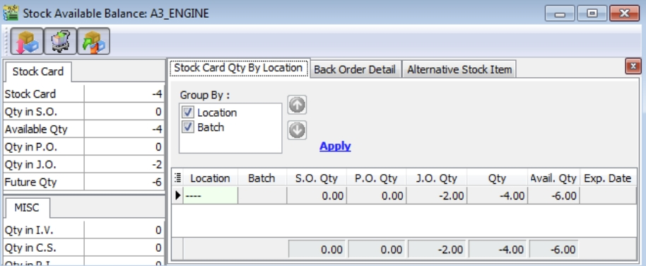

   :::note
   
   **Result for component "ENGINE" item:**

   SO Qty = 0.00

   PO Qty = 0.00

   JO Qty = -2.00

   Qty (On Hand) = -4.00

   Available Qty = -6.00
   
   :::

### Batch Update Unit Cost

Allow users to run Update Unit Cost for ALL or Stock Item Assembly selected.

1. At Stock Item Assembly browse, RIGHT click on the area between the detail and close button.

2. You will see the small menu. See screenshot below.

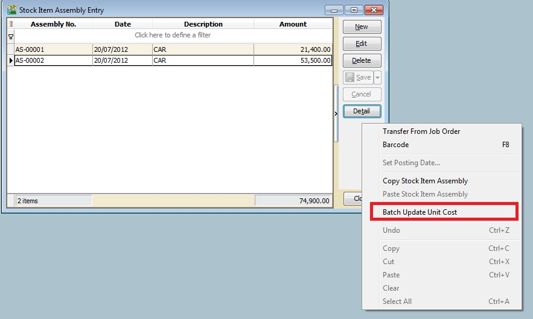

3. Click on Batch Update Unit Cost. You will see the screenshot below.

4. You can highlight more than one Stock Assembly document. RIGHT click and "Tick Selection".

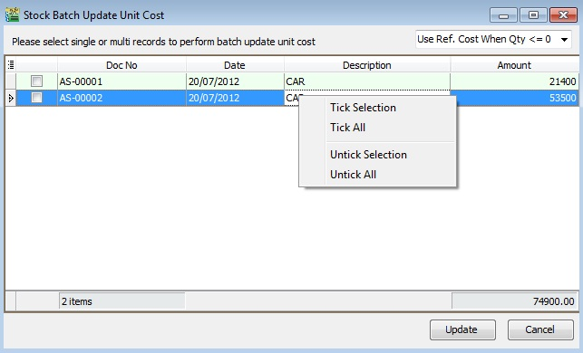

5. After that, press the UPDATE button to start.

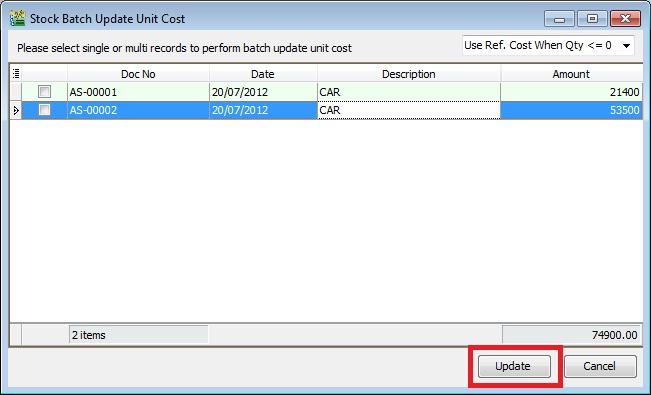

6. Once completed, it will prompt the below message. Press OK to exit.

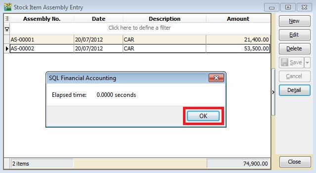

## Stock Item Disassembly

Stock Item Disassembly is an entry form to record the actual components (materials) to be received after convert or disassemble from the final product.

Components (materials) will be added into the stock balance. However, the final products will be deducted out from the stock balance. You can always check the stock movement from the stock card report.

### Stock Item Disassembly (DS) Entry

1. CLICK on the **NEW** button.

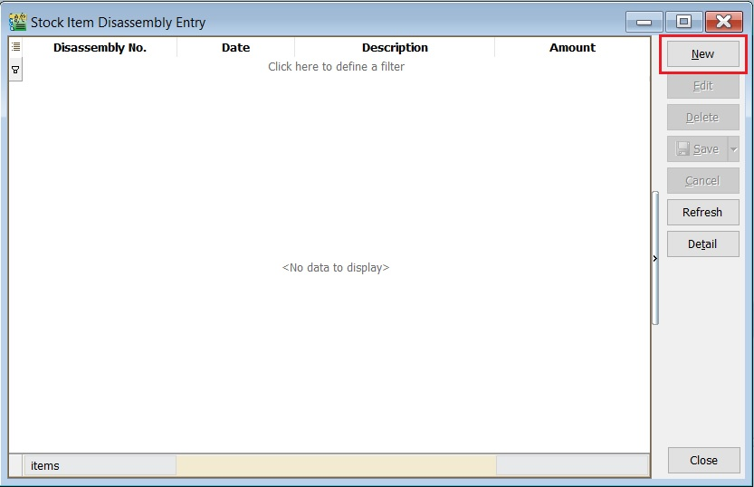

2. Select the **Disassembly Code** to disassembly.

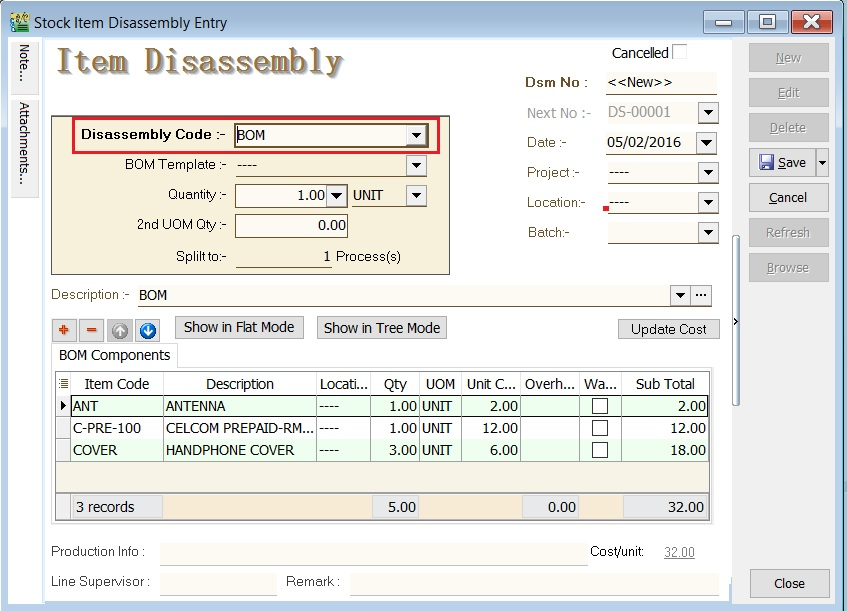

3. Enter the **quantity**. BOM components quantity based on the BOM master in **Maintain Stock Item**.

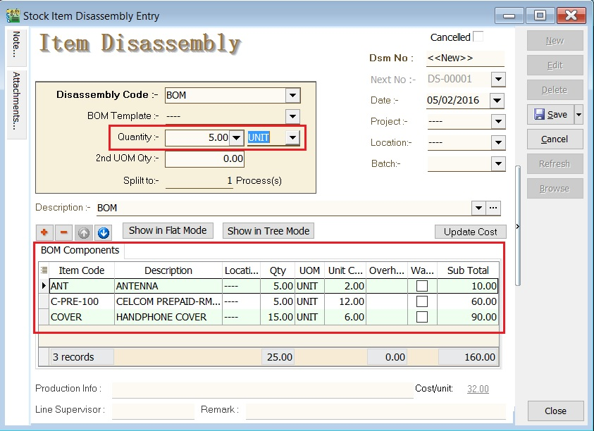

4. CLICK on the **SAVE** button.

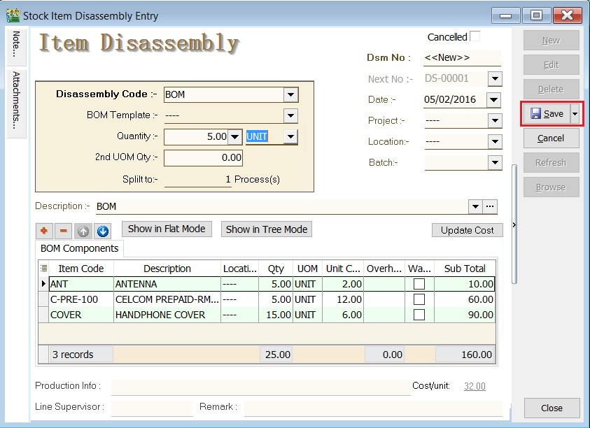

### Stock Balance Result After Disassembly

Stock balance results:

| | Item Code | Qty | DS | **After DS Qty** |
|---|---|---|---|---|
|End Products | BOM | 5.00 | -5.00 | **0.00** |
|Component | ANT | 0.00 | +5.00 | **5.00** |
|Component | C-PRE-100 | 0.00 | +5.00 | **5.00** |
|Component | COVER | 0.00 | +15.00 | **15.00** |
