:::note
This is an additional module.
:::

## Print Job Order Listing

### How to Print Job Order Listing

1. Go to Production -> Select the report

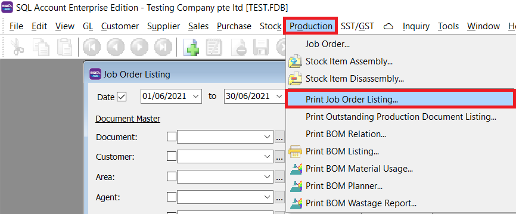

2. Select the Document Master Details

3. Select the Document Details

4. Press Apply Button

5. Click Preview

- Example of job order listing report.

### Print Document Style

Tick relevant check boxes.

|**Field Name**| **Explanation**|
|---|---|
|Print Document Style | Tick this checkbox to print out bulk report or send batch email|
|Include Cancelled Documents |  Tick this checkbox to include cancelled documents in the listing|

## Print Outstanding Production Document Listing

### How to Print Outstanding Production Document Listing

1. Go to Production -> Select the report

2. Select Outstanding Sales Order or Outstanding Job Order

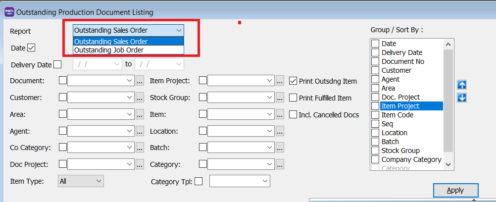

3. Select how you want to filter your report

4. Tick the relevant options

|**Field Name**| **Explanation**|
|---|---|
|Print Outstanding Item | Tick this include documents and items that have not been transferred to other documents|
|Print Fulfilled Item | Tick this include documents and items that have already been transferred to other documents|
|Include Cancelled Document | Tick this checkbox to include cancelled documents in the listing|

5. Press Apply Button

6. Click Preview

- Example of oustanding job order listing report.

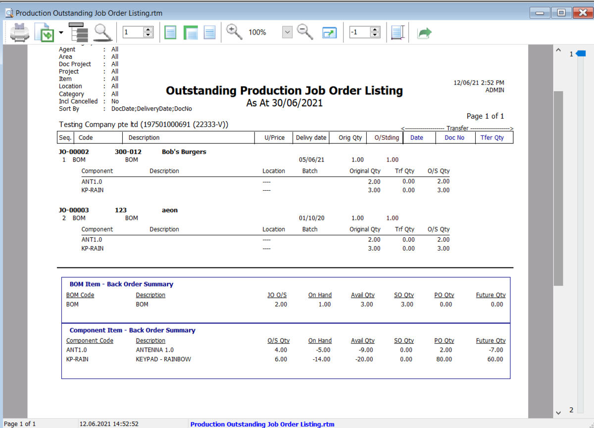

- Example of outstanding sales order listing report.

## Print BOM Relation

### How to Print BOM Relation

1. Go to Production -> Select the report

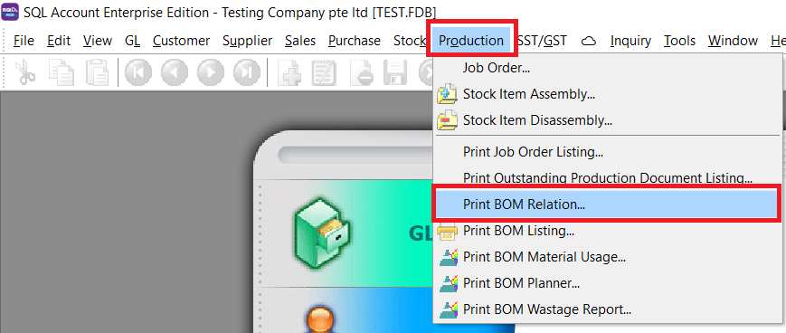

2. Select the Item Code

3. Press Apply

4. Preview the report

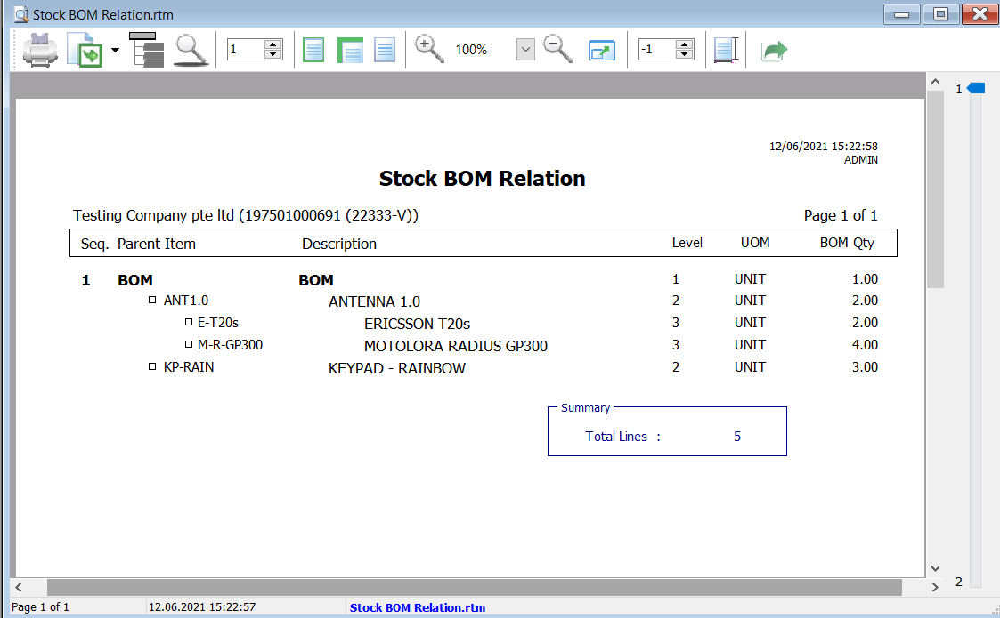

## Print BOM Listing

### How to Print BOM Listing

1. Go to Production -> Select the report

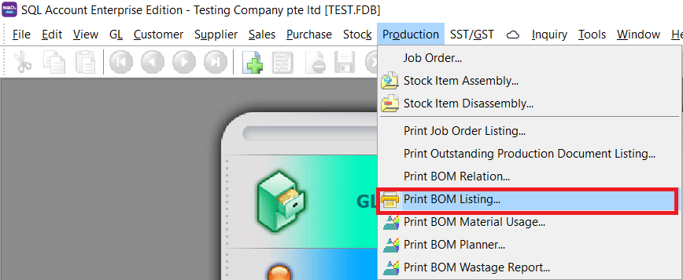

2. This is the browse screen

3. Select document type

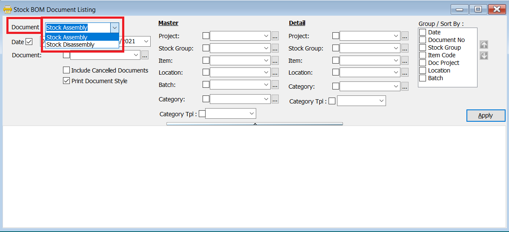

4. Tick relevant options

|**Field Name** | **Explanation**|
|---|---|
|Print Document Style| Tick this print all documents in this list as individual documents|
|Include Cancelled Document | Tick this checkbox to include cancelled documents in the listing|

5. Filter your document listing

6. Press Apply Button

7. Preview the report. Press "detail" icon to see the detailed item information for each document

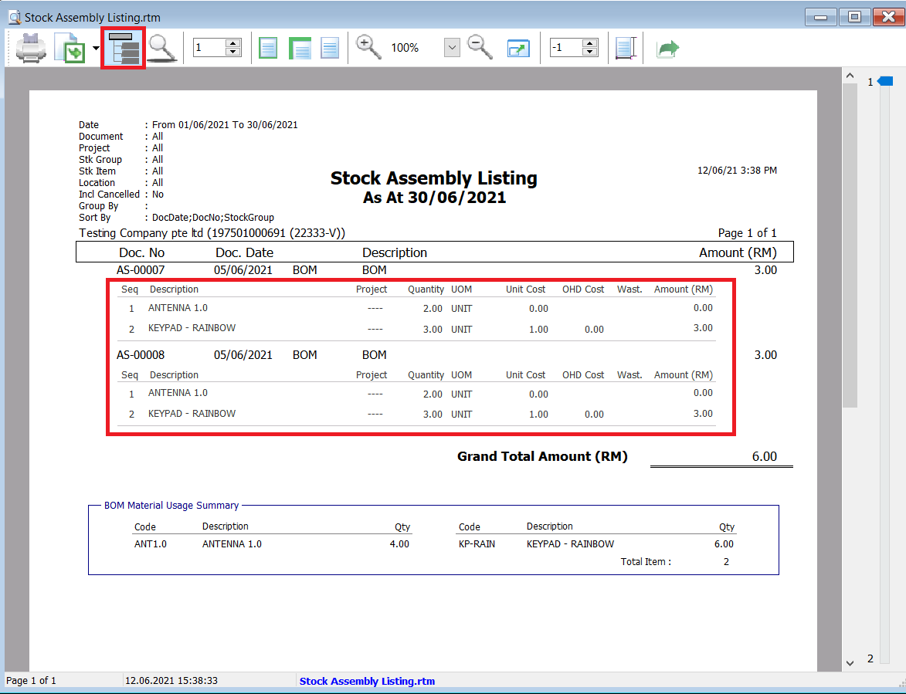

## Print BOM Material Usage

### How to Print BOM Material Usage

1. Go to Production -> Select the report

2. Filter by selecting the sub item, location, stock group, batch and category

3. Press Apply Button

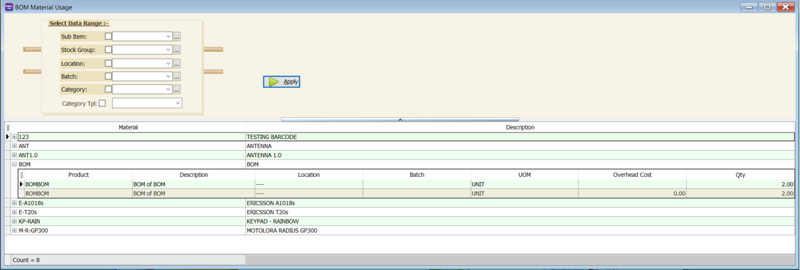

4. Preview the report

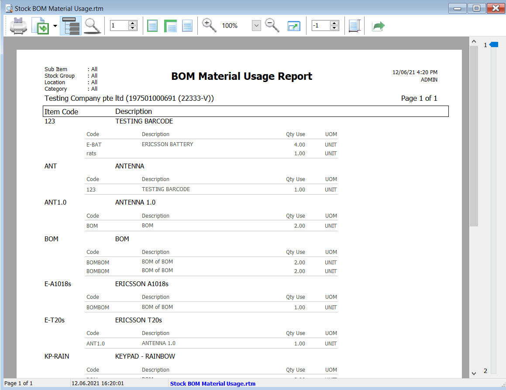

## Print BOM Planner

### How to Print BOM Planner

1. Go to Production -> Select the report

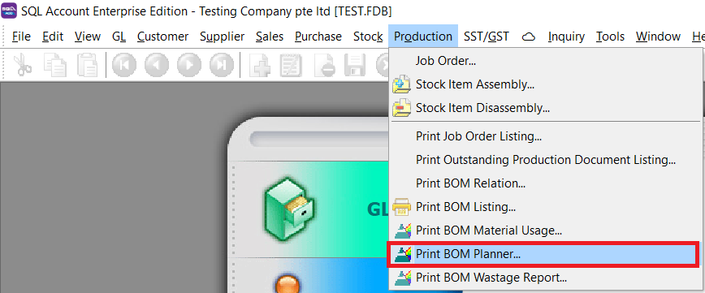

2. Filter by selecting the BOM Code or BOM template

3. Press Apply Button

4. Preview the report

## Print BOM Wastage Report

### How to Print BOM Wastage Report

1. Go to Production -> Select the report

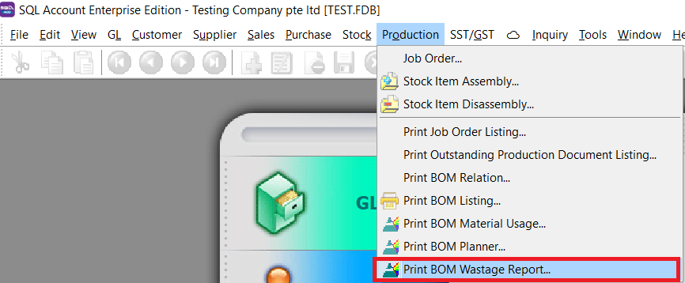

2. Set the date period, and select if you want to se Stock Assembly or Stock disassembly

3. Filter based on project , stock group, item, location, and batch

4. Press Apply Button

5. Preview the report

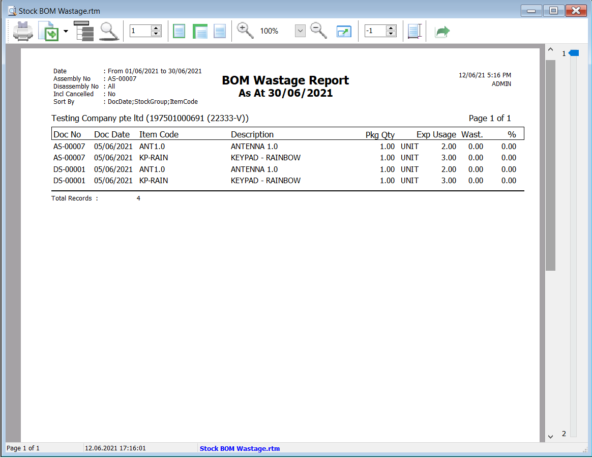
