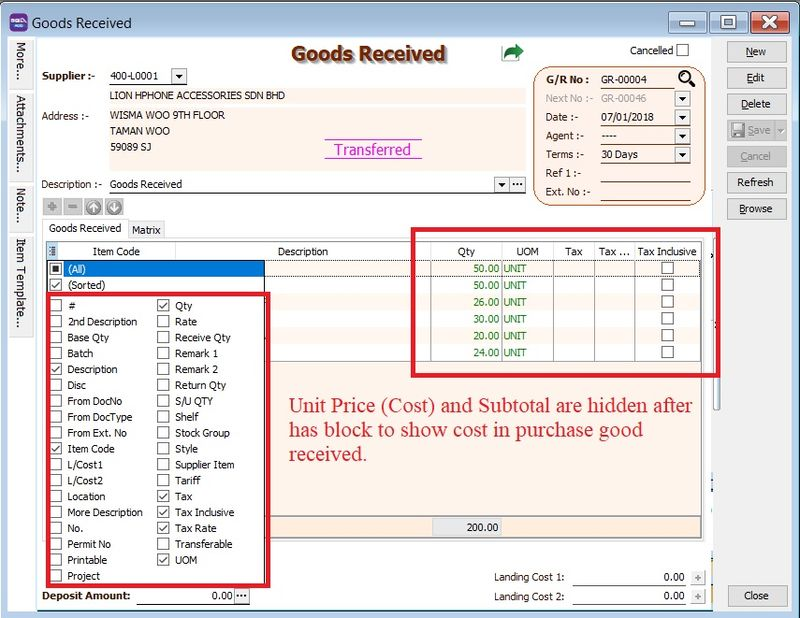
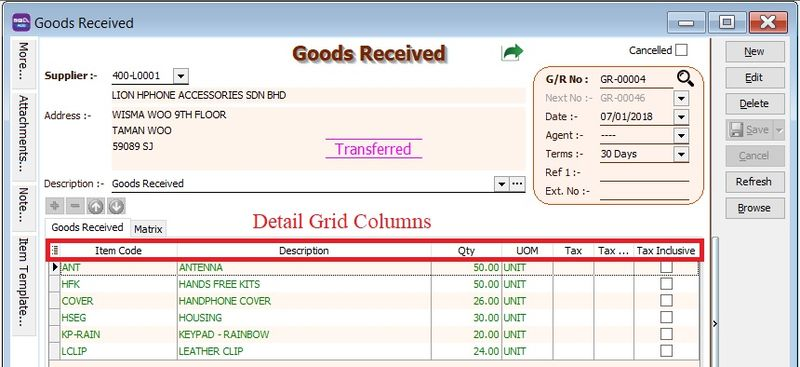

## 1. Why user still cannot view the unit price and subtotal where show cost in Purchase Goods Received Note / Invoice have granted rights

**Issue:**

1. User Access control has granted to **Show Cost in Purchase Goods Received**.
2. Purchase Goods Received still cannot view the unit price, tax amount and subtotal.

**Solution:**

1. Point your mouse to any detail grid columns.

    

2. Right Click -> Grid Layout -> Load Layout.

    

3. At Load Grid Layout, click on Reset Layout.

    

4. Purchase Goods Received detail grid layout has reset follow the users access rights.

    
