## Print Purchase Document Listing

### How to Print Purchase Document Listing

1. Go to Purchase and click Print Purchase Document Listing

    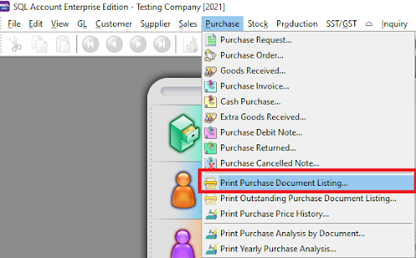

2. Select which Document listing you want to see. Follow the image

    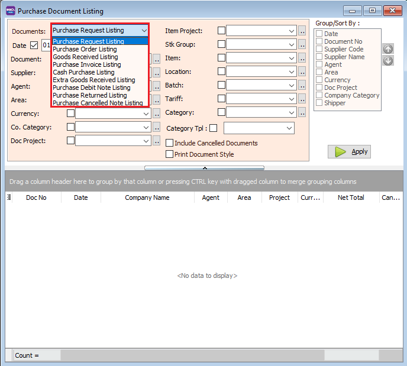

3. Press Apply Button

    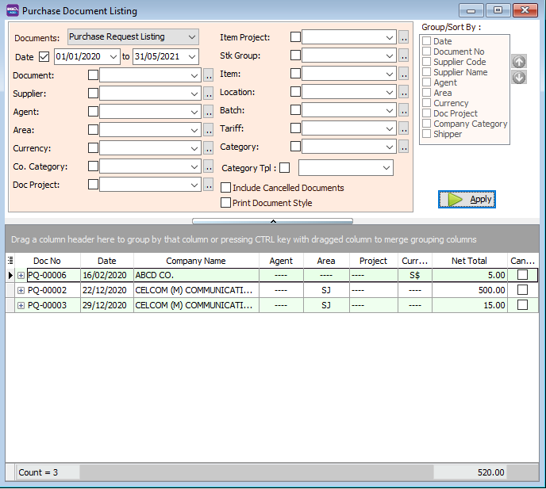

4. Click Preview & Listing Report

    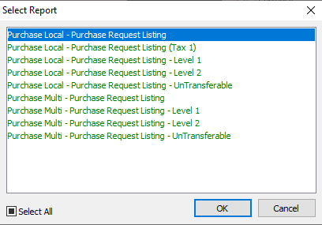

- Example of customer invoices listing report.

    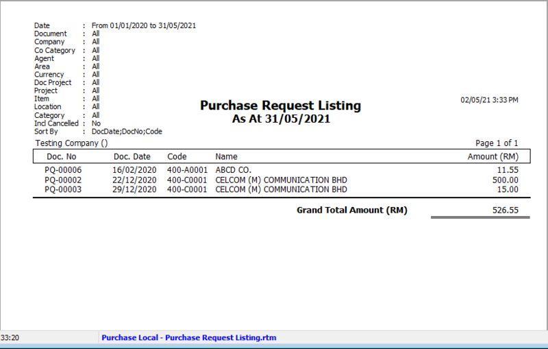

### Print Document Style

Tick relevant check boxes.

|**Field Name**| **Explanation**|
|---|---|
|Print Document Style| Tick this checkbox to print out bulk report or send batch email|
|Include Cancelled Documents| Tick this checkbox to include cancelled documents in the listing|

If you Tick Print Document Style , you will see that you will able able to choose purchase document report format.

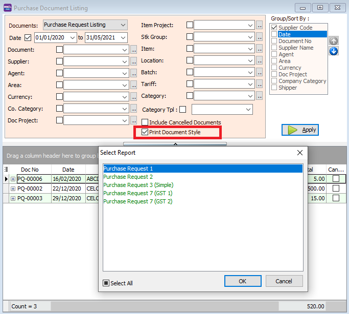

***Group/Sort By***

You can filter your documents based on Document, Agent, Area, Currency, Project and Company Category.

You can use the Group by/Sort by table to choose how you want to group your report listing.

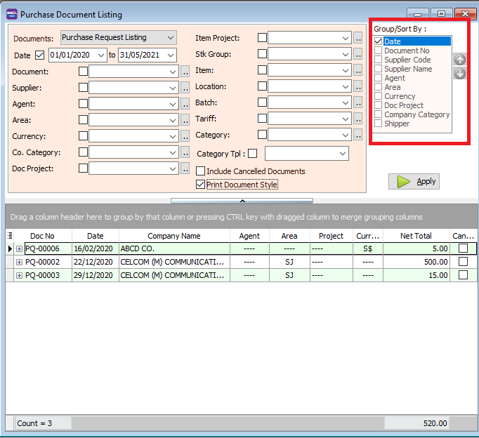

Select the Listing Report.

Here is an example of the report.

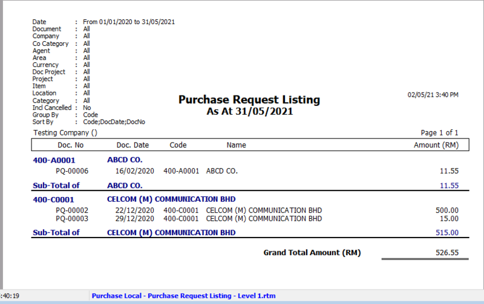

## Print Outstanding Purchase Document Listing

### How to Print Outstanding Purchase Document Listing

1. Select which Document listing you want to see. Follow the image

    

2. Press Apply Button

    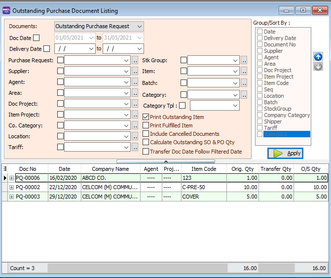

3. Click Preview & Listing Report

    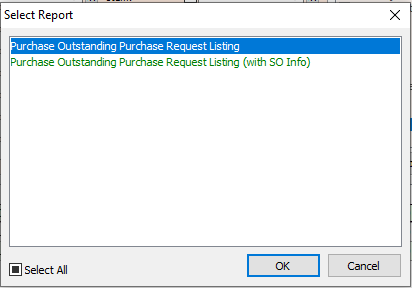

- Example of outstanding purchase document listing report.

    

### Print Outstanding Item & Print Fulfilled Item

|**Field Name**| **Explanation**|
|---|---|
|Print Outstanding Item| Tick this to include documents and items that have not been transferred to other documents.|
|Print Fulfilled Item| Tick this to include documents and items that have already been transferred to other documents.|
|Include Cancelled Document| Tick this checkbox to include cancelled documents in the listing.|
|Calculate Outstanding SO & PO Qty| Calculate outstanding quantity in the report.|
|Transfer Doc Date Follow Filtered Date| Display documents based on the transfer date.|

***Group/Sort By***

You can filter your documents based on Document, Agent, Area, Currency, Project, and Company Category.

You can use the Group by/Sort by table to choose how you want to group your report listing.

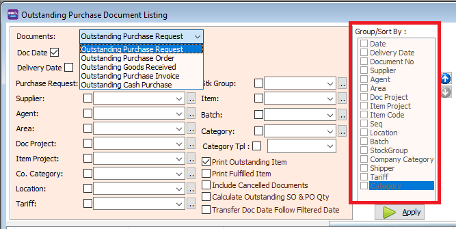

Select the Listing Report.

- Here is an example of the outstanding purchase report:

## Print Purchase Price History

### How to Print Purchase Price History

1. Select which Document listing you want to see. Follow the image

2. Filter the documents by supplier, agent, area etc

    

3. Select how many records you want to display

    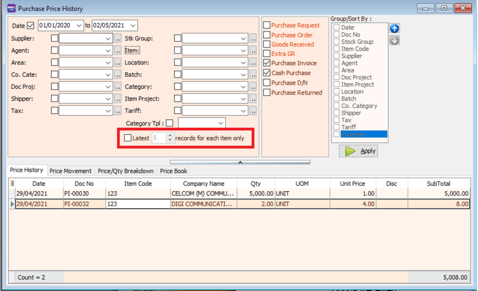

4. Press Apply Button

    

5. Click Preview & Listing Report

    

- Example of purchase price history report.

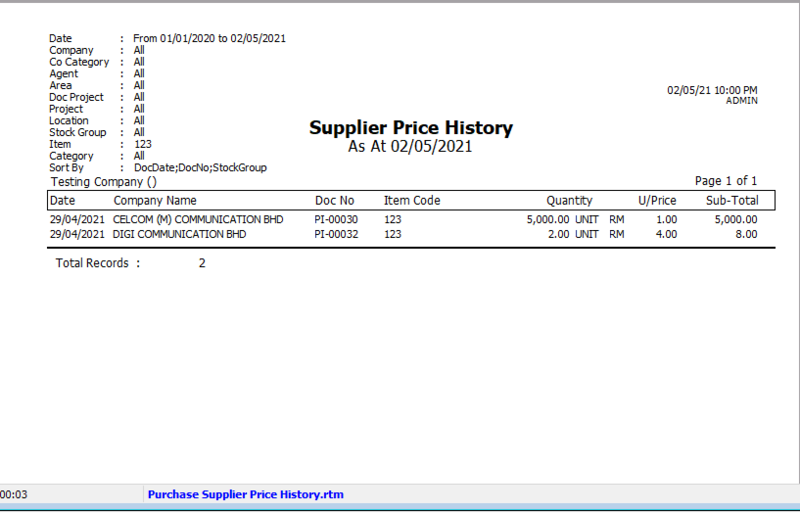

- Example of price history.

- Price movement.

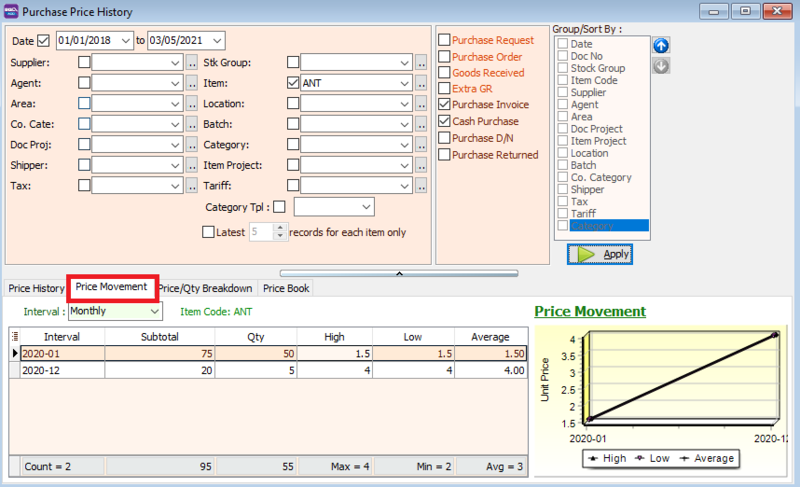

- Price/qty breakdown.

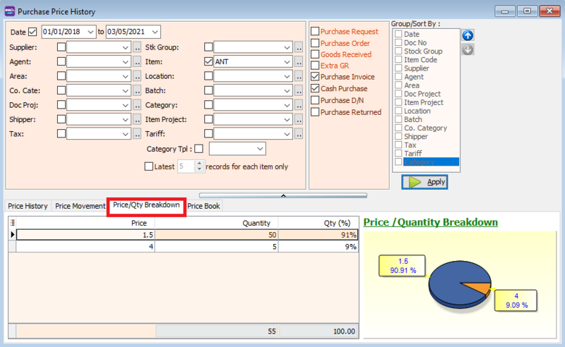

- Price book.

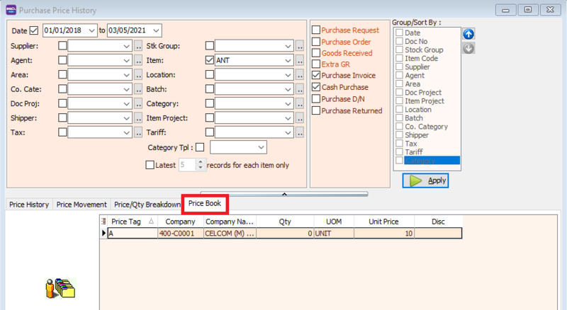

|**Feature**| **Explanation**|
|---|---|
|Price History| View past prices of stock items|
|Price Movement| Observe price movements for each stock item on a line graph|
|Price/Qty Breakdown| Analyze each price breakdown for your stock item displayed on a pie chart|
|Price Book| Review price tags for item codes|

***Group/Sort By***

You can filter your documents based on Document, Agent, Area, Currency, Project, and Company Category.

You can use the Group by/Sort by table to choose how you want to group your report listing.

Select the Listing Report.

- Here is an example of the price history report:

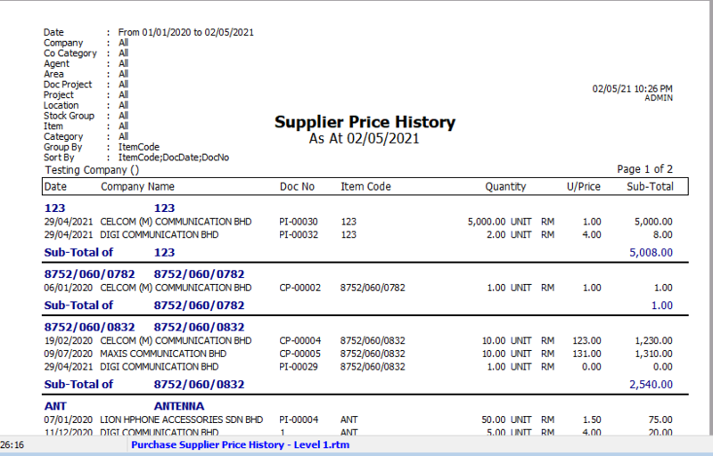

## Print Purchase Analysis by Document

### How to Print Purchase Analysis by Document

1. Filter the documents by supplier, agent, area etc

    

2. Select which documents you want to see, if you want to see RM amount or quantity , and if you want to include tax and foreign currency.

    

3. Press Apply Button

    

4. Click Preveiw & Listing Report

- Example of the analysis report.

    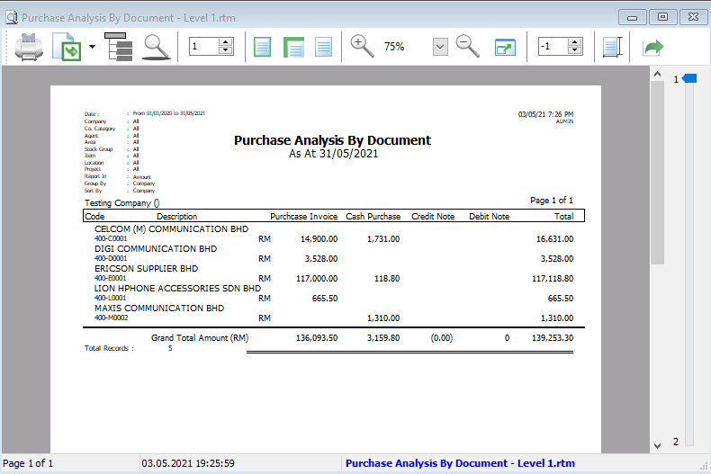

***Group/Sort By***

You can filter your documents based on Document, Agent, Area, Currency, Project and Company Category.

You can use the Group by/Sort by table to choose how you want to group your report listing.

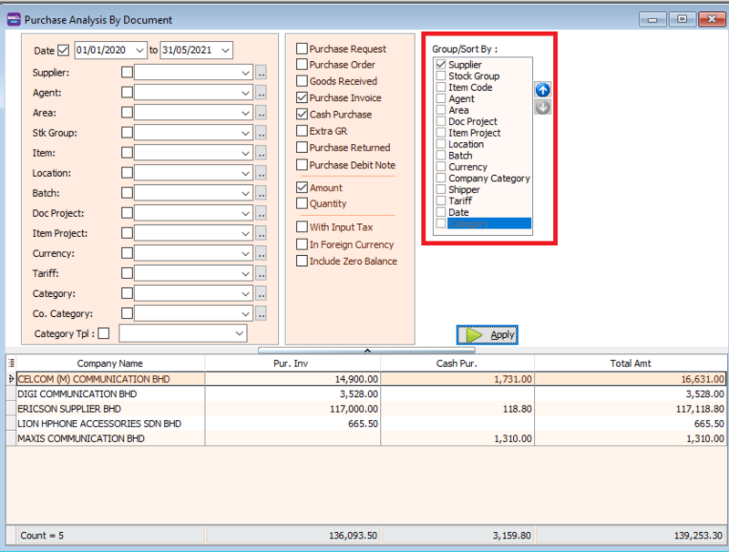

## Print Yearly Purchase Analysis

### How to Print Yearly Purchase Analysis

1. Filter the documents by supplier, agent, area etc

    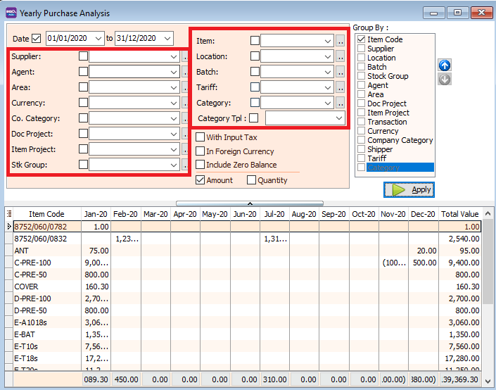

2. Set how you want to group the report by going to group by / sort by

    

3. Select if you want to see the yearly amount or yearly quantity of your purchase

    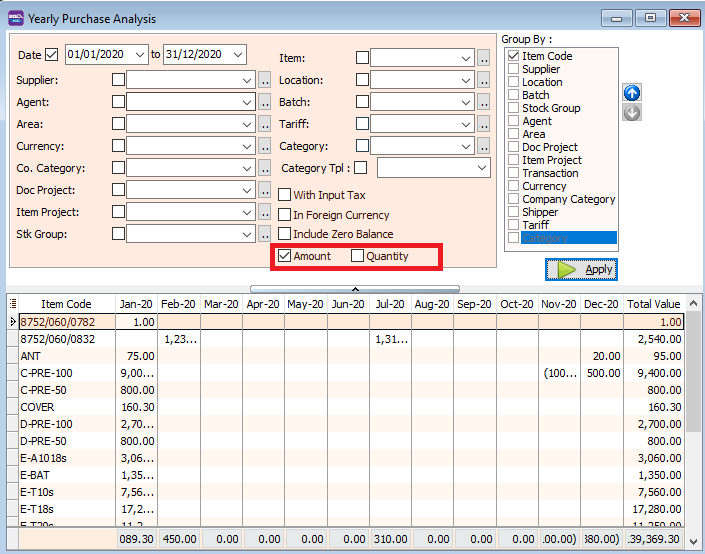

4. Press Apply Button

    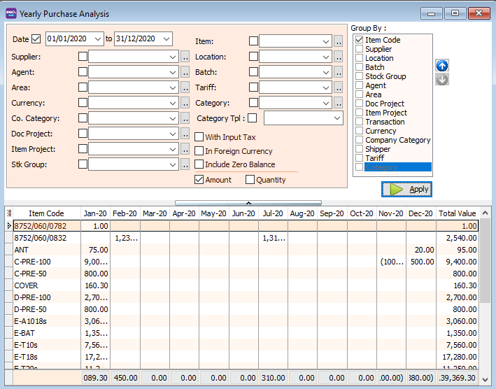

5. Click Preveiw & Listing Report

- Example If you ticked "Qty" , your report will show yearly quantity.

- Example If you ticked "Amount" , your report will show yearly amount.

