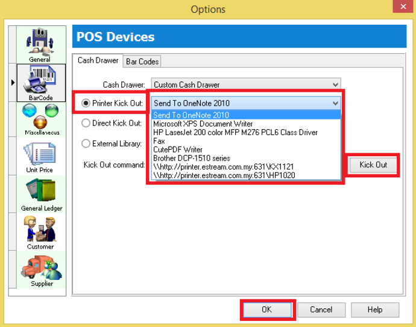

## How to set Cash Drawer Kick Out?

### Setup

1. Tools > Option > Click on Barcode

    - **Option 1 : Direct Kick Out** -> Cash Drawer direct connects to your PC.

        

        :::tip[tip]
        Select the correct *Port No* and then click on **Kick Out** button to test whether the *Cash Drawer* success kicks out, if the port no did not showing in list, may manually type in your *Port No*.
        :::

    - **Option 2**: Printer Kick Out -> Cash Drawer direct connect to Printer

        

        :::tip[tip]
        Select your Printer Name and then click on **Kick Out** button to test whether the *Cash Drawer* success kicks out
        :::

        :::info[note]
        There are the problem if you are using cash drawer RJ 11, RJ 14, may change to Com Port (**Need USB Cash Drawer**)
        :::

**If you met the problem on direct kick out, may reply the question below before call in :**

1. Check Window OS
2. Check SQL Account version
3. Try preview and print see able to print out nicely?
4. Try window Test Print receipt printer
5. Try Tools > Option Kick out whether can response
6. Check receipt printer Model
7. Check what receipt printer driver install
8. Check Cash Drawer model (you are not allowed to use RJ11, use USB Com direct connect to PC instead)

## Why prompt error message when apply the Sales Price History?

### Issue

**Error message:** `arithmetic exception, numeric overflow or string truncation numeric value is out of range`

1. Don't have **multi currency module.**

2. Don't have big currency value like Indonesia country.

### Solution

1. Go to **Tools | Options...**

2. Click on **Miscellaneous.**

3. Change the **Currency Rate** the display format to **#,0.0000** (represent 4 decimals).

