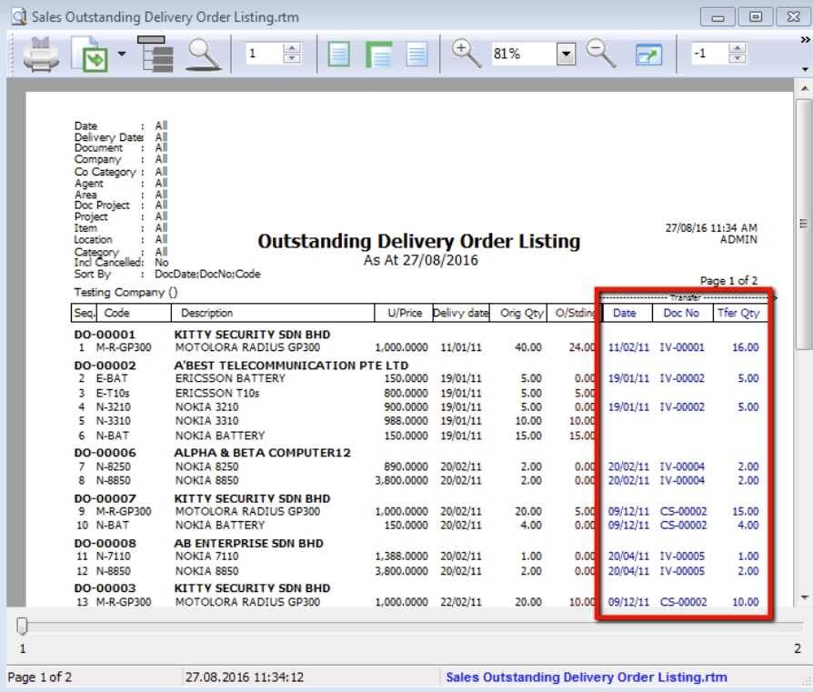

## Sales Report

### Sales Document Listing

   1. Go to **Sales** > **Print Sales Document Listing** >  filter which type of document you want: for example, **Sales Quotation /Sales Order/ Deliver Order/ Invoice Listing**

   2. Filter by **date**, if left untick means all periods will be shown

   3. Filter area by pipelines (It’s optional)

   4. System can generate by group and can give you a summary on each diff group (group/sort by)

   5. Click **Apply** to generate, whenever you change any setting under Step 3 or 4, please redo by clicking Apply

      

#### Export report into Excel

   1. **Right click on any title bar**

   2. **Click on Grid Export > Export to Excel**.

      

#### Batch Printing Invoices

   If you want to print out entire month invoices by batch and into a page-by-page format,

   1. **Sales** > **Print Sales Document Listing**.

   2. Tick **“Print Document Style”**

   :::info

   Watch tutorial video here: [Sales Invoicing Batch Print Invoices](ttps://www.youtube.com/watch?v=MbNMVn0mBiw&feature=youtu.be)

   :::

   

### Outstanding Sales Document Listing (Require Partial Delivery Module)

This report can help you check the transfer document’s info, such as the amount of outstanding items for the particular document and; which invoices the DO have been transferred to.

1. **Sales** > **Print Outstanding Sales Document Listing**.

2. Filter the information that you want and apply.

3. Criteria

   1. **Print Outstanding Item** – to check outstanding items which have not yet been transferred.

   2. **Print Fulfilled Item** – to check those documents which have been fully transferred and transferred to which document.

   3. **Include cancelled documents** – tick to show cancelled documents in the report.

   4. **Outstanding SO & PO** – to check the number of outstanding items from sales order and purchase order

   5. **Transfer Doc Date Follow Filtered Date** – tick this if you want the document transfer date (e.g. transfer document Sales Order to Invoice both will followed filtered date.)

4. **Apply**

   

5. If you want to know where this **document has already been transferred** to, you just **Preview** the report.

   
