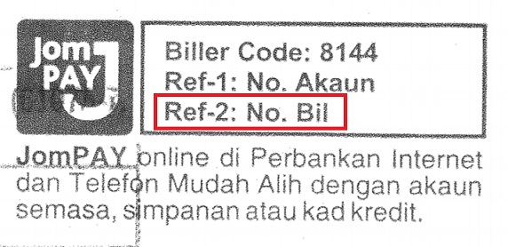
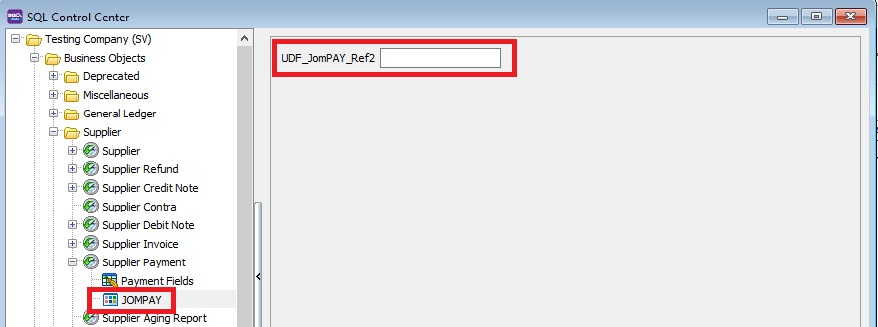
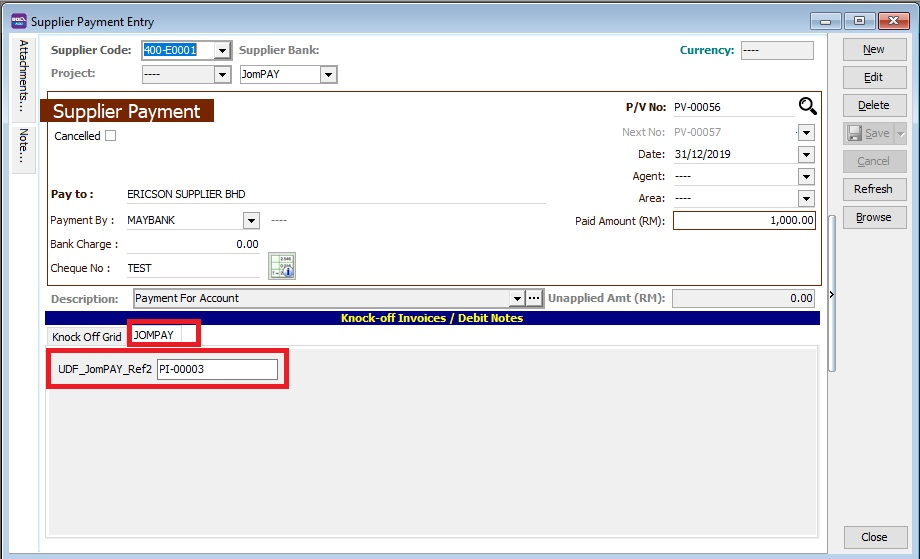
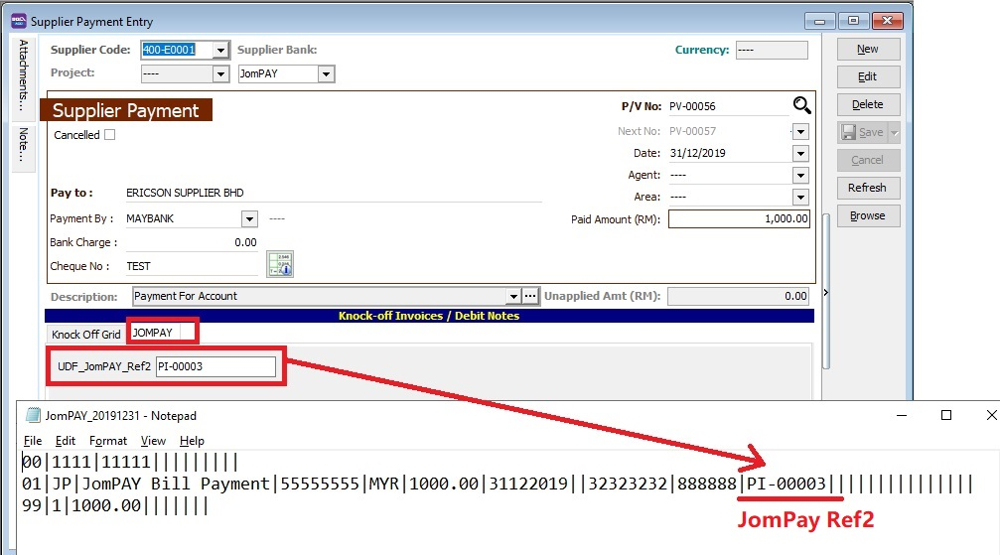

## JOMPAY - How to add the Ref 2 (optional) in the bank payment file format?

**Issue:**

How to capture the JomPay Ref 2 (bill no) in the bank payment file format?

**Solution:**

1. Go to **Tools | DIY | SQL Control Center**...
2. Add the JomPAY Ref2 field under **Supplier | Supplier Payment | Payment Fields**.

| Field Name  | Data Type | Size |
|-------------|-----------|------|
| JomPAY_Ref2 | String    | 30   |

3. Create **Quick Form** and add the UDF_JomPay_Ref2.

4. At **Supplier Payment**, key-in the bill no into UDF_JomPAY_Ref2 under JOMPAY tab.

5. JomPAY Ref 2 will be captured in the bank JomPAY payment format.

:::note NOTE:
The above solution is using SQL Account version 784 and above. Modules required:
1. Interbank GIRO
2. DIY field (or Professional Set).
:::