## Maintain Supplier

To keep the Supplier profile data such as addresses, telephone, fax, email, contact person, credit limits, credit
terms, etc. In other words, it is your supplier contacts list.

### New Supplier

To create NEW supplier, CLICK on NEW button. See screenshot below.

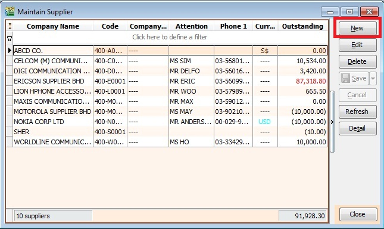

You will get a blank form to be fill-in with the supplier data.

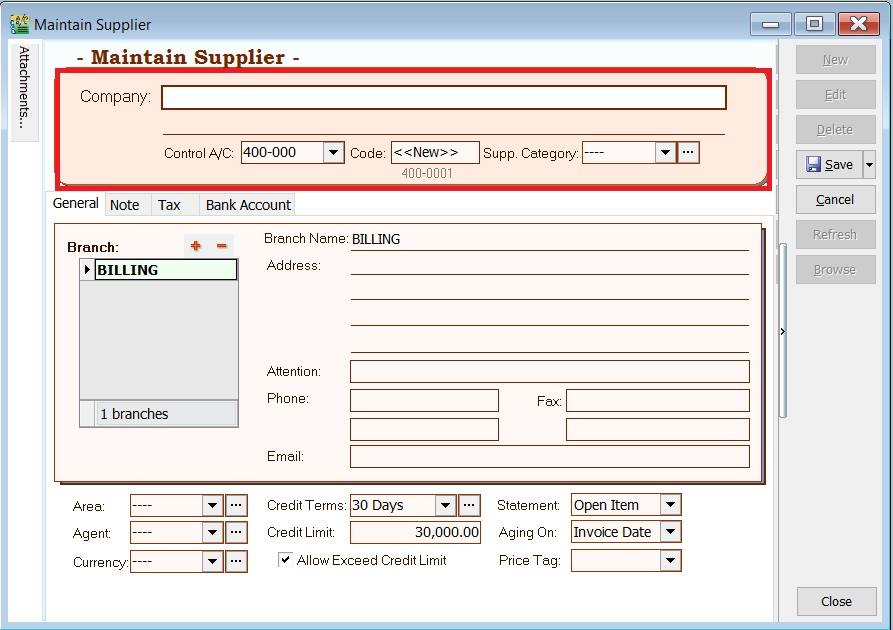

You may start input the following fields:

| **Field Name**       | **Field Type**                                                                                       | **Length** | **Explanation**                                                                                       |
|-----------------------|------------------------------------------------------------------------------------------------------|------------|-------------------------------------------------------------------------------------------------------|
| Company              | Alphanumerical                                                                                        | 100        | Input the supplier billing company name.                                                              |
| Description 2 (under Company) | Alphanumerical                                                                                        | 100        | Optional field recommended to input Chinese translated name, former company name, company register no, etc. |
| Control A/c          | Lookup from Maintain Accounts (Special Type: Customer Control Account)                                | 10         | Select an appropriate Supplier Control Account to be posted to GL when customer documents are created. |
| Code                 | Alphanumerical                                                                                        | 10         | AUTO/MANUAL generate the Supplier Code.                                                               |
| Cust Category        | Lookup from Maintain Company Category                                                                 | 15         | Categorize your supplier for reporting purpose.                                                       |

#### General

| **Field Name**  | **Field Type**                               | **Length**              | **Explanation**                                                                 |
|------------------|----------------------------------------------|-------------------------|---------------------------------------------------------------------------------|
| Branch Name      | Alphanumerical                               | 100                     | You may maintain multiple sets of addresses by differentiating the Branch Name. Default Branch Name: BILLING |
| Address (4 lines)| Alphanumerical                               | 40 (each line)          | Input the company addresses.                                                    |
| Attention        | Alphanumerical                               | 70                      | Input the contact person.                                                       |
| Phone 1 & 2      | Alphanumerical                               | 30                      | Input the telephone number.                                                     |
| Fax 1 & 2        | Alphanumerical                               | 30                      | Input the fax number.                                                           |
| Email            | Alphanumerical                               | 60                      | Input the email.                                                                |
| Area             | Lookup from Maintain Area                    | 10                      | Select a default Area.                                                          |
| Agent            | Lookup from Maintain Agent                   | 10                      | Select a default Agent.                                                         |
| Currency         | Lookup from Maintain Currency                | 6                       | Select a default Currency.                                                      |
| Credit Terms     | Lookup from Maintain Terms                   | 10                      | Select a default Terms.                                                         |
| Credit Limit     | Numeric                                      | —                       | Set the credit limit.                                                           |
| Statement        | Option                                       | —                       | Select a default statement type, i.e., Open Item or Brought Forward. Default: Open Item |
| Aging On         | Option                                       | —                       | Select a default Aging type, i.e., Invoice Date or Due Date. Default: Invoice Date |
| Price Tag        | Lookup from Maintain Stock Price Tag         | 10                      | Set the price tag to the items.                                                 |

#### Note

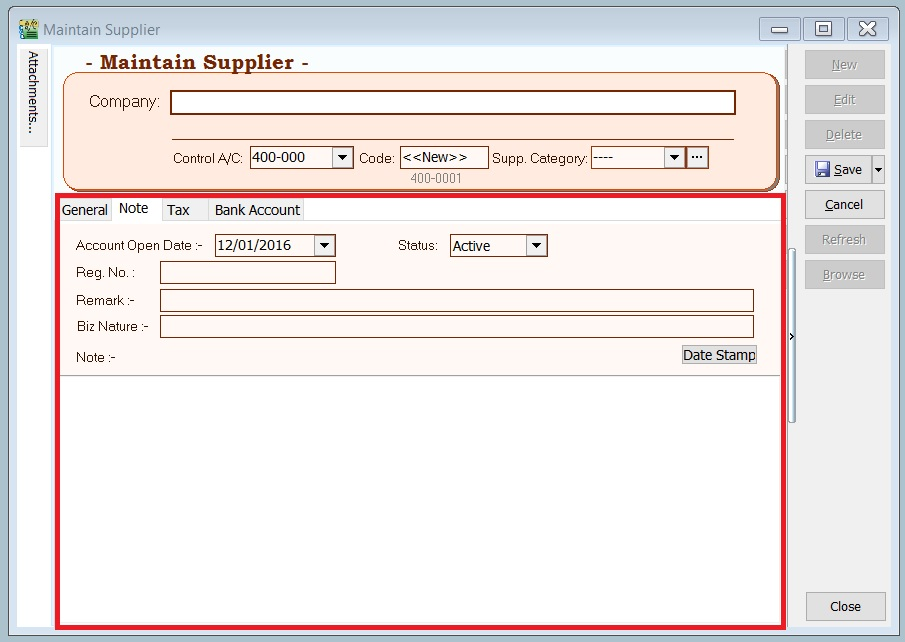

| **Field Name**      | **Field Type**   | **Length**  | **Explanation**                                                                 |
|----------------------|------------------|-------------|---------------------------------------------------------------------------------|
| Account Open Date    | Date             | —           | Creation date.                                                                  |
| Remark               | Alphanumerical   | 80          | This remark will show in Inquiry → Account Inquiry.                             |
| Biz Nature           | Alphanumerical   | 100         | Input supplier business nature. For example, Chemical Manufacturing, Car Service, etc. |
| Note                 | Alphanumerical   | Rich Text   | Record the supplier knowledge base. You can use the "Date Stamp".               |
| Status               | Option           | —           | See **Status Options** table below.                                             |

| **Status** | **Explanation**                                                                 |
|------------|---------------------------------------------------------------------------------|
| Active     | Allow to create official documents and select to print Supplier Statement.      |
| Inactive   | Not allow to create official documents, but cannot select to print Supplier Statement. |
| Suspend    | Not allow to create official documents, but can select to print Supplier Statement. |
| Prospect   | Allow to create official documents and select to print Supplier Statement.      |
| Pending    | Allow to create official documents and select to print Supplier Statement.      |

#### Tax

| **Field Name**  | **Explanation & Properties**                                                                 |
|------------------|-----------------------------------------------------------------------------------------------|
| Default Tax      | Select a default tax code based on supplier.                                                  |
| Tax Area         | Not applicable to Malaysia/Singapore.                                                         |
| Exemption No     | • Input the Tax Exemption number applicable to your supplier.  
| | • Field type: Alphanumerical.  
| | • Length: 50 |
| Expiry Date      | Set an expiry date.
| | • This will be tax exempted before the expiry date.
| | • Field type: Date.       |

**Tariff Code Setting**
This setting set the supplier who has supply the taxable goods under the Sales Tax (Person Exempted from Payment of Tax) Order 2018.

| **Field Name** | **Explanation & Properties** |
|----------------|-------------------------------|
| Tariff         | • Add tariff code of taxable goods to be sold in exemption.  |
|                | • Lookup: [Maintain Tariff](../../usage/Tools/Tools.md#maintain-tariff)  |
|                | • Related Topic: [Maintain Stock Item → Main Header](../../usage/stock/stock-guide#maintain-stock-item) |
| Tax            | • Select an appropriate tax code that falls under the Person Exempted in **Schedule C ONLY** (must be declared in SST-02). |
|                | • Schedule C tax code: PEC1, PEC2, PEC3, PEC4, PEC5 |
|                | • Lookup: [Maintain Tax](../../usage/gst-and-sst/gst#maintain-tax) |

#### Bank Account

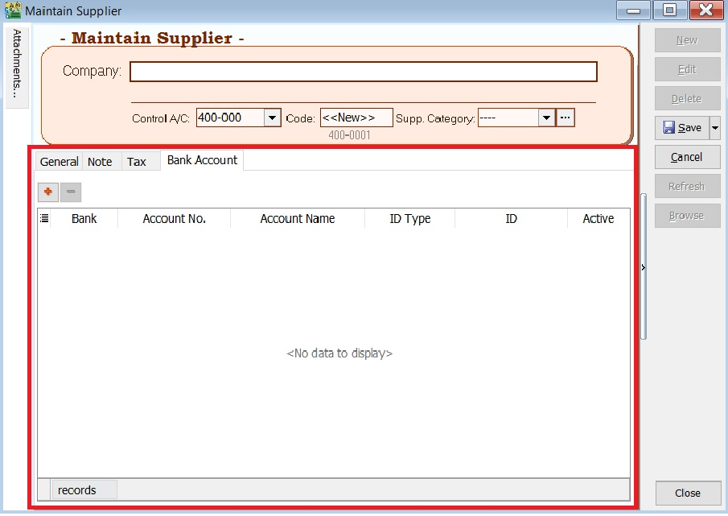

| **Field Name** | **Explanation & Properties** |
|----------------|-------------------------------|
| Bank           | Select the correct bank. |
| Account No     | Key in the account number of the supplier. |
| Account Name   | Insert the name. |
| ID Type        | Select the ID type that you want. |
| ID             | Insert the ID. |
| Active         | • Tick it when active.  |
|                | • Untick when inactive. |

### Edit Supplier

You can EDIT the supplier, CLICK on EDIT button. See screenshot below.

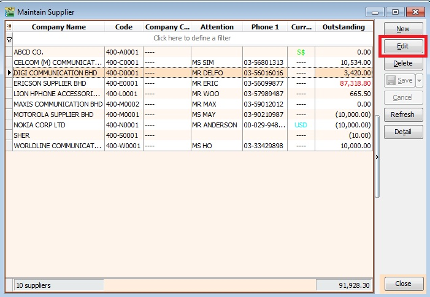

:::note
 
 1. User able to EDIT the supplier data depends on the user access rights granted.
 2. Any EDITING the system will be audited (logged) with changes made.

:::

### Save Supplier

You have to SAVE the supplier data before can be used. See screenshot below.

### Delete Supplier

You can DELETE the unwanted supplier data. See screenshot below.

:::note  
 1. User able to DELETE the supplier data depends on the user access rights granted.
:::

### Supplier Code Format

Supplier code can be AUTO generate or overwrite it manually. See screenshot below.

:::note Important
 1. Every supplier code is unique. 
 2. If the system found there is an duplicate code trying to save, users will be notify by warning message. See screenshot below.
:::

You can set the supplier code format via Tools | Options...(Supplier). See screenshot below.

Explanation of the Supplier Code Format:

For example,

| **Company Name** | **Customer Control Acc** | **Format**     | **Result**     |
|------------------|---------------------------|----------------|----------------|
| ABCD SDN BHD     | 401-000                   | %.1s-%.1s%.1d  | 4-A-1          |
| ABCD SDN BHD     | 401-000                   | %.2s-%.2s%.2d  | 40-AB-01       |
| ABCD SDN BHD     | 401-000                   | %.3s-%.3s%.3d  | 401-ABC-001    |
| ABCD SDN BHD     | 401-000                   | %.4s-%.4s%.4d  | 401--ABCD-0001 |

## Supplier Invoice

- General invoice received from supplies likes purchase of service, insurance, stationery or any non-stock control billing.
- Besides that, you can check the invoices status such as outstanding and payment history.

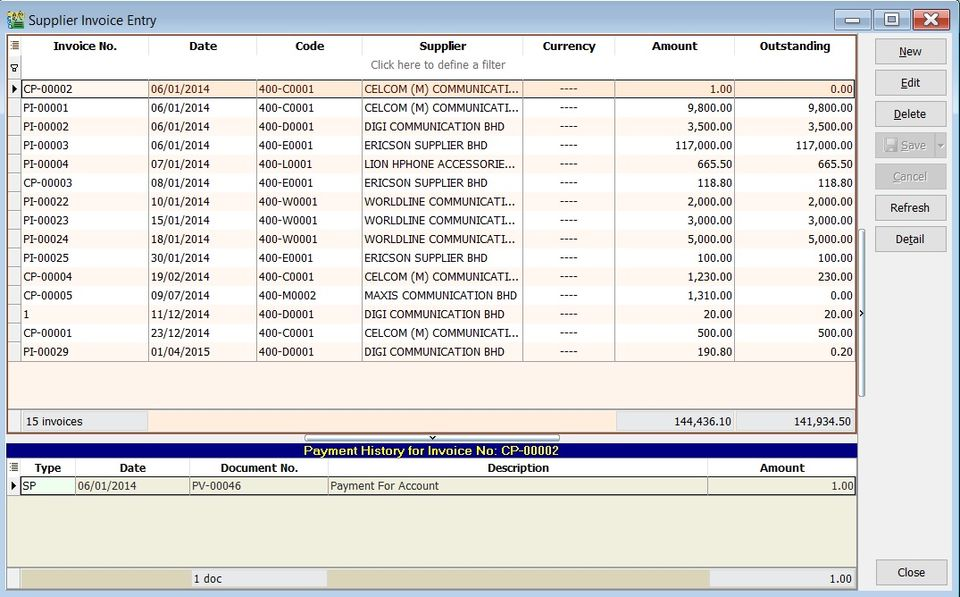

### Basic Entry
  
1. Click on New button.
2. See the New Supplier Invoice entry form screenshot below.

3. Select the Supplier Code. You direct key-in and search by either supplier code or name.
4. Input the Purchase A/c and amount to be debit.
5. Below is the example of the entry created:

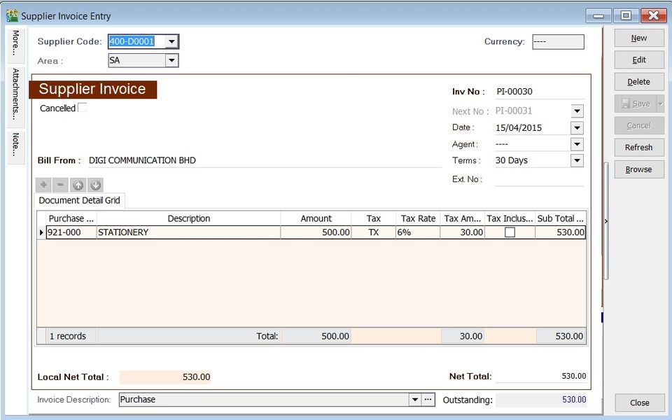

| Account                  | DR (RM)  | CR (RM)  |
|---------------------------|----------|----------|
| Stationery               | 500.00   |          |
| Supplier Control Account |          | 500.00   |

### Project

- There are 2 types of project you need to be take note.
  1) Document Project
  2) Detail Project
- For document project, you need to point to MORE section (on the left side bar).
- For detail project, you have to insert the project column out from Field Chooser.

| **Label** | **Types**          | **Explanation**                                             |
|-----------|--------------------|-------------------------------------------------------------|
| A         | Document Project   | It represents the project for a document to be credited.    |
| B         | Detail Project     | It represents the project for individual GL Account to be debited. |

### Attachment

- It is very useful to attach any supporting documents to an invoice.
- In future, you able to retrieve and refer the attachment file easily.

1) You have to point to the attachment section.
2) Click on ( + ) button to insert the filename path.
3) See the sample screenshot below.

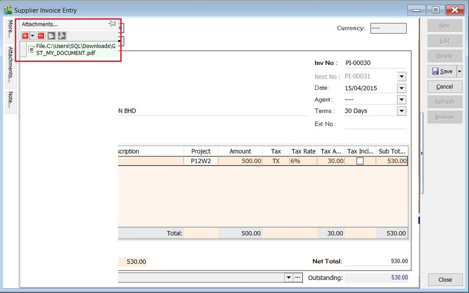

### Note

1. Click on the Note section (on the LEFT side bar).
2. RIGHT click it, you will see the Rich Text Editor pop-up.
3. You can start key-in the note. See the example screenshot below.
4. Click on X button to save and exit the Rich Text Editor.

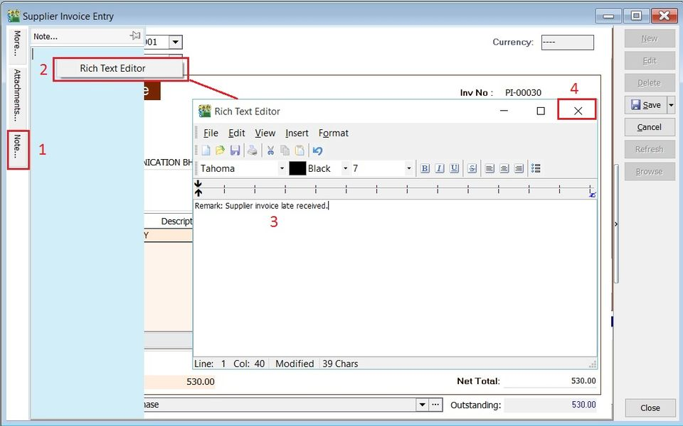

5. You will get prompted the Save changes? message. Click YES to save it.

### Invoice description

1. To show the document description in Supplier Statement, eg. Purchase-Stationery April 2015.

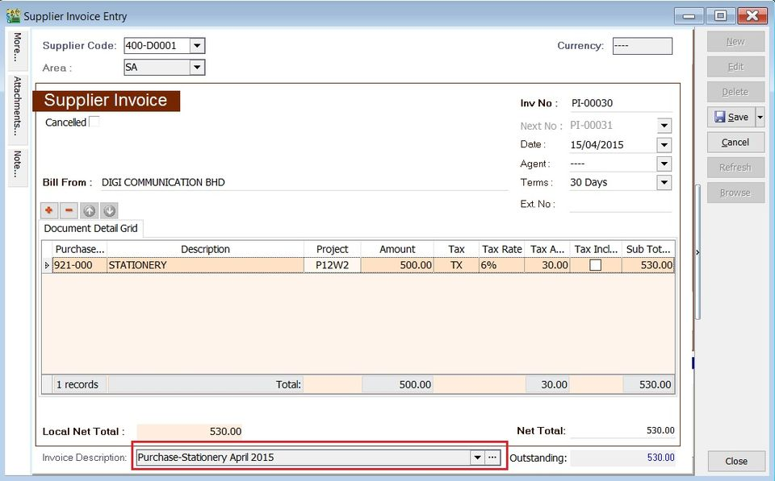

2. Sample of supplier statement screenshot below.

## Supplier Payment

- To record the payment amount to Suppliers.
- To off-set against the outstanding supplier invoices.

### Basic Entry

1. Click on New button.
2. See the New Supplier Payment entry form screenshot below.

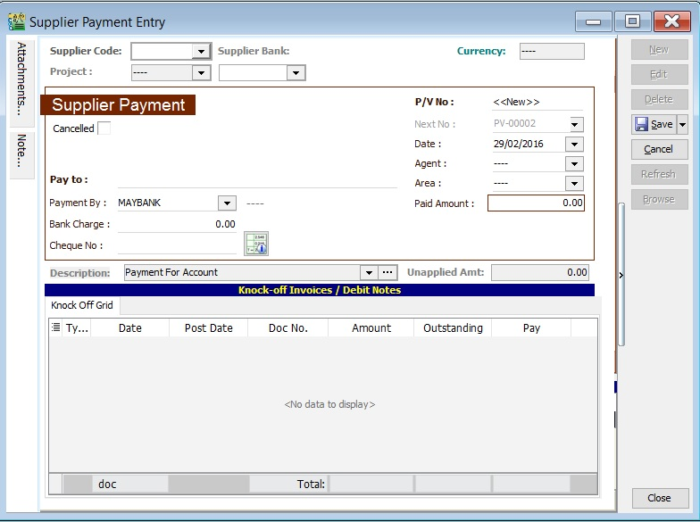

3. Select the Supplier Code. Direct key-in and search by either Supplier code or name.
4. Select the Payment Method (bank or cash account) in Payment By.
5. Enter the Paid Amount (follow the bank account currency).
6. Below is the example of the entry created:

**Double Entry will be:-**

| **Account**             | **DR (RM)** | **CR (RM)** |
|--------------------------|-------------|-------------|
| Supplier Control Acc     | 2,500.00    |             |
| Bank Account             |             | 2,500.00    |

7. Enter Bank Charges if there is a bank charges.

8. It will auto post the following double entry:-

| **Account**     | **DR (RM)** | **CR (RM)** |
|-----------------|-------------|-------------|
| Bank Charges    | 2.00        |             |
| Bank Account    |             | 2.00        |

9. Enter the cheque number, cash or TT into Cheque No. field.

### Knock-Off

Purpose to knock-off the invoices:
1. To show the outstanding invoices in Supplier Aging Report.
2. To indicate the payment knock-off the invoices in Supplier Statement.
3. To remove / recover from the GST Bad Debt Relief on outstanding more than 6 months

#### Partial Knock-Off

1. You can enter the knock-off amount into Pay column (auto tick).
2. Unapplied Amt will be reduced by the knock-off amount entered.

#### Document Knock-Off

1. You can tick on the outstanding documents.
2. Unapplied Amt will be reduced by the knock-off amount ticked.

#### Random Knock-Off

1. You can click on the Pay column. It will auto tick on the outstanding documents.
2. Unapplied Amt will be reduced according to the outstanding balance.

:::note
 Unapplied amount shows the Supplier payment amount not allocated/knock-off against any outstanding invoices and debit note.
:::

### Attachment

- It is very useful to attach any supporting documents.
- In future, you able to retrieve and refer the attachment file easily.

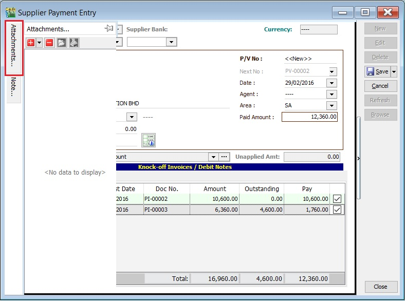

1. You have to point to the attachment section.
2. Click on ( + ) button to insert the filename path.
3. See the sample screenshot below.

### Note

1. Click on the Note section (on the LEFT side bar).
2. RIGHT click it, you will see the Rich Text Editor pop-up.

3. You can start key-in the note. See the example screenshot below.
4. Click on X button to save and exit the Rich Text Editor.

5. You will get prompted the Save changes? message. Click YES to save it.

### Description

To show the Supplier payment description in the Supplier Statement, eg. Payment For Jan & Feb 2016.

Sample of Supplier statement screenshot below.

## Supplier Debit Note

- General debit note received from Supplier likes the adjustment for undercharged to purchase of stationery, services, insurance, or any non-stock control billing.
- Besides that, you can check the debit note status such as outstanding and payment history.

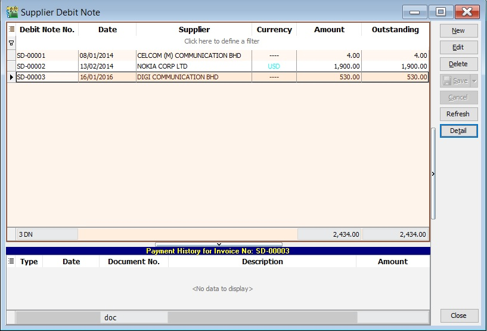

### Basic Entry

1. Click on New button.
2. See the New Supplier Debit Note entry form screenshot below.

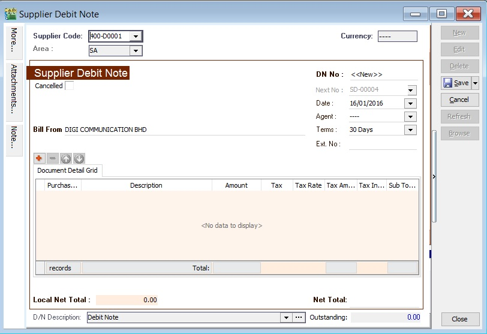

3. Select the Supplier Code. You direct key-in and search by either supplier code or name.
4. Input the Purchase A/c and amount to be debit.
5. Below is the example of the entry created:

**Double Entry will be:-**

| **Account**               | **DR (RM)** | **CR (RM)** |
|----------------------------|-------------|-------------|
| Stationery                 | 500.00      |             |
| Supplier Control Account   |             | 500.00      |

### Project

- There are 2 types of project you need to be take note.  
  1. Document Project  
  2. Detail Project  
- For document project, you need to point to MORE section (on the left side bar).  
- For detail project, you have to insert the project column out from Field Chooser.  

| **Label** | **Types**        | **Explanation**                                                  |
|-----------|------------------|------------------------------------------------------------------|
| A         | Document Project | It represents the project for a document to be credited.         |
| B         | Detail Project   | It represents the project for individual GL Account to be debited. |

### Attachment

- It is very useful to attach any supporting documents to a debit note.
- In future, you able to retrieve and refer the attachment file easily.

1. You have to point to the attachment section.
2. Click on ( + ) button to insert the filename path.
3. See the sample screenshot below.

### Note

1. Click on the Note section (on the LEFT side bar).
2. RIGHT click it, you will see the Rich Text Editor pop-up.
3. You can start key-in the note. See the example screenshot below.
4. Click on X button to save and exit the Rich Text Editor.

5. You will get prompted the Save changes? message. Click YES to save it.

### D/N Description

1. To show the document description in Supplier Statement, eg. Undercharged-Stationery April 2015.

2. Sample of supplier statement screenshot below.

## Supplier Credit Note

- Credit note is use to reduce and offset the outstanding invoices or debit note.
- For those Credit Note created from Purchase module, you are require to offset against the outstanding Invoices/Debit Note here.
- You can check any unapplied amount for a credit note. Unapplied amount meaning the credit note amount must find the invoice / debit note to knock-off.

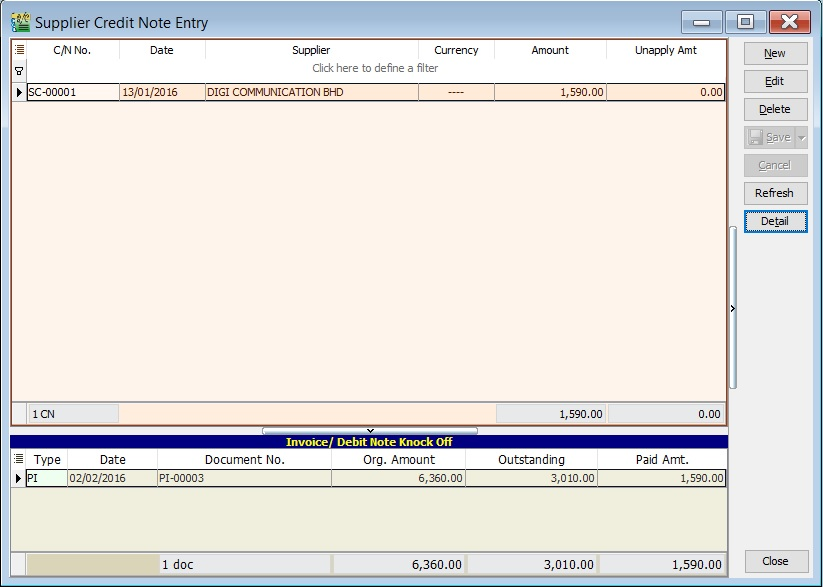

### Basic Entry

1. Click on New button.
2. See the New Supplier Credit Note entry form screenshot below.

3. Select the Supplier Code. You direct key-in and search by either supplier code or name.
4. Input the Purchase A/c and amount to be credit.
5. Below is the example of the entry created:

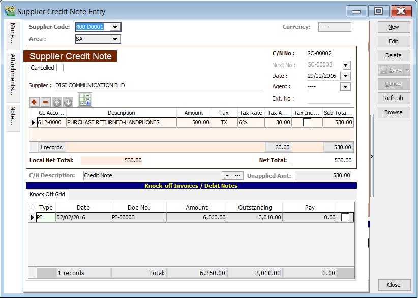

**Double Entry will be:-**

| **Account**            | **DR (RM)** | **CR (RM)** |
|-------------------------|-------------|-------------|
| Supplier Control Acc    | 500.00      |             |
| Purchase Returns        |             | 500.00      |

### Unapplied Amount

- Unapplied amount shows the credit note amount not allocated/knock-off against any outstanding invoices and debit note.
- It will remains in supplier aging report show as negative amount (-).

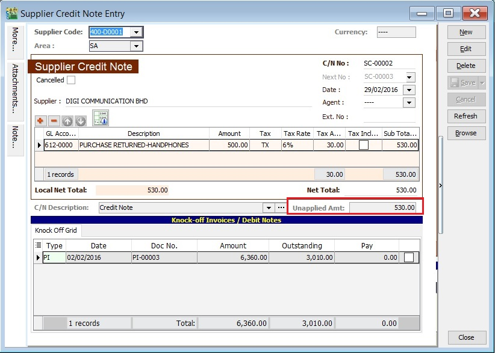

### Knock-Off Outstanding

- To knock-off the outstanding invoice/debit note, TICK the checkbox beside the pay column.
- You can direct input the pay amount into pay column.

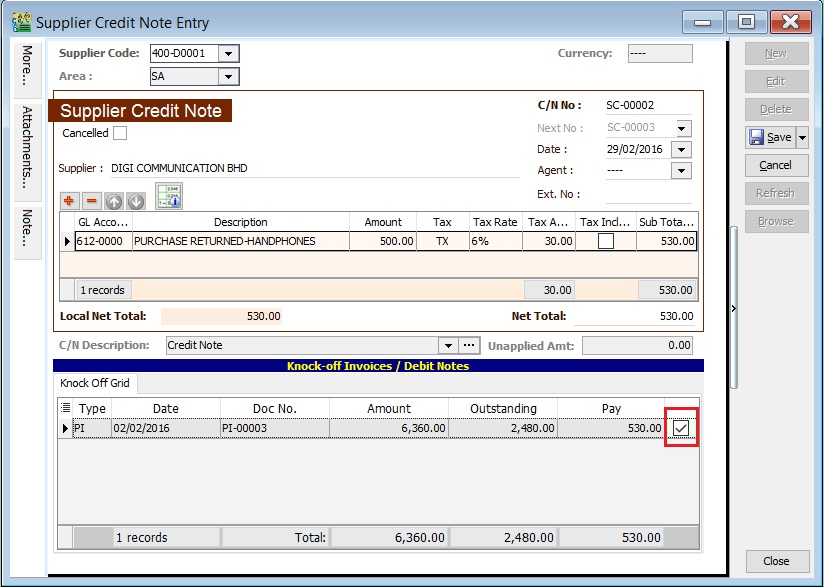

### Project

- There are 2 types of project you need to be take note.
  1. Document Project
  2. Detail Project
- For document project, you need to point to MORE section (on the left side bar).
- For detail project, you have to insert the project column out from Field Chooser.

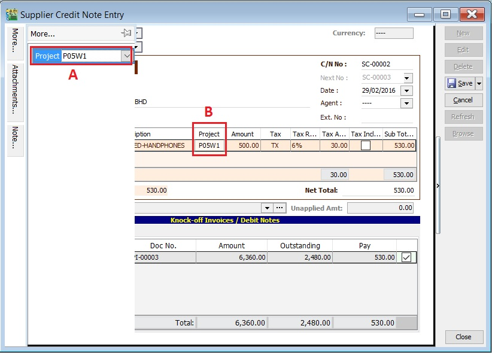

| **Label** | **Types**        | **Explanation**                                                  |
|-----------|------------------|------------------------------------------------------------------|
| A         | Document Project | It represents the project for a document to be debited.          |
| B         | Detail Project   | It represents the project for individual GL Account to be credited. |

### Attachment

- It is very useful to attach any supporting documents to a credit note.
- In future, you able to retrieve and refer the attachment file easily.

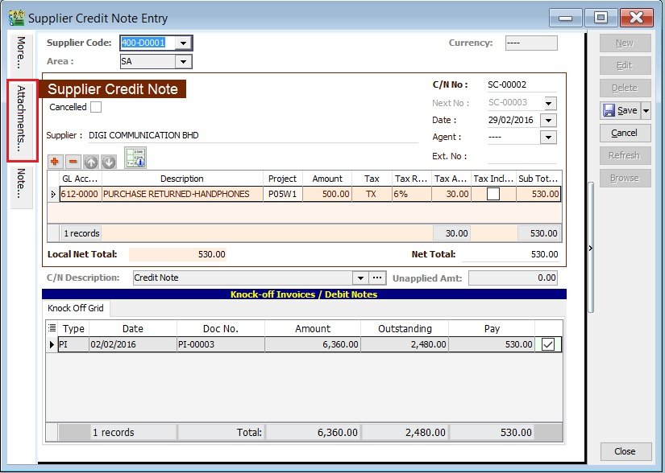

1. You have to point to the attachment section.  
2. Click on ( + ) button to insert the filename path.  
3. See the sample screenshot below.  

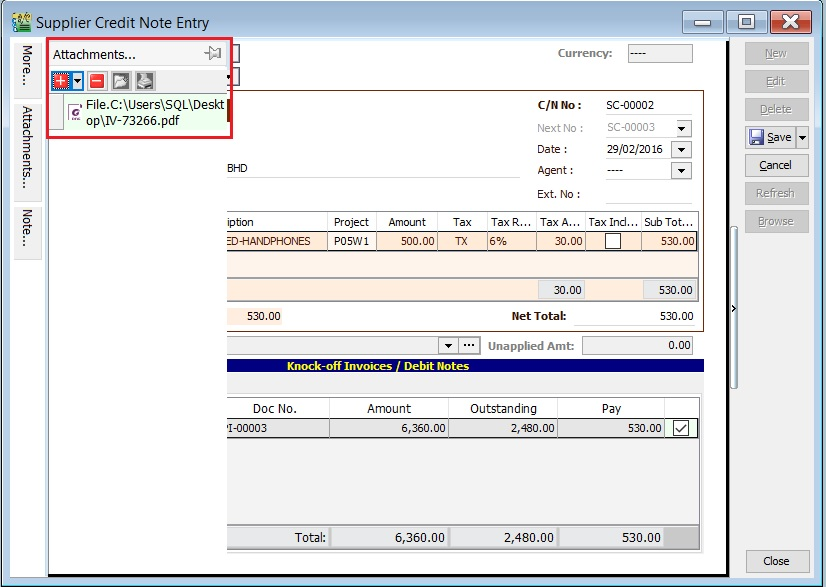

### Note

1. Click on the Note section (on the LEFT side bar).  
2. RIGHT click it, you will see the Rich Text Editor pop-up.  
3. You can start key-in the note. See the example screenshot below.  
4. Click on X button to save and exit the Rich Text Editor.  

5. You will get prompted the Save changes? message. Click YES to save it.  

### C/N Description

1. To show the document description in Supplier Statement, eg. Overcharged-Stationery April 2015.  

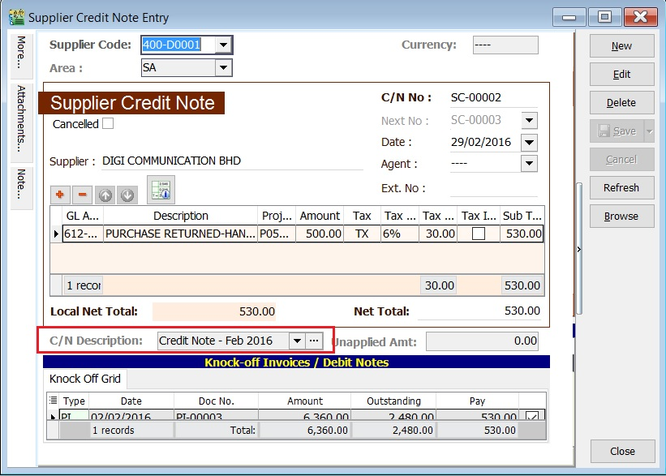

2. Sample of supplier statement screenshot below.  

### Foreign Exchange Currency Gain/Loss

- Difference in the foreign currency exchange rate will AUTO post the FOREX Gain/Loss entry into GL.
- Posting date can be changed to reflect the FOREX Gain/Loss for a month.

## Supplier Refund

- To receive the refund for the amount over paid to supplier.
- To off-set against the unapplied amount for Supplier Payment and Credit Note.

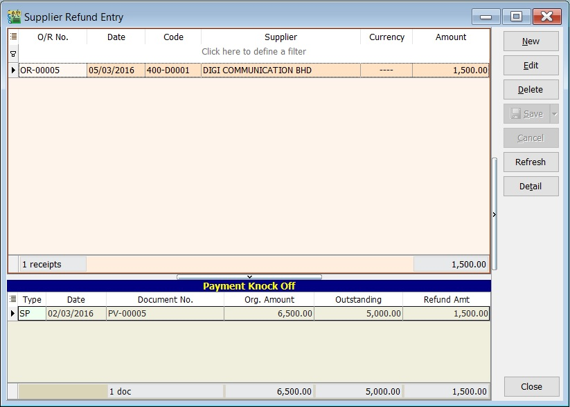

### Basic Entry

1. Click on New button.
2. See the New Supplier Refund entry form screenshot below.

3. Select the Supplier Code. Direct key-in and search by either Supplier code or name.
4. Select the Payment Method (bank or cash account) in Received In.
5. Enter the Refund Amount (follow the bank account currency).
6. Below is the example of the entry created:

**Double Entry will be:-**

| **Account**            | **DR (RM)** | **CR (RM)** |
|-------------------------|-------------|-------------|
| Bank Acc               | 3,590.00    |             |
| Supplier Control Acc    |             | 3,590.00    |

7. Enter Bank Charges if there is a bank charges.

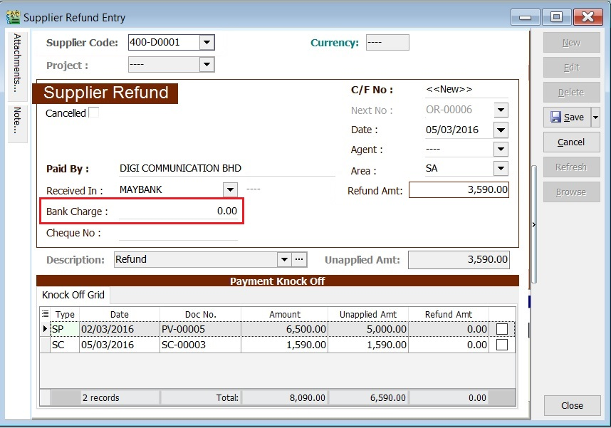

8. Lets said the bank charges = Rm2.00, therefore the double entry posting will be:-

| **Account**      | **DR (RM)** | **CR (RM)** |
|------------------|-------------|-------------|
| Bank Charges     | 2.00        |             |
| Bank Account     |             | 2.00        |

9. Enter the cheque number, cash or TT into Cheque No. field.

### Knock-off

Purpose to knock-off the invoices:
1. To show the outstanding invoices in Supplier Aging Report.
2. To indicate the payment knock-off the invoices in Supplier Statement.

#### Partial Knock-Off

1. You can enter the knock-off amount into Pay column (auto tick).
2. Unapplied Amt will be reduced by the knock-off amount entered.

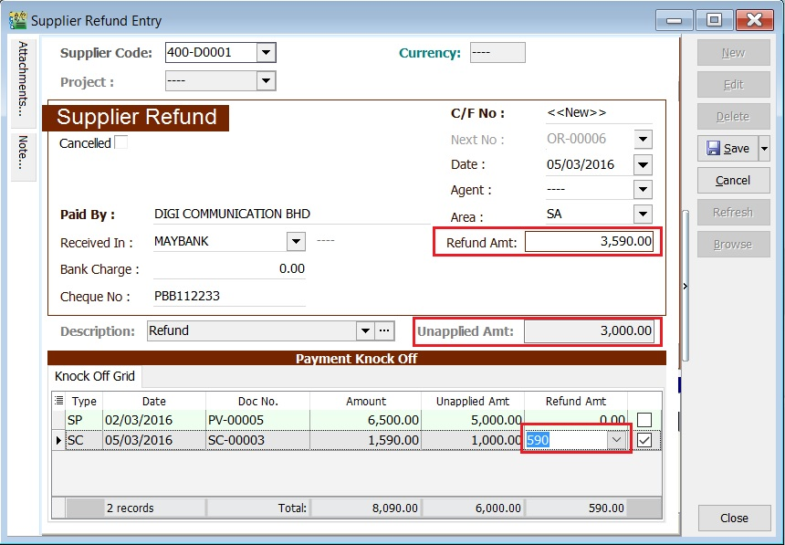

#### Document Knock-Off

1. You can tick on the outstanding documents.
2. Unapplied Amt will be reduced by the knock-off amount ticked.

#### Random Knock 0ff

1. You can click on the Pay column. It will auto tick on the outstanding documents.
2. Unapplied Amt will be reduced according to the outstanding balance.

:::note
 Refund Unapplied amount shows the supplier refund amount not allocated/knock-off against any unapplied amount in supplier payment and credit note.
:::

### Attachment

- It is very useful to attach any supporting documents.
- In future, you able to retrieve and refer the attachment file easily.

1. You have to point to the attachment section.
2. Click on ( + ) button to insert the filename path.
3. See the sample screenshot below.

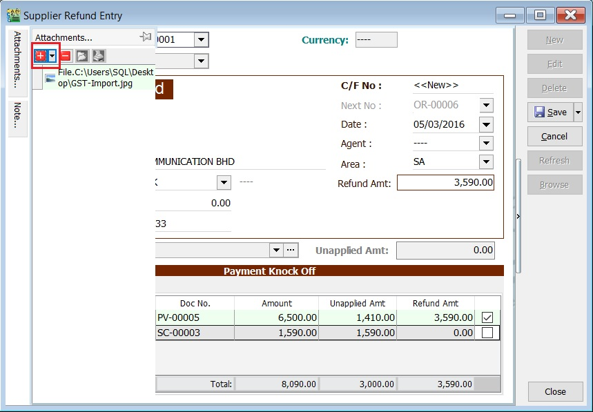

### Note

1. Click on the Note section (on the LEFT side bar).
2. RIGHT click it, you will see the Rich Text Editor pop-up.

3. You can start key-in the note. See the example screenshot below.
4. Click on X button to save and exit the Rich Text Editor.

5. You will get prompted the Save changes? message. Click YES to save it.

### Description

To show the supplier refund description in the Supplier Statement, eg. Refund For SC-00002 & PV-00004..

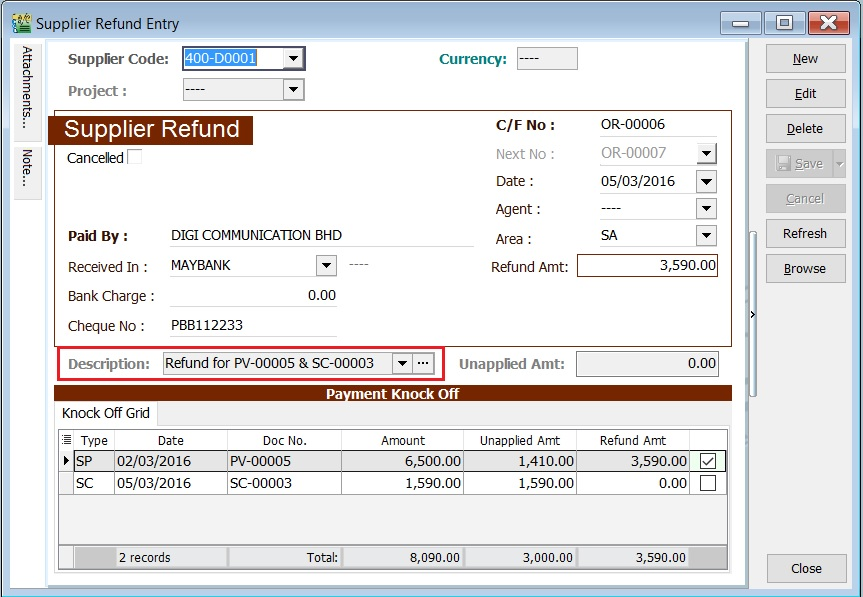

Sample of supplier statement screenshot below.

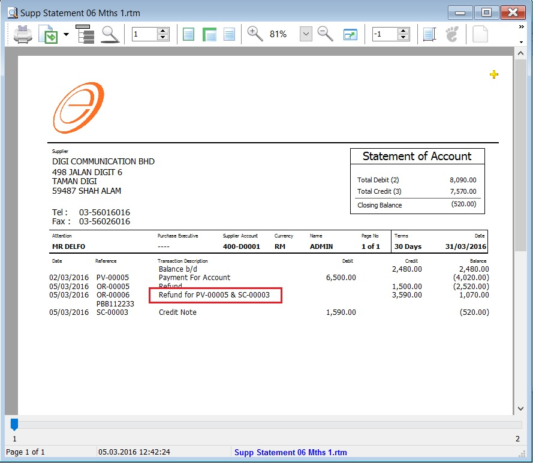

## Supplier Contra

- To make settlement of the outstanding between both supplier and customer accounts without any monetary transactions.
- It will use an intermediate accounts known as Contra Account. This account balance must be ZERO.

### Basic Entry

Assume that you have create the [Customer Contra](../../usage/customer/guide#customer-contra). You will found the same contra no. appeared in the Supplier Contra.
1. Highlight the Contra No to edit. Click on Edit button.
2. See the Supplier Contra entry form screenshot below.

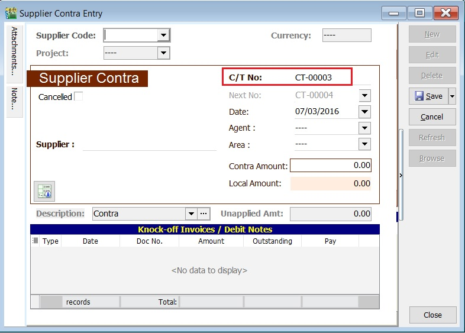

3. Select the Supplier Code. Direct key-in and search by either supplier code or name.
4. Enter the Contra Amount (follow the supplier currency).
5. Below is the example of the entry created:

**Double Entry will be:-**

| **Account**             | **DR (RM)** | **CR (RM)** |
|--------------------------|-------------|-------------|
| Supplier Control Acc     | 1,500.00    |             |
| Contra Acc               |             | 1,500.00    |

:::note TIPS

To ensure the contra account has set properly. [Contra Account](../../usage/tools/guide#options)

:::

### Knock-off

Purpose to knock-off the invoices:
1. To show the outstanding invoices in Supplier Aging Report.
2. To indicate the contra knock-off the invoices in Supplier Statement.

#### Partial Knock-Off

1. You can enter the knock-off amount into Pay column (auto tick).
2. Unapplied Amt will be reduced by the knock-off amount entered.

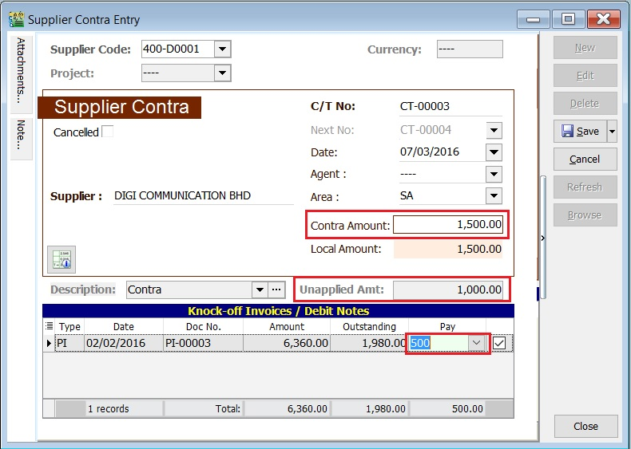

#### Document Knock-Off

1. You can tick on the outstanding documents.
2. Unapplied Amt will be reduced by the knock-off amount ticked.

#### Random Knock-Off

1. You can click on the Pay column. It will auto tick on the outstanding documents.
2. Unapplied Amt will be reduced according to the outstanding balance.

:::note
 Refund unapplied amount shows the supplier contra amount not allocated/knock-off against any outstanding supplier invoices and debit note.
:::

### Attachment

- It is very useful to attach any supporting documents.
- In future, you able to retrieve and refer the attachment file easily.

1. You have to point to the attachment section.
2. Click on ( + ) button to insert the filename path.
3. See the sample screenshot below.

### Note

1. Click on the Note section (on the LEFT side bar).
2. RIGHT click it, you will see the Rich Text Editor pop-up.

3. You can start key-in the note. See the example screenshot below.
4. Click on X button to save and exit the Rich Text Editor.

5. You will get prompted the Save changes? message. Click YES to save it.

### Description

To show the supplier contra description in the Supplier Statement, eg. Contra IV-00005 .

Sample of supplier statement screenshot below.

### GL Ledger - Contra Account

1. Select the date range.
2. Select the account code, eg. 450-000 CONTRA ACCOUNT.
3. Tick on General Ledger.
4. Click Apply button.
5. Example of the Contra Account ledger as shown below.

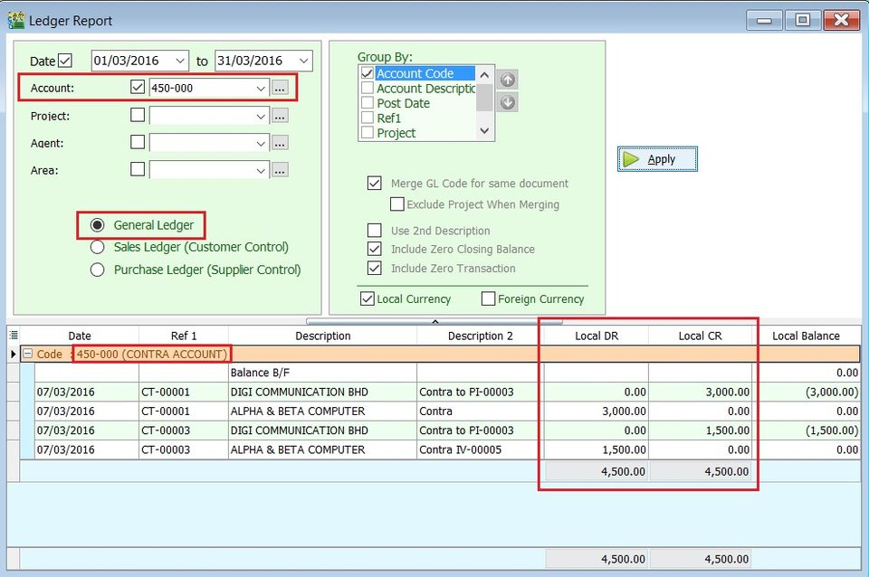